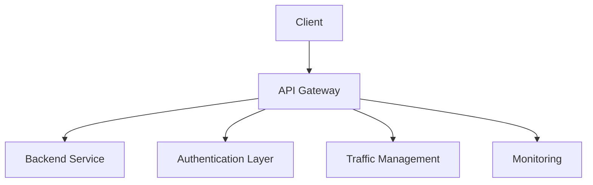
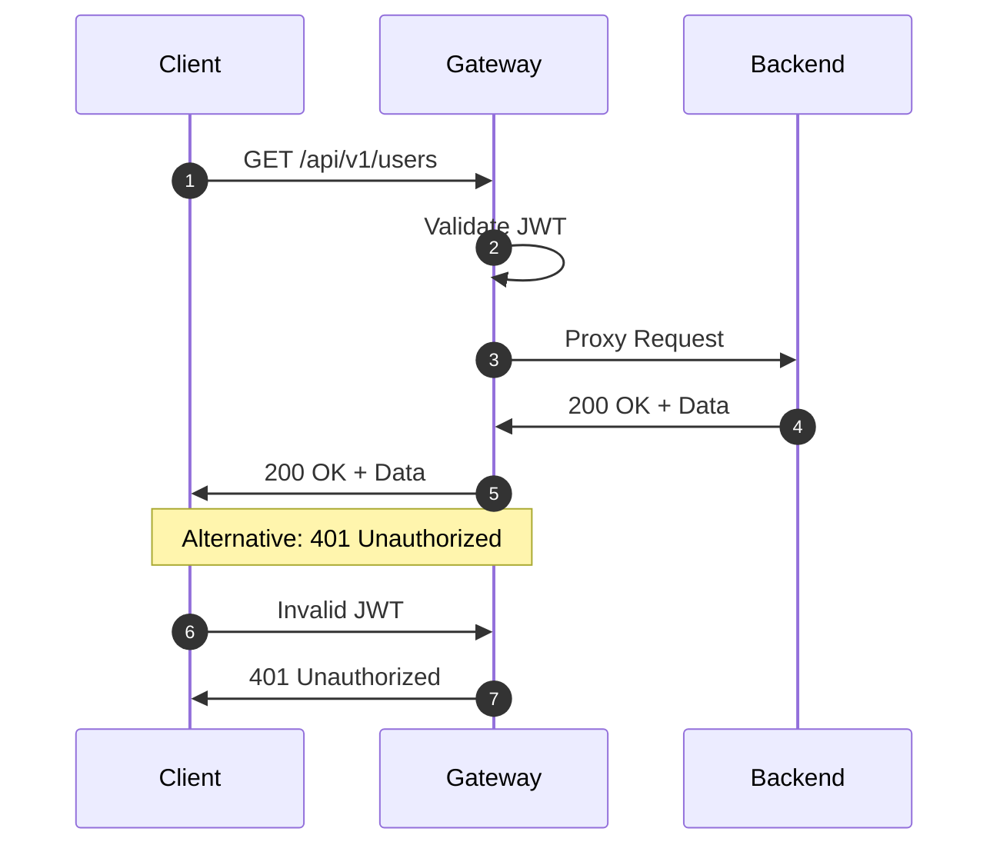
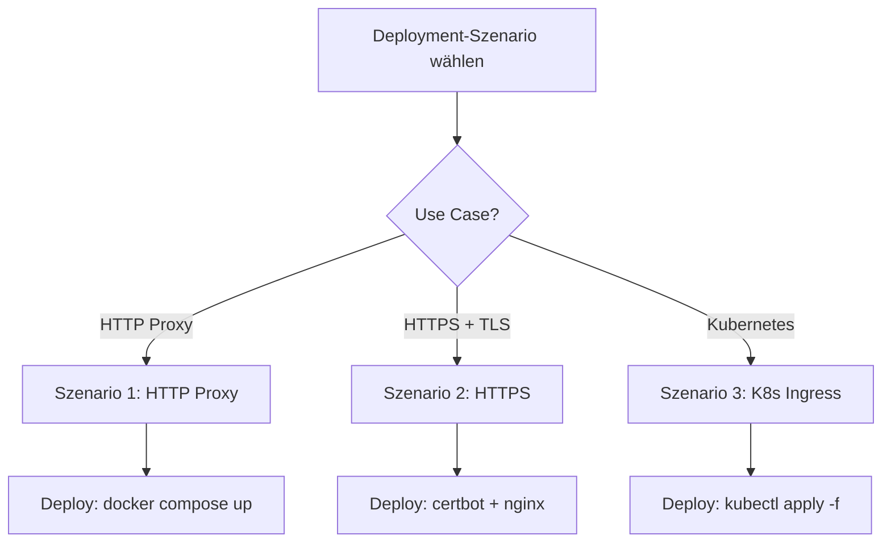
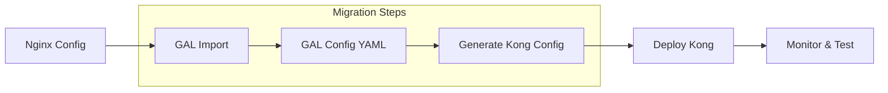
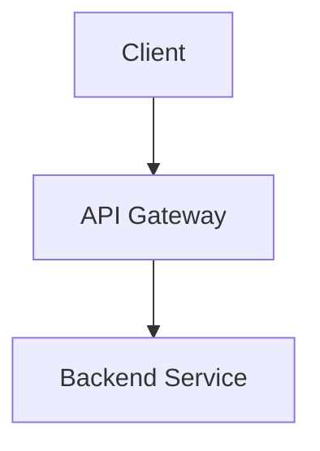

# Mermaid-Diagramme für Provider-Guides

## Übersicht

MkDocs Material unterstützt Mermaid nativ (siehe mkdocs.yml:122-124). Verwende den `mermaid-expert` Agent für professionelle Diagramme.

## Empfohlene Diagramme für Provider-Guides

### 1. Architektur-Diagramm (Graph TB)

Zeigt die Gesamtarchitektur des Providers:

- **Client Layer** → **Gateway Layer** → **Backend Services**
- **Cross-Cutting Concerns**: Authentication, Traffic Management, Monitoring
- **Provider-spezifische Komponenten**
- **Professionelles 8-Farben-Schema**

**Beispiel:**


### 2. Request Flow Sequenzdiagramm

Zeigt den Ablauf einer HTTP-Anfrage:

- **Client** → **Gateway** → **Backend** Request Flow
- **Authentication Flow** (JWT, API Key, OAuth)
- **CORS Preflight** (OPTIONS) Flow
- **Alternative Flows** (Fehlerszenarien: 401, 429, 503, 504)
- **Auto-nummerierte Schritte** (`autonumber`)
- **Detaillierte Header-Informationen**

**Beispiel:**


### 3. Deployment-Flowchart (Flowchart TD)

Entscheidungsbaum für verschiedene Deployment-Szenarien:

- **3-5 Deployment-Szenarien** mit Entscheidungslogik
- **Jedes Szenario** mit konkreten Deployment-Schritten
- **Use-Case-Beschreibungen**
- **Konkrete Bash/YAML-Beispiele**

**Beispiel:**


### 4. Migration-Flow (Flowchart LR)

Zeigt die Migration von/zu anderen Providern:

- **Source Providers** → **GAL Import** → **Generate** → **Deploy** → **Monitor**
- **6-8 Migration-Schritte** mit Commands
- **Migration-Checklist-Tabelle** (Before/During/After)
- **Provider-spezifische Migration-Guides**
- **Common Migration Problems** mit Solutions

**Beispiel:**


## Best Practices für Mermaid

### Syntax

```markdown

```

### Styling

- **Konsistentes Farbschema** über alle Diagramme
- **Deutsche Beschriftungen** für Labels
- **Kurze, prägnante Labels** (max 3-5 Wörter)
- **Production-ready Styling** (8+ Farben für verschiedene Komponenten)

### Farbschema (8 Farben)

1. **Client**: `#E3F2FD` (Light Blue)
2. **Gateway**: `#C8E6C9` (Light Green)
3. **Backend**: `#FFF9C4` (Light Yellow)
4. **Auth**: `#FFCCBC` (Light Orange)
5. **Traffic**: `#F8BBD0` (Light Pink)
6. **Monitoring**: `#D1C4E9` (Light Purple)
7. **Storage**: `#FFECB3` (Light Amber)
8. **Provider-specific**: `#B2DFDB` (Light Teal)

### Nach jedem Diagramm

Füge **2-3 Absätze** Erklärungstext hinzu:

```markdown
#### Erklärung

Das Architektur-Diagramm zeigt die drei Hauptkomponenten des GCP API Gateway:

1. **Client Layer**: Externe Clients (Web, Mobile, IoT)
2. **Gateway Layer**: GCP API Gateway mit Cloud Endpoints
3. **Backend Services**: Cloud Run, Cloud Functions, App Engine

Die Cross-Cutting Concerns (Authentifizierung, Traffic Management, Monitoring)
werden als separate Layer dargestellt, die in allen Komponenten integriert sind.
```

## Beispiel: GCP API Gateway Diagramme

Siehe `docs/guides/GCP_APIGATEWAY.md` für vollständige Beispiele:

- **4 Mermaid-Diagramme**: Architektur, Request Flow, Deployment, Migration
- **~200 Zeilen** Mermaid-Code
- **Professionelles 8-Farben-Schema**
- **Alle Diagramme interaktiv** in MkDocs

## Integration in Provider-Guide

1. Füge Diagramme nach dem "Übersicht"-Abschnitt ein
2. Ein Diagramm pro Sektion (Architektur, Request Flow, Deployment, Migration)
3. Jedes Diagramm mit 2-3 Absätzen Erklärungstext
4. Verwende konsistentes Farbschema über alle Diagramme

## Tools

- **mermaid-expert Agent**: Für komplexe Diagramme
- **mermaid.live**: Zum Testen der Syntax (https://mermaid.live)
- **MkDocs Material**: Native Mermaid-Unterstützung
