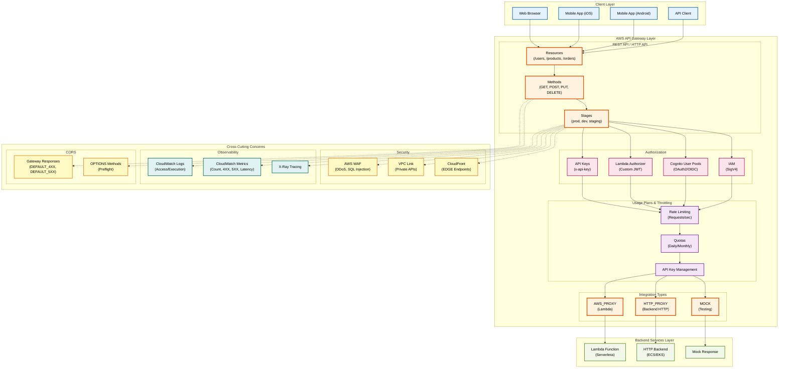
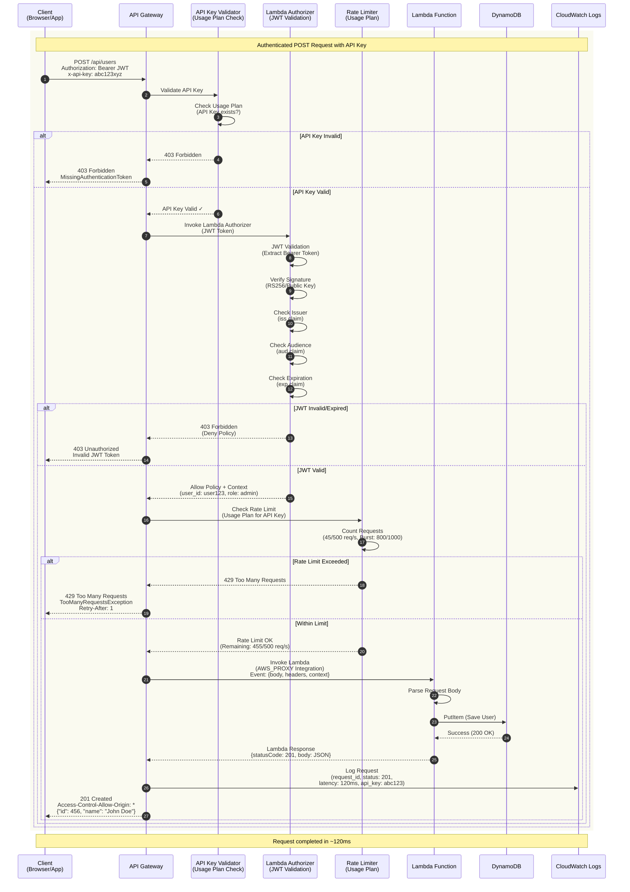

# AWS API Gateway Provider Anleitung

**Umfassende Anleitung für AWS API Gateway Provider in GAL (Gateway Abstraction Layer)**

## Inhaltsverzeichnis

1. [Übersicht](#ubersicht)
2. [AWS API Gateway Architektur](#aws-api-gateway-architektur)
3. [Schnellstart](#schnellstart)
4. [Konfigurationsoptionen](#konfigurationsoptionen)
5. [Request Flow durch AWS API Gateway](#request-flow-durch-aws-api-gateway)
6. [Provider-Vergleich](#provider-vergleich)

**Weitere Dokumentation:**
- [Feature-Implementierungen](AWS_APIGATEWAY_FEATURES.md) - Integration-Typen, Auth, CORS, Usage Plans
- [Deployment & Migration](AWS_APIGATEWAY_DEPLOYMENT.md) - Deployment, Import, Migration, Best Practices

---
## Übersicht

AWS API Gateway ist ein vollständig verwalteter Service von Amazon Web Services, der es Entwicklern ermöglicht, APIs in beliebigem Umfang zu erstellen, zu veröffentlichen, zu verwalten, zu überwachen und zu sichern.

GAL unterstützt AWS API Gateway als **Cloud-Provider** mit vollständiger Import/Export-Funktionalität über OpenAPI 3.0 mit `x-amazon-apigateway` Extensions.

### Motivation

**Warum AWS API Gateway mit GAL?**

- **Cloud-Native**: Perfekt für AWS-basierte Microservices-Architekturen
- **Serverless**: Nahtlose Integration mit AWS Lambda
- **Skalierbarkeit**: Automatische Skalierung ohne Infrastruktur-Management
- **AWS-Ökosystem**: Integration mit Cognito, IAM, CloudWatch, WAF
- **Pay-per-Use**: Nur bezahlen für tatsächliche API-Aufrufe
- **Multi-Region**: Globale Verfügbarkeit mit CloudFront (EDGE Endpoints)

---

## AWS API Gateway Architektur

### REST API Komponenten



**Diagramm-Erklärung:**

- **Client Layer:** Verschiedene Client-Typen (Web Browser, Mobile Apps für iOS/Android, API Clients)
- **AWS API Gateway Layer:** Zentrale Komponenten
  - **REST API / HTTP API:** Resources, Methods, Stages für API-Organisation
  - **Authorization:** Vier Hauptmechanismen (API Keys, Lambda Authorizer, Cognito, IAM)
  - **Integration Types:** HTTP_PROXY für Backend HTTP, AWS_PROXY für Lambda, MOCK für Testing
  - **Usage Plans & Throttling:** Rate Limiting, Quotas, API Key Management
- **Backend Services:** Lambda Function (Serverless), HTTP Backend (ECS/EKS), Mock Response
- **Cross-Cutting Concerns:**
  - **Security:** AWS WAF (DDoS/SQL Injection), VPC Link (Private APIs), CloudFront (EDGE)
  - **Observability:** CloudWatch Logs, Metrics, X-Ray Tracing
  - **CORS:** Gateway Responses für Error Handling, OPTIONS Methods für Preflight

### Endpoint-Typen

| Typ | Beschreibung | Verwendung |
|-----|-------------|------------|
| **REGIONAL** | API in einer spezifischen AWS Region | Latenz-sensitiv, Single-Region |
| **EDGE** | API über CloudFront global verteilt | Globale APIs, niedrige Latenz weltweit |
| **PRIVATE** | API nur innerhalb VPC erreichbar | Interne APIs, höchste Sicherheit |

---

## Schnellstart

### 1. Voraussetzungen

- AWS Account mit API Gateway Zugriff
- AWS CLI installiert und konfiguriert
- GAL installiert (`pip install gal-gateway`)

### 2. Einfache HTTP Proxy API

**GAL Konfiguration** (`config.yaml`):

```yaml
version: "1.0"
provider: aws_apigateway

global_config:
  aws_apigateway:
    api_name: "PetStore-API"
    api_description: "Pet Store REST API"
    endpoint_type: "REGIONAL"
    stage_name: "prod"
    integration_type: "HTTP_PROXY"
    cors_enabled: true

services:
  - name: petstore
    type: rest
    protocol: https
    upstream:
      host: petstore.example.com
      port: 443
    routes:
      - path_prefix: /pets
        methods:
          - GET
          - POST
      - path_prefix: /pets/{id}
        methods:
          - GET
          - PUT
          - DELETE
```

**OpenAPI generieren:**

```bash
gal generate -c config.yaml -p aws_apigateway -o api.json
```

**Zu AWS deployen:**

```bash
# API erstellen
aws apigateway import-rest-api --body file://api.json

# API ID aus Output merken
export API_ID="abc123xyz"

# Deployment erstellen
aws apigateway create-deployment \
  --rest-api-id $API_ID \
  --stage-name prod

# API URL anzeigen
echo "https://${API_ID}.execute-api.us-east-1.amazonaws.com/prod"
```

---

## Konfigurationsoptionen

### Global Config

```yaml
global_config:
  aws_apigateway:
    # API Configuration
    api_name: "My-API"                    # API Name
    api_description: "My API Description" # Beschreibung
    endpoint_type: "REGIONAL"             # REGIONAL, EDGE, PRIVATE

    # Stage Configuration
    stage_name: "prod"                    # Stage Name (prod, dev, staging)
    stage_description: "Production Stage" # Stage Beschreibung

    # Integration Configuration
    integration_type: "HTTP_PROXY"        # HTTP_PROXY, AWS_PROXY, MOCK
    integration_timeout_ms: 29000         # Max: 29000ms

    # Lambda Integration (nur bei AWS_PROXY)
    lambda_function_arn: "arn:aws:lambda:..."
    lambda_invoke_role_arn: "arn:aws:iam:..."  # Optional

    # Authorization
    authorizer_type: null                 # lambda, cognito, iam
    lambda_authorizer_arn: null           # Lambda Authorizer ARN
    lambda_authorizer_ttl: 300            # Cache TTL (Sekunden)
    cognito_user_pool_arns: []            # Cognito User Pool ARNs

    # API Keys
    api_key_required: false               # API Key erforderlich
    api_key_source: "HEADER"              # HEADER oder AUTHORIZER

    # CORS
    cors_enabled: true
    cors_allow_origins: ["*"]
    cors_allow_methods: ["GET", "POST", "PUT", "DELETE", "OPTIONS"]
    cors_allow_headers: ["Content-Type", "Authorization", "X-Api-Key"]
```

### Service Config

```yaml
services:
  - name: my_service
    type: rest                     # Immer "rest" für API Gateway
    protocol: https                # http oder https
    upstream:
      host: backend.example.com    # Backend Host
      port: 443                    # Backend Port

    routes:
      - path_prefix: /api/users
        methods:
          - GET
          - POST
        authentication:            # Optional: Route-Level Auth
          type: jwt
          jwt:
            issuer: "https://cognito-idp.us-east-1.amazonaws.com/..."
            audience: "my-app-client-id"
```

---

## Request Flow durch AWS API Gateway

Das folgende Sequenzdiagramm zeigt den vollständigen Request-Ablauf durch AWS API Gateway mit allen Security- und Traffic-Management-Features:



**Alternative Flows:**

| Fehler | HTTP Status | Response | Ursache |
|--------|-------------|----------|---------|
| **API Key Invalid** | 403 Forbidden | `{"message":"Forbidden"}` | x-api-key fehlt oder ungültig |
| **Lambda Authorizer Deny** | 403 Forbidden | `{"message":"User is not authorized"}` | JWT ungültig/expired |
| **Rate Limit Exceeded** | 429 Too Many Requests | `{"message":"Too Many Requests"}` | Usage Plan Limit überschritten |
| **Lambda Timeout** | 504 Gateway Timeout | `{"message":"Endpoint request timed out"}` | Lambda > 29s (Hard Limit!) |
| **Lambda Error** | 502 Bad Gateway | `{"message":"Internal server error"}` | Lambda Exception |

**Flow-Erklärung:**

1. **Client Request:** Client sendet POST Request mit JWT Token (Authorization Header) und API Key (x-api-key Header)
2. **API Key Validation:** Gateway prüft ob API Key existiert und zu einem Usage Plan gehört
3. **Lambda Authorizer Invocation:** Gateway ruft Lambda Authorizer Function auf
4. **JWT Validation:** Lambda validiert JWT Token (Signature, Issuer, Audience, Expiration)
5. **IAM Policy Generation:** Lambda Authorizer generiert Allow/Deny IAM Policy + Context (user_id, role)
6. **Rate Limit Check:** Gateway prüft Usage Plan Rate Limits (500 req/s, Burst 1000)
7. **Lambda Integration:** Gateway invoked Backend Lambda Function (AWS_PROXY)
8. **DynamoDB Write:** Lambda speichert User Data in DynamoDB
9. **CloudWatch Logging:** Request wird mit allen Details geloggt (request_id, status, latency, api_key)
10. **Response:** Client erhält 201 Created mit CORS Headers

**AWS API Gateway Besonderheiten:**

- **29 Sekunden Hard Timeout:** Lambda Integration hat Maximum 29000ms Timeout
- **Usage Plans:** Rate Limiting erfolgt pro API Key über Usage Plans
- **Lambda Authorizer TTL:** Authorizer Responses werden gecached (default: 300s)
- **Gateway Responses:** DEFAULT_4XX und DEFAULT_5XX Responses für CORS Error Handling
- **CloudWatch Logs:** Access Logs (JSON Format) und Execution Logs (DEBUG)
- **X-Ray Tracing:** Distributed Tracing über Lambda und Backend Services

---

## Provider-Vergleich

| Feature | AWS API Gateway | Azure APIM | Kong | Envoy |
|---------|----------------|------------|------|-------|
| **Deployment** | Cloud (AWS) | Cloud (Azure) | Self-Hosted | Self-Hosted |
| **Serverless** | ✅ Lambda | ✅ Functions | ❌ | ❌ |
| **Pricing** | Pay-per-Request | Pay-per-Request | Free/Enterprise | Free |
| **Auto-Scaling** | ✅ Automatic | ✅ Automatic | Manual | Manual |
| **Multi-Region** | ✅ EDGE | ✅ Multi-Region | Manual | Manual |
| **WAF Integration** | ✅ AWS WAF | ✅ Azure WAF | Plugins | Envoy WAF |
| **Vendor Lock-in** | ⚠️ AWS | ⚠️ Azure | ✅ Open | ✅ Open |

**Empfehlung:**
- **AWS API Gateway**: Wenn Sie bereits AWS nutzen und Serverless bevorzugen
- **Azure APIM**: Wenn Sie Azure-native sind
- **Kong/Envoy**: Wenn Sie Multi-Cloud oder On-Premise benötigen

---

