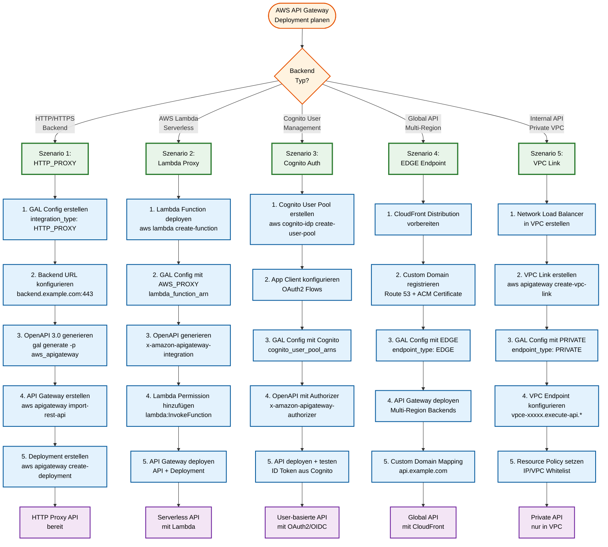

# AWS API Gateway Deployment & Migration

**Deployment, Import, Migration und Best Practices für AWS API Gateway Provider in GAL**

**Navigation:**
- [← Zurück zur AWS API Gateway Übersicht](AWS_APIGATEWAY.md)
- [← Feature-Implementierungen](AWS_APIGATEWAY_FEATURES.md)

## Inhaltsverzeichnis

1. [Deployment-Strategien](#deployment-strategien)
2. [Deployment-Entscheidungsbaum](#deployment-entscheidungsbaum)
3. [Import von bestehenden AWS APIs](#import-von-bestehenden-aws-apis)
4. [Migration zu AWS API Gateway](#migration-zu-aws-api-gateway)
5. [Best Practices](#best-practices)
6. [Troubleshooting](#troubleshooting)
7. [Weiterführende Ressourcen](#weiterfuhrende-ressourcen)

---
## Deployment-Strategien

### 1. AWS CLI Deployment

```bash
# 1. OpenAPI generieren
gal generate -c config.yaml -p aws_apigateway -o api.json

# 2. API erstellen
API_ID=$(aws apigateway import-rest-api \
  --body file://api.json \
  --query 'id' --output text)

echo "API ID: $API_ID"

# 3. Deployment erstellen
aws apigateway create-deployment \
  --rest-api-id $API_ID \
  --stage-name prod \
  --description "Initial deployment"

# 4. API URL
echo "API URL: https://${API_ID}.execute-api.${AWS_REGION}.amazonaws.com/prod"
```

---

### 2. Terraform Deployment

**terraform/main.tf:**

```hcl
resource "aws_api_gateway_rest_api" "api" {
  name        = "PetStore-API"
  description = "Pet Store REST API managed by GAL"
  body        = file("${path.module}/api.json")

  endpoint_configuration {
    types = ["REGIONAL"]
  }
}

resource "aws_api_gateway_deployment" "prod" {
  rest_api_id = aws_api_gateway_rest_api.api.id
  stage_name  = "prod"

  lifecycle {
    create_before_destroy = true
  }
}

resource "aws_api_gateway_stage" "prod" {
  deployment_id = aws_api_gateway_deployment.prod.id
  rest_api_id   = aws_api_gateway_rest_api.api.id
  stage_name    = "prod"

  xray_tracing_enabled = true

  access_log_settings {
    destination_arn = aws_cloudwatch_log_group.api_logs.arn
    format          = "$context.requestId"
  }
}

resource "aws_cloudwatch_log_group" "api_logs" {
  name              = "/aws/apigateway/petstore"
  retention_in_days = 7
}

output "api_url" {
  value = "${aws_api_gateway_stage.prod.invoke_url}"
}
```

**Deployment:**

```bash
# OpenAPI generieren
gal generate -c config.yaml -p aws_apigateway -o terraform/api.json

# Terraform apply
cd terraform
terraform init
terraform plan
terraform apply

# API URL ausgeben
terraform output api_url
```

---

### 3. CI/CD mit GitHub Actions

**.github/workflows/deploy-api.yml:**

```yaml
name: Deploy AWS API Gateway

on:
  push:
    branches:
      - main
    paths:
      - 'api-config.yaml'
      - '.github/workflows/deploy-api.yml'

jobs:
  deploy:
    runs-on: ubuntu-latest

    steps:
      - name: Checkout Code
        uses: actions/checkout@v3

      - name: Setup Python
        uses: actions/setup-python@v4
        with:
          python-version: '3.11'

      - name: Install GAL
        run: pip install gal-gateway

      - name: Generate OpenAPI
        run: |
          gal generate \
            -c api-config.yaml \
            -p aws_apigateway \
            -o api.json

      - name: Configure AWS Credentials
        uses: aws-actions/configure-aws-credentials@v2
        with:
          aws-access-key-id: ${{ secrets.AWS_ACCESS_KEY_ID }}
          aws-secret-access-key: ${{ secrets.AWS_SECRET_ACCESS_KEY }}
          aws-region: us-east-1

      - name: Deploy to AWS
        run: |
          # API erstellen oder updaten
          if aws apigateway get-rest-api --rest-api-id ${{ secrets.API_ID }} 2>/dev/null; then
            # Update existing API
            aws apigateway put-rest-api \
              --rest-api-id ${{ secrets.API_ID }} \
              --mode overwrite \
              --body file://api.json
          else
            # Create new API
            API_ID=$(aws apigateway import-rest-api \
              --body file://api.json \
              --query 'id' --output text)
            echo "API_ID=$API_ID" >> $GITHUB_ENV
          fi

          # Create deployment
          aws apigateway create-deployment \
            --rest-api-id ${{ secrets.API_ID }} \
            --stage-name prod \
            --description "Deployed from GitHub Actions"

      - name: Output API URL
        run: |
          echo "API deployed to:"
          echo "https://${{ secrets.API_ID }}.execute-api.us-east-1.amazonaws.com/prod"
```

---

### 4. Blue-Green Deployment

**Konzept:** Zero-Downtime Updates mit Stage-Wechsel

```bash
# 1. Aktuellen Stand sichern
OLD_STAGE="prod"
NEW_STAGE="prod-v2"

# 2. Neue Version deployen
aws apigateway create-deployment \
  --rest-api-id $API_ID \
  --stage-name $NEW_STAGE \
  --description "Blue-Green deployment v2"

# 3. Neue Version testen
curl https://${API_ID}.execute-api.us-east-1.amazonaws.com/${NEW_STAGE}/health

# 4. Traffic umleiten (Custom Domain)
aws apigateway update-base-path-mapping \
  --domain-name api.example.com \
  --base-path "" \
  --patch-operations op=replace,path=/stage,value=$NEW_STAGE

# 5. Alte Version löschen (nach Bestätigung)
aws apigateway delete-stage \
  --rest-api-id $API_ID \
  --stage-name $OLD_STAGE
```

---

## Deployment-Entscheidungsbaum

Der folgende Entscheidungsbaum hilft bei der Auswahl der richtigen AWS API Gateway Deployment-Strategie:



**Deployment-Strategien im Überblick:**

| Szenario | Use Case | Integration Type | Hauptmerkmale | Pricing |
|----------|----------|------------------|---------------|---------|
| **1. HTTP_PROXY** | Bestehende HTTP Backends | `HTTP_PROXY` | Einfach, direkte Verbindung | $3.50/M requests |
| **2. Lambda Proxy** | Serverless APIs | `AWS_PROXY` | Auto-Scaling, Pay-per-Invocation | $3.50/M + Lambda |
| **3. Cognito Auth** | User Management APIs | `HTTP_PROXY` + Cognito | OAuth2/OIDC, MFA, Social Logins | $3.50/M + Cognito MAU |
| **4. EDGE Endpoint** | Globale APIs | `HTTP_PROXY` / `AWS_PROXY` | CloudFront, niedrige Latenz weltweit | $3.50/M + CloudFront |
| **5. VPC Link** | Interne/Private APIs | `HTTP_PROXY` + VPC Link | Höchste Sicherheit, keine Public IPs | $3.50/M + VPC Link |

**Szenario-Details:**

### Szenario 1: HTTP_PROXY (Backend HTTP)

**Use Case:** Einfacher Reverse Proxy zu bestehenden HTTP/HTTPS Backends

**Deployment Steps:**
```bash
# 1. GAL Config
cat > config.yaml <<EOF
version: "1.0"
provider: aws_apigateway
global_config:
  aws_apigateway:
    integration_type: "HTTP_PROXY"
    backend_address: "https://backend.example.com"
services:
  - name: api_service
    upstream:
      host: backend.example.com
      port: 443
    routes:
      - path_prefix: /api
        methods: [GET, POST]
EOF

# 2. OpenAPI generieren
gal generate -c config.yaml -p aws_apigateway > api.json

# 3. API erstellen
API_ID=$(aws apigateway import-rest-api --body file://api.json --query 'id' --output text)

# 4. Deployment
aws apigateway create-deployment --rest-api-id $API_ID --stage-name prod

# 5. API URL
echo "https://${API_ID}.execute-api.us-east-1.amazonaws.com/prod"
```

### Szenario 2: Lambda Proxy Integration

**Use Case:** Serverless APIs ohne Infrastruktur-Management

**Deployment Steps:**
```bash
# 1. Lambda Function deployen
aws lambda create-function \
  --function-name my-api-function \
  --runtime python3.11 \
  --role arn:aws:iam::123456789012:role/lambda-role \
  --handler lambda_function.lambda_handler \
  --zip-file fileb://function.zip

# 2. GAL Config mit AWS_PROXY
# (integration_type: AWS_PROXY, lambda_function_arn)

# 3. OpenAPI generieren + API erstellen

# 4. Lambda Permission
aws lambda add-permission \
  --function-name my-api-function \
  --statement-id apigateway-invoke \
  --action lambda:InvokeFunction \
  --principal apigateway.amazonaws.com \
  --source-arn "arn:aws:execute-api:us-east-1:123456789012:${API_ID}/*/*"

# 5. Deployment
aws apigateway create-deployment --rest-api-id $API_ID --stage-name prod
```

### Szenario 3: Cognito Authentication

**Use Case:** User-basierte APIs mit OAuth2/OIDC Authentication

**Deployment Steps:**
```bash
# 1. Cognito User Pool
aws cognito-idp create-user-pool \
  --pool-name my-api-users \
  --auto-verified-attributes email

# 2. App Client
aws cognito-idp create-user-pool-client \
  --user-pool-id us-east-1_AbCdEfGhI \
  --client-name my-api-client \
  --explicit-auth-flows ALLOW_USER_PASSWORD_AUTH ALLOW_REFRESH_TOKEN_AUTH

# 3. GAL Config mit cognito_user_pool_arns

# 4. OpenAPI mit Cognito Authorizer generieren

# 5. API deployen + testen
```

### Szenario 4: Multi-Region (EDGE Endpoint)

**Use Case:** Globale APIs mit niedrigster Latenz weltweit

**Features:**
- CloudFront Distribution (150+ Edge Locations)
- Custom Domain mit Route 53
- ACM Certificate für SSL/TLS
- Geo-Routing für Multi-Region Backends

### Szenario 5: VPC Link (Private APIs)

**Use Case:** Interne APIs ohne Public Exposure

**Features:**
- Network Load Balancer in VPC
- VPC Link für private Integration
- PRIVATE Endpoint Type
- Resource Policies für IP/VPC Whitelisting

**Migration Checklist:**

| Phase | Action | Tool |
|-------|--------|------|
| **1. Backend vorbereiten** | Backend deployen (Lambda, ECS, EKS) | AWS Console / CLI |
| **2. GAL Config** | integration_type, backend config | YAML Editor |
| **3. OpenAPI generieren** | x-amazon-apigateway Extensions | `gal generate` |
| **4. API Gateway deployen** | REST API + API Config + Deployment | `aws apigateway` |
| **5. Testing** | Functional Tests, Load Tests | curl, Postman, JMeter |
| **6. Monitoring Setup** | CloudWatch Logs, Metrics, X-Ray | AWS Console |

---

## Import von bestehenden AWS APIs

## Import von bestehenden AWS APIs

### Export aus AWS API Gateway

```bash
# Liste aller APIs
aws apigateway get-rest-apis

# API exportieren (OpenAPI 3.0)
aws apigateway get-export \
  --rest-api-id <api-id> \
  --stage-name prod \
  --export-type oas30 \
  --accepts application/json > api-export.json
```

### Import zu GAL

```bash
# OpenAPI zu GAL Config konvertieren
gal import \
  -i api-export.json \
  -p aws_apigateway \
  -o gal-config.yaml

# Konvertierte Config prüfen
cat gal-config.yaml
```

**Beispiel Export:**

```json
{
  "openapi": "3.0.1",
  "info": {
    "title": "PetStore API",
    "version": "1.0.0"
  },
  "paths": {
    "/pets": {
      "get": {
        "x-amazon-apigateway-integration": {
          "type": "http_proxy",
          "httpMethod": "GET",
          "uri": "https://petstore.example.com/pets"
        }
      }
    }
  }
}
```

**Konvertierte GAL Config:**

```yaml
version: "1.0"
provider: gal

global_config:
  aws_apigateway:
    api_name: "PetStore API"
    api_description: ""
    endpoint_type: "REGIONAL"
    stage_name: "prod"
    integration_type: "HTTP_PROXY"
    cors_enabled: false

services:
  - name: imported-api
    type: rest
    protocol: https
    upstream:
      host: petstore.example.com
      port: 443
    routes:
      - path_prefix: /pets
        methods:
          - GET
```

**Was wird importiert:**
- ✅ API Name, Description, Version
- ✅ Routes (Paths) und HTTP Methods
- ✅ Integration Type (HTTP_PROXY, AWS_PROXY, MOCK)
- ✅ Lambda ARNs (bei AWS_PROXY)
- ✅ Cognito User Pool ARNs
- ✅ API Key Configuration
- ✅ CORS Configuration

**Was wird NICHT importiert:**
- ❌ Usage Plans (Rate Limiting)
- ❌ WAF Rules
- ❌ Stage Variables
- ❌ Deployment Configurations
- ❌ API Keys (nur Header-Name)
- ❌ VTL Mapping Templates

---

## Migration zu AWS API Gateway

Der folgende Ablauf zeigt den typischen Migrationsprozess von anderen Gateway-Providern zu AWS API Gateway:

```mermaid
flowchart LR
    subgraph Source["Quell-Provider"]
        Nginx["Nginx<br/>(nginx.conf)"]
        Kong["Kong Gateway<br/>(Declarative YAML)"]
        Envoy["Envoy Proxy<br/>(YAML Config)"]
        Azure["Azure APIM<br/>(OpenAPI 3.0)"]
        GCP["GCP API Gateway<br/>(OpenAPI 2.0)"]
    end

    subgraph GAL["GAL - Gateway Abstraction Layer"]
        Import["GAL Import<br/>gal import -i config"]
        Config["GAL Config<br/>(Provider-agnostisch)"]
        Export["GAL Export<br/>gal generate -p aws_apigateway"]
    end

    subgraph AWS["AWS API Gateway"]
        OpenAPI["OpenAPI 3.0<br/>(x-amazon-apigateway)"]
        Validate["AWS Validation<br/>import-rest-api --dry-run"]
        Deploy["Deployment"]

        subgraph DeploySteps["Deployment Steps"]
            API["1. REST API<br/>(aws apigateway import-rest-api)"]
            Lambda["2. Lambda Functions<br/>(if AWS_PROXY)"]
            UsagePlans["3. Usage Plans & API Keys<br/>(if API Key Auth)"]
            Testing["4. Testing<br/>(curl + CloudWatch Logs)"]
            Canary["5. Canary Deployment<br/>(Stage Variables, Traffic Shifting)"]
        end

        Live["Live Gateway<br/>(execute-api URL)"]
    end

    subgraph Migration["Migrations-Schritte"]
        M1["1. GAL Import<br/>(Auto-Conversion)"]
        M2["2. Config anpassen<br/>(AWS-spezifisch)"]
        M3["3. OpenAPI 3.0<br/>generieren"]
        M4["4. x-amazon-apigateway<br/>Extensions Review"]
        M5["5. AWS CLI Deploy"]
        M6["6. Lambda Functions<br/>(if needed)"]
        M7["7. Usage Plans Setup"]
        M8["8. Testing & Cutover"]
    end

    %% Flow
    Nginx --> M1
    Kong --> M1
    Envoy --> M1
    Azure --> M1
    GCP --> M1

    M1 --> Import
    Import --> M2
    M2 --> Config
    Config --> M3
    M3 --> Export
    Export --> M4
    M4 --> OpenAPI
    OpenAPI --> M5
    M5 --> Validate
    Validate --> Deploy
    Deploy --> API
    API --> M6
    M6 --> Lambda
    Lambda --> M7
    M7 --> UsagePlans
    UsagePlans --> M8
    M8 --> Testing
    Testing --> Canary
    Canary --> Live

    %% Annotations
    Import -.->|Unterstützt:<br/>Nginx, Kong, Envoy,<br/>Azure, GCP| Config
    Config -.->|Provider-neutral:<br/>services, routes,<br/>upstream| Export
    Export -.->|Auto-generiert:<br/>x-amazon-apigateway,<br/>Authorizers| OpenAPI
    Validate -.->|Prüft:<br/>OpenAPI 3.0,<br/>Extensions| Deploy
    API -.->|REST API ID:<br/>abc123xyz| Lambda
    Testing -.->|CloudWatch:<br/>Access Logs,<br/>Metrics| Canary

    %% Styling
    classDef sourceStyle fill:#ffebee,stroke:#c62828,stroke-width:2px,color:#000
    classDef galStyle fill:#e8f5e9,stroke:#2e7d32,stroke-width:3px,color:#000
    classDef awsStyle fill:#e3f2fd,stroke:#1565c0,stroke-width:2px,color:#000
    classDef stepStyle fill:#fff3e0,stroke:#ef6c00,stroke-width:2px,color:#000
    classDef deployStyle fill:#f3e5f5,stroke:#6a1b9a,stroke-width:2px,color:#000

    class Nginx,Kong,Envoy,Azure,GCP sourceStyle
    class Import,Config,Export galStyle
    class OpenAPI,Validate,Deploy,Live awsStyle
    class M1,M2,M3,M4,M5,M6,M7,M8 stepStyle
    class API,Lambda,UsagePlans,Testing,Canary deployStyle
```



**Migrations-Checkliste:**

| Phase | Schritte | Tools | Validierung |
|-------|----------|-------|-------------|
| **1. Export** | Quell-Config extrahieren | `nginx -T`, `aws apigateway get-export` | Syntax Check |
| **2. Import** | GAL Import durchführen | `gal import -i config.yaml -p <provider>` | Schema Validation |
| **3. Anpassung** | AWS-spezifische Config | Edit `global_config.aws_apigateway` | Manual Review |
| **4. Export** | OpenAPI 3.0 generieren | `gal generate -p aws_apigateway` | OpenAPI 3.0 Syntax |
| **5. Lambda Deploy** | Lambda Functions deployen (falls AWS_PROXY) | `aws lambda create-function` | Lambda Test |
| **6. API Deploy** | AWS API Gateway deployen | `aws apigateway import-rest-api` | API Config Validation |
| **7. Usage Plans** | API Keys + Usage Plans erstellen | `aws apigateway create-usage-plan` | Rate Limit Test |
| **8. Testing** | Functional + Load Tests | curl, Postman, JMeter | Response Comparison |
| **9. Canary** | Traffic Shifting (10% → 50% → 100%) | Stage Variables, Canary Settings | Error Rate Monitoring |

**Provider-Spezifische Migration Notes:**

### Von Nginx zu AWS API Gateway

| Nginx Feature | AWS API Gateway Equivalent | Migration Notes |
|---------------|---------------------------|-----------------|
| **upstream block** | Backend Integration (HTTP_PROXY) | Direct mapping |
| **location block** | API Gateway Resources + Methods | Path-based routing |
| **limit_req** | Usage Plans (Rate Limiting) | Migrate to API Key + Usage Plan |
| **auth_basic** | Lambda Authorizer | Custom Lambda für Basic Auth |
| **add_header** | Gateway Responses | CORS Headers via Gateway Responses |
| **proxy_pass** | x-amazon-apigateway-integration | HTTP_PROXY Integration |

**Migration Command:**
```bash
# 1. Export Nginx Config
nginx -T > nginx-full.conf

# 2. GAL Import
gal import -i nginx-full.conf -p nginx -o gal-config.yaml

# 3. Anpassen für AWS
# Edit gal-config.yaml: provider: aws_apigateway, add aws_apigateway config

# 4. OpenAPI 3.0 generieren
gal generate -c gal-config.yaml -p aws_apigateway > api.json

# 5. AWS Deployment
aws apigateway import-rest-api --body file://api.json
```

### Von Kong zu AWS API Gateway

| Kong Feature | AWS API Gateway Equivalent | Migration Notes |
|--------------|---------------------------|-----------------|
| **Services** | Backend Integration | HTTP_PROXY or AWS_PROXY |
| **Routes** | API Gateway Resources + Methods | Path/Host routing |
| **Plugins: rate-limiting** | Usage Plans | API Key required |
| **Plugins: jwt** | Lambda Authorizer | Custom JWT validation |
| **Plugins: cors** | Gateway Responses + OPTIONS | Auto-generated |
| **Plugins: request-transformer** | Mapping Templates (VTL) | Manual VTL config |

**Migration Command:**
```bash
# 1. Kong Declarative Config exportieren
deck dump -o kong.yaml

# 2. GAL Import
gal import -i kong.yaml -p kong -o gal-config.yaml

# 3. AWS API Gateway generieren
gal generate -c gal-config.yaml -p aws_apigateway > api.json
```

### Von Azure APIM zu AWS API Gateway

| Azure APIM Feature | AWS API Gateway Equivalent | Migration Notes |
|-------------------|---------------------------|-----------------|
| **Backend** | HTTP_PROXY Integration | Backend URL mapping |
| **JWT Validation Policy** | Lambda Authorizer or Cognito | Migrate to Lambda Authorizer |
| **Rate Limit Policy** | Usage Plans | API Key + Throttling |
| **CORS Policy** | Gateway Responses | OPTIONS Methods |
| **Subscription Keys** | API Keys | Usage Plans for Quotas |

### Von GCP API Gateway zu AWS API Gateway

| GCP Feature | AWS Equivalent | Migration Notes |
|-------------|----------------|-----------------|
| **x-google-backend** | x-amazon-apigateway-integration | Backend URL mapping |
| **x-google-issuer (JWT)** | Lambda Authorizer or Cognito | JWT validation logic |
| **Service Account Auth** | IAM Authorization | IAM roles for backend |
| **OpenAPI 2.0** | OpenAPI 3.0 | Version upgrade (GAL handles) |

**Rollback-Strategie:**

Bei Problemen während der Migration:

1. **Keep old Gateway running** während AWS API Gateway Testing
2. **DNS/Load Balancer** zeigt noch auf altes Gateway
3. **Smoke Tests** auf AWS API Gateway durchführen
4. **Graduelle Migration** via Weighted Routing (Route 53):
   - 10% Traffic → AWS API Gateway
   - 50% Traffic → AWS API Gateway
   - 100% Traffic → AWS API Gateway
5. **Schneller Rollback** durch DNS-Switch zurück

**Migrations-Timeline:**

- **Woche 1:** Export, GAL Import, Config Review
- **Woche 2:** AWS API Gateway Deployment, Lambda Functions (if needed)
- **Woche 3:** Usage Plans Setup, Functional Testing
- **Woche 4:** Load Testing, Performance Validation
- **Woche 5:** 10% Canary Deployment, Monitoring
- **Woche 6:** 50% Traffic, 100% Traffic, Old Gateway dekommissionieren

**Häufige Migrations-Probleme:**

**Problem 1: OpenAPI 3.0 Validation Errors**

AWS API Gateway ist strikt bei OpenAPI 3.0 Validierung.

**Lösung:**
```bash
# Dry-Run Validation
aws apigateway import-rest-api \
  --body file://api.json \
  --fail-on-warnings \
  --dry-run

# Zeigt detaillierte Validierungsfehler
```

**Problem 2: Lambda Authorizer Cold Starts**

Lambda Authorizer kann bei Cold Starts 1-2 Sekunden benötigen.

**Lösung:**
- Lambda Authorizer TTL erhöhen (300s - 3600s)
- Provisioned Concurrency für Authorizer Lambda
- Cognito User Pools als Alternative

**Problem 3: 29 Sekunden Timeout Limit**

AWS API Gateway hat hardcoded 29s Maximum Integration Timeout.

**Lösung:**
- Backend optimieren (< 29s Response Time)
- Asynchrone Patterns (SQS + Lambda)
- Step Functions für Long-Running Tasks

**Problem 4: Usage Plans benötigen API Keys**

Rate Limiting in AWS API Gateway erfordert API Keys.

**Lösung:**
```bash
# API Key erstellen
aws apigateway create-api-key --name "client-key" --enabled

# Usage Plan erstellen
aws apigateway create-usage-plan \
  --name "standard-plan" \
  --throttle burstLimit=1000,rateLimit=500 \
  --quota limit=100000,period=MONTH

# API Key zu Usage Plan hinzufügen
aws apigateway create-usage-plan-key \
  --usage-plan-id <plan-id> \
  --key-id <key-id> \
  --key-type API_KEY
```

---

## Best Practices

### 1. API-Design

**✅ DO:**
- Verwende REST-konforme Resource-Namen (`/users`, `/products`)
- Versioniere deine API (`/v1/users`, `/v2/users`)
- Nutze HTTP-Methoden korrekt (GET, POST, PUT, DELETE)
- Implementiere Health Check Endpoints (`/health`, `/ready`)

**❌ DON'T:**
- Vermeide Verben in Pfaden (`/getUser`, `/createProduct`)
- Nutze keine inkonsistente Namenskonventionen
- Exposiere keine Backend-Implementierungsdetails

---

### 2. SKU-Auswahl

| SKU | Requests/Monat | Kosten | Verwendung |
|-----|---------------|--------|------------|
| **REST API** | Pay-per-Request | $3.50/Million | Standard-APIs, volle Features |
| **HTTP API** | Pay-per-Request | $1.00/Million | Einfache APIs, weniger Features |
| **WebSocket API** | Pay-per-Message | $1.00/Million | Real-time APIs |

**Empfehlung:** Nutze REST API für volle Feature-Unterstützung (Lambda Authorizer, Usage Plans, etc.)

---

### 3. Subscription Management (API Keys)

**Strategie:**
1. **Usage Plans** für verschiedene Tiers (Free, Basic, Premium)
2. **API Keys** pro Customer/Application
3. **Rate Limiting** pro Usage Plan
4. **Quotas** für monatliche Limits

**Beispiel:**

```bash
# Free Tier
aws apigateway create-usage-plan \
  --name "FreeTier" \
  --throttle burstLimit=100,rateLimit=10 \
  --quota limit=10000,period=MONTH

# Premium Tier
aws apigateway create-usage-plan \
  --name "PremiumTier" \
  --throttle burstLimit=5000,rateLimit=1000 \
  --quota limit=1000000,period=MONTH
```

---

### 4. Rate Limiting

**Empfehlungen:**

```yaml
# Konservativ (kleine APIs)
throttle:
  burst_limit: 100
  rate_limit: 50

# Standard (mittlere APIs)
throttle:
  burst_limit: 1000
  rate_limit: 500

# Aggressiv (große APIs)
throttle:
  burst_limit: 5000
  rate_limit: 2000
```

**Hinweis:** Rate Limiting wird in AWS API Gateway über **Usage Plans** konfiguriert, nicht über OpenAPI.

---

### 5. Security

**✅ Implementiere:**
- ✅ HTTPS Only (HTTP wird automatisch zu HTTPS umgeleitet)
- ✅ API Keys für öffentliche APIs
- ✅ Cognito/Lambda Authorizer für User-APIs
- ✅ IAM Authorization für Service-to-Service
- ✅ AWS WAF für DDoS-Schutz
- ✅ CloudWatch Logs für Audit Trail

**✅ Nutze AWS Services:**
- AWS WAF: DDoS Protection, SQL Injection, XSS
- AWS Shield: DDoS Protection
- AWS Secrets Manager: Sichere API Keys
- AWS Certificate Manager: SSL/TLS Zertifikate

---

### 6. Monitoring & Logging

**CloudWatch Metrics:**

```bash
# API Gateway Metrics anzeigen
aws cloudwatch get-metric-statistics \
  --namespace AWS/ApiGateway \
  --metric-name Count \
  --dimensions Name=ApiName,Value=PetStore-API \
  --start-time 2025-10-20T00:00:00Z \
  --end-time 2025-10-20T23:59:59Z \
  --period 3600 \
  --statistics Sum
```

**Wichtige Metriken:**
- **Count**: Anzahl API-Requests
- **4XXError**: Client-Fehler
- **5XXError**: Server-Fehler
- **Latency**: Response-Zeit
- **IntegrationLatency**: Backend-Response-Zeit

**CloudWatch Logs aktivieren:**

```bash
aws apigateway update-stage \
  --rest-api-id $API_ID \
  --stage-name prod \
  --patch-operations \
    op=replace,path=/accessLogSettings/destinationArn,value=arn:aws:logs:... \
    op=replace,path=/accessLogSettings/format,value='$context.requestId'
```

---

## Troubleshooting

### 1. "Missing Authentication Token"

**Problem:** API Request ohne Authentication

**Ursache:** Falscher Pfad oder fehlende Authorization

**Lösung:**

```bash
# Prüfe API URL
aws apigateway get-rest-api --rest-api-id $API_ID

# Prüfe Stage
aws apigateway get-stage --rest-api-id $API_ID --stage-name prod

# Korrekter Request
curl -H "Authorization: Bearer <token>" \
  https://${API_ID}.execute-api.us-east-1.amazonaws.com/prod/api/users
```

---

### 2. "Execution failed due to configuration error: Invalid permissions on Lambda function"

**Problem:** API Gateway kann Lambda nicht aufrufen

**Lösung:**

```bash
# Lambda Permission hinzufügen
aws lambda add-permission \
  --function-name my-function \
  --statement-id apigateway-invoke \
  --action lambda:InvokeFunction \
  --principal apigateway.amazonaws.com \
  --source-arn "arn:aws:execute-api:us-east-1:123456789012:${API_ID}/*/*"
```

---

### 3. "Forbidden" bei Cognito Authorization

**Problem:** Cognito Token wird nicht akzeptiert

**Prüfung:**

```bash
# Token dekodieren (JWT)
echo "eyJhbGc..." | base64 -d

# Prüfe:
# - iss (Issuer) = Cognito User Pool URL
# - aud (Audience) = App Client ID
# - exp (Expiration) > current time
```

**Lösung:** Token neu anfordern mit korrekten Parametern

---

### 4. CORS Preflight Fehler

**Problem:** Browser blockiert Request wegen CORS

**Lösung:**

```yaml
global_config:
  aws_apigateway:
    cors_enabled: true
    cors_allow_origins:
      - "https://your-app.com"  # Nicht "*" in Production!
    cors_allow_methods: [GET, POST, PUT, DELETE, OPTIONS]
    cors_allow_headers: [Content-Type, Authorization]
```

**Deployment:**

```bash
gal generate -c config.yaml -p aws_apigateway -o api.json
aws apigateway put-rest-api --rest-api-id $API_ID --mode overwrite --body file://api.json
aws apigateway create-deployment --rest-api-id $API_ID --stage-name prod
```

---

### 5. Lambda Timeout (504 Gateway Timeout)

**Problem:** Lambda Function läuft länger als API Gateway Timeout (29s)

**Lösung:**

```yaml
# Reduziere Lambda Execution Time
global_config:
  aws_apigateway:
    integration_timeout_ms: 29000  # Max: 29000ms

# Oder verwende Asynchrone Patterns (SQS, Step Functions)
```

---

## Weiterführende Ressourcen

### AWS Dokumentation

- [AWS API Gateway Developer Guide](https://docs.aws.amazon.com/apigateway/)
- [OpenAPI Extensions for API Gateway](https://docs.aws.amazon.com/apigateway/latest/developerguide/api-gateway-swagger-extensions.html)
- [Lambda Authorizers](https://docs.aws.amazon.com/apigateway/latest/developerguide/apigateway-use-lambda-authorizer.html)
- [Cognito User Pools](https://docs.aws.amazon.com/apigateway/latest/developerguide/apigateway-integrate-with-cognito.html)

### GAL Dokumentation

- [Schnellstart-Guide](QUICKSTART.md)
- [Provider-Übersicht](PROVIDERS.md)
- [Authentication Guide](AUTHENTICATION.md)
- [Import/Export Guide](../import/aws-apigateway.md)

### Beispiele

- [AWS API Gateway Examples](https://github.com/pt9912/x-gal/blob/main/examples/aws-apigateway-example.yaml)
- [GitHub Actions Workflow](https://github.com/pt9912/x-gal/blob/main/.github/workflows/deploy-api.yml)

---

**Version:** 1.4.0
**Status:** ✅ Production Ready
**Letztes Update:** 2025-10-20
