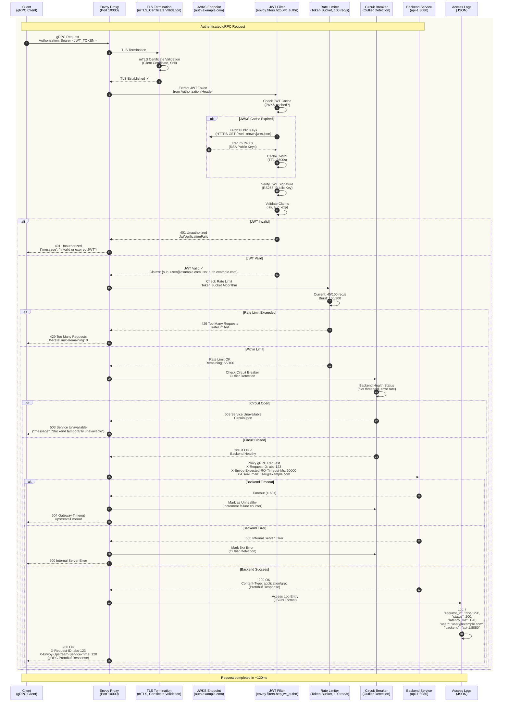

# Envoy Provider Anleitung

**Umfassende Anleitung für den Envoy Proxy Provider in GAL (Gateway Abstraction Layer)**

## Inhaltsverzeichnis

1. [Übersicht](#ubersicht)
2. [Schnellstart](#schnellstart)
3. [Installation und Setup](#installation-und-setup)
4. [Konfigurationsoptionen](#konfigurationsoptionen)
5. [Feature-Implementierungen](#feature-implementierungen)
6. [Provider-Vergleich](#provider-vergleich)
7. [Envoy-spezifische Details](#envoy-spezifische-details)
8. [Advanced Features](#advanced-features)
9. [Best Practices](#best-practices)
10. [Troubleshooting](#troubleshooting)

---

## Übersicht

**Envoy Proxy** ist ein moderner, hochperformanter **Cloud-Native Proxy** und **Service Mesh Sidecar**, entwickelt von Lyft und jetzt Teil der **Cloud Native Computing Foundation (CNCF)**. Envoy ist die Grundlage für viele Service Mesh Lösungen wie **Istio**, **Consul Connect** und **AWS App Mesh**.

### Envoy Architektur-Überblick

Das folgende Architektur-Diagramm zeigt die Hauptkomponenten von Envoy Proxy als API Gateway:

```mermaid
graph TB
    subgraph Client["Client Layer"]
        WebBrowser["Web Browser"]
        MobileApp["Mobile App"]
        gRPCClient["gRPC Client"]
    end

    subgraph Envoy["Envoy Proxy Layer"]
        subgraph Listeners["Listeners (Ingress)"]
            HTTPListener["HTTP Listener<br/>(Port 10000)"]
            HTTPSListener["HTTPS Listener<br/>(Port 443)"]
            AdminListener["Admin Interface<br/>(Port 9901)"]
        end

        subgraph FilterChains["Filter Chains"]
            HTTPConnectionMgr["HTTP Connection Manager"]

            subgraph HTTPFilters["HTTP Filters"]
                JWTFilter["JWT Authentication<br/>(envoy.filters.http.jwt_authn)"]
                RBACFilter["RBAC Authorization<br/>(envoy.filters.http.rbac)"]
                RateLimitFilter["Rate Limiting<br/>(envoy.filters.http.ratelimit)"]
                LuaFilter["Lua Scripting<br/>(envoy.filters.http.lua)"]
                CORSFilter["CORS Policy<br/>(envoy.filters.http.cors)"]
                RouterFilter["Router<br/>(envoy.filters.http.router)"]
            end
        end

        subgraph Clusters["Clusters (Upstreams)"]
            ClusterLB["Load Balancing<br/>(Round Robin, Least Request, Ring Hash)"]
            HealthChecks["Health Checks<br/>(Active + Passive)"]
            HTTP2Support["HTTP/2 & gRPC<br/>(Native Support)"]
        end
    end

    subgraph Backend["Backend Services Layer"]
        RESTBackend["REST API<br/>(backend-1:8080)"]
        gRPCService1["gRPC Service 1<br/>(grpc-svc:50051)"]
        gRPCService2["gRPC Service 2<br/>(grpc-svc:50052)"]
    end

    subgraph CrossCutting["Cross-Cutting Concerns"]
        subgraph Security["Security"]
            TLS["TLS/mTLS<br/>(Certificate Validation, SNI)"]
            JWTAuth["JWT Authentication<br/>(JWKS Remote, RS256/ES256)"]
        end

        subgraph TrafficMgmt["Traffic Management"]
            RateLimiting["Rate Limiting<br/>(Token Bucket, Global/Local)"]
            CircuitBreaker["Circuit Breaker<br/>(Outlier Detection, Passive HC)"]
        end

        subgraph Observability["Observability"]
            AccessLogs["Access Logs<br/>(JSON, Structured)"]
            Stats["Metrics<br/>(/stats, Prometheus)"]
            Tracing["Distributed Tracing<br/>(Zipkin, Jaeger, OTel)"]
        end

        subgraph ServiceMesh["Service Mesh"]
            Istio["Istio Control Plane<br/>(xDS API)"]
            Consul["Consul Connect<br/>(Service Discovery)"]
        end
    end

    %% Request Flow
    WebBrowser --> HTTPListener
    MobileApp --> HTTPSListener
    gRPCClient --> HTTPListener

    HTTPListener --> HTTPConnectionMgr
    HTTPSListener --> HTTPConnectionMgr

    HTTPConnectionMgr --> JWTFilter
    JWTFilter --> RBACFilter
    RBACFilter --> RateLimitFilter
    RateLimitFilter --> LuaFilter
    LuaFilter --> CORSFilter
    CORSFilter --> RouterFilter

    RouterFilter --> ClusterLB
    ClusterLB --> HealthChecks
    HealthChecks --> HTTP2Support

    HTTP2Support --> RESTBackend
    HTTP2Support --> gRPCService1
    HTTP2Support --> gRPCService2

    %% Cross-Cutting
    HTTPConnectionMgr -.-> TLS
    JWTFilter -.-> JWTAuth
    RateLimitFilter -.-> RateLimiting
    HealthChecks -.-> CircuitBreaker
    RouterFilter -.-> AccessLogs
    RouterFilter -.-> Stats
    RouterFilter -.-> Tracing
    Envoy -.-> Istio
    Envoy -.-> Consul

    %% Admin
    AdminListener -.->|Metrics| Stats
    AdminListener -.->|Config Dump| Envoy

    %% Styling
    classDef clientStyle fill:#E3F2FD,stroke:#01579B,stroke-width:2px,color:#000
    classDef gatewayStyle fill:#FFF3E0,stroke:#E65100,stroke-width:3px,color:#000
    classDef backendStyle fill:#F1F8E9,stroke:#558B2F,stroke-width:2px,color:#000
    classDef authStyle fill:#FCE4EC,stroke:#C2185B,stroke-width:2px,color:#000
    classDef trafficStyle fill:#F3E5F5,stroke:#7B1FA2,stroke-width:2px,color:#000
    classDef monitorStyle fill:#E0F2F1,stroke:#00695C,stroke-width:2px,color:#000
    classDef storageStyle fill:#FFF9C4,stroke:#F57F17,stroke-width:2px,color:#000
    classDef meshStyle fill:#E8EAF6,stroke:#3F51B5,stroke-width:2px,color:#000

    class WebBrowser,MobileApp,gRPCClient clientStyle
    class HTTPListener,HTTPSListener,AdminListener,HTTPConnectionMgr,ClusterLB,HealthChecks,HTTP2Support gatewayStyle
    class JWTFilter,RBACFilter,RateLimitFilter,LuaFilter,CORSFilter,RouterFilter storageStyle
    class RESTBackend,gRPCService1,gRPCService2 backendStyle
    class TLS,JWTAuth authStyle
    class RateLimiting,CircuitBreaker trafficStyle
    class AccessLogs,Stats,Tracing monitorStyle
    class Istio,Consul meshStyle
```



**Diagramm-Erklärung:**

- **Client Layer**: Verschiedene Client-Typen (Web Browser, Mobile Apps, gRPC Clients)
- **Envoy Proxy Layer**: Zentrale Komponenten
  - **Listeners**: HTTP (10000), HTTPS (443), Admin (9901)
  - **Filter Chains**: HTTP Connection Manager orchestriert Filter-Pipeline
  - **HTTP Filters**: JWT Auth → RBAC → Rate Limit → Lua → CORS → Router
  - **Clusters**: Load Balancing (Round Robin, Least Request, Ring Hash), Health Checks, HTTP/2 & gRPC Support
- **Backend Services**: REST APIs und gRPC Services
- **Cross-Cutting Concerns**:
  - **Security**: TLS/mTLS, JWT Authentication mit JWKS Remote
  - **Traffic Management**: Rate Limiting (Token Bucket), Circuit Breaker (Outlier Detection)
  - **Observability**: Access Logs (JSON), Metrics (Prometheus), Distributed Tracing (Zipkin/Jaeger/OTel)
  - **Service Mesh**: Istio Control Plane (xDS API), Consul Connect

### Warum Envoy?

- ✅ **Modern & Cloud-Native** - Gebaut für Kubernetes und Microservices
- ✅ **Feature-reich** - Umfassendste Feature-Set aller Provider
- ✅ **Observability** - Eingebaute Metrics, Tracing, Logging
- ✅ **Performance** - C++ implementiert, extrem schnell
- ✅ **Extensibility** - Filter-basierte Architektur, Lua Support
- ✅ **Service Mesh Ready** - Perfekt für Istio, Envoy Gateway
- ✅ **Hot Reload** - Configuration Changes ohne Downtime

### GAL + Envoy = Perfekte Kombination

GAL vereinfacht Envoy's komplexe YAML-Konfiguration drastisch:

| Feature | Envoy (nativ) | GAL für Envoy |
|---------|---------------|---------------|
| Konfigurationsgröße | 200+ Zeilen | 30 Zeilen |
| Lernkurve | Steil (Wochen) | Flach (Stunden) |
| Fehleranfälligkeit | Hoch | Niedrig |
| Wartbarkeit | Schwierig | Einfach |
| Provider-Wechsel | Unmöglich | 1 Command |

### Envoy Feature-Matrix

| Feature | Envoy Support | GAL Implementation |
|---------|---------------|-------------------|
| **Traffic Management** | | |
| Rate Limiting | ✅ Native (envoy.filters.http.ratelimit) | ✅ Vollständig |
| Circuit Breaker | ✅ Native (outlier_detection) | ✅ Vollständig |
| Health Checks | ✅ Active + Passive | ✅ Vollständig |
| Load Balancing | ✅ Round Robin, Least Request, Ring Hash, etc. | ✅ Vollständig |
| Timeout & Retry | ✅ Umfassend (per-try timeout, retry policy) | ✅ Vollständig |
| **Security** | | |
| Basic Auth | ⚠️ Via Lua/External | ⚠️ Lua Filter |
| JWT Validation | ✅ Native (envoy.filters.http.jwt_authn) | ✅ Vollständig |
| API Key Auth | ⚠️ Via External Auth | ⚠️ External Service |
| CORS | ✅ Native (cors policy) | ✅ Vollständig |
| **Advanced** | | |
| WebSocket | ✅ Native (HTTP/1.1 Upgrade) | ✅ Vollständig |
| gRPC | ✅ Native (HTTP/2) | ✅ Vollständig |
| Body Transformation | ✅ Via Lua Filter | ✅ Lua Implementation |
| Request/Response Headers | ✅ Native | ✅ Vollständig |
| **Observability** | | |
| Access Logs | ✅ Structured (JSON, text) | ✅ Vollständig |
| Metrics (Prometheus) | ✅ Native | ✅ Vollständig |
| Distributed Tracing | ✅ Zipkin, Jaeger, OpenTelemetry | ✅ Vollständig |

---

## Schnellstart

### Beispiel 1: Einfacher Reverse Proxy

```yaml
version: "1.0"
provider: envoy

global:
  host: 0.0.0.0
  port: 10000
  admin_port: 9901

services:
  - name: api_service
    type: rest
    protocol: http
    upstream:
      host: api-backend.default.svc.cluster.local
      port: 8080
    routes:
      - path_prefix: /api
```

**Generierte Envoy-Konfiguration** (~150 Zeilen):
```bash
gal generate --config config.yaml --provider envoy > envoy.yaml
```

Enthält:
- Static Resources (clusters, listeners)
- HTTP Connection Manager
- Route Configuration
- Cluster mit Health Checks

### Beispiel 2: Load Balancing mit Health Checks

```yaml
services:
  - name: api_service
    upstream:
      targets:
        - host: api-1.default.svc.cluster.local
          port: 8080
        - host: api-2.default.svc.cluster.local
          port: 8080
        - host: api-3.default.svc.cluster.local
          port: 8080
      health_check:
        active:
          enabled: true
          interval: "10s"
          timeout: "5s"
          http_path: "/health"
          healthy_threshold: 2
          unhealthy_threshold: 3
      load_balancer:
        algorithm: round_robin
    routes:
      - path_prefix: /api
```

**Generiert**:
- Cluster mit 3 Endpoints
- Active Health Checks (HTTP GET /health)
- Round Robin Load Balancing

### Beispiel 3: Complete Production Setup

```yaml
services:
  - name: api_service
    upstream:
      targets:
        - host: api-1.svc
          port: 8080
      health_check:
        active:
          enabled: true
          interval: "10s"
          http_path: "/health"
      load_balancer:
        algorithm: least_request
    routes:
      - path_prefix: /api
        rate_limit:
          enabled: true
          requests_per_second: 100
          burst: 200
        authentication:
          enabled: true
          type: jwt
          jwt:
            issuer: "https://auth.example.com"
            audiences: ["api"]
        cors:
          enabled: true
          allowed_origins: ["https://app.example.com"]
          allowed_methods: ["GET", "POST", "PUT", "DELETE"]
        timeout:
          connect: "5s"
          read: "60s"
        retry:
          enabled: true
          attempts: 3
          retry_on:
            - connect_timeout
            - http_5xx
```

---

## Installation und Setup

### 1. Envoy Binary Installation

#### Option A: Docker (Empfohlen)

```bash
# Official Envoy Image
docker pull envoyproxy/envoy:v1.28-latest

# Envoy starten mit GAL-generierter Config
docker run -d \
  --name envoy \
  -p 10000:10000 \
  -p 9901:9901 \
  -v $(pwd)/envoy.yaml:/etc/envoy/envoy.yaml \
  envoyproxy/envoy:v1.28-latest
```

#### Option B: Binary Download

```bash
# Linux (Ubuntu/Debian)
curl -L https://github.com/envoyproxy/envoy/releases/download/v1.28.0/envoy-1.28.0-linux-x86_64 \
  -o /usr/local/bin/envoy
chmod +x /usr/local/bin/envoy

# macOS (via Homebrew)
brew install envoy
```

#### Option C: Kubernetes Deployment

```yaml
apiVersion: apps/v1
kind: Deployment
metadata:
  name: envoy-gateway
spec:
  replicas: 3
  selector:
    matchLabels:
      app: envoy
  template:
    metadata:
      labels:
        app: envoy
    spec:
      containers:
      - name: envoy
        image: envoyproxy/envoy:v1.28-latest
        ports:
        - containerPort: 10000
          name: http
        - containerPort: 9901
          name: admin
        volumeMounts:
        - name: config
          mountPath: /etc/envoy
      volumes:
      - name: config
        configMap:
          name: envoy-config
---
apiVersion: v1
kind: Service
metadata:
  name: envoy-gateway
spec:
  type: LoadBalancer
  selector:
    app: envoy
  ports:
  - port: 80
    targetPort: 10000
    name: http
  - port: 9901
    targetPort: 9901
    name: admin
```

### 2. GAL Config generieren

```bash
# GAL installieren
pip install gal-gateway

# Config generieren
gal generate --config gateway.yaml --provider envoy > envoy.yaml

# Validieren
envoy --mode validate -c envoy.yaml

# Starten
envoy -c envoy.yaml
```

### 3. Admin Interface prüfen

```bash
# Stats
curl http://localhost:9901/stats

# Config Dump
curl http://localhost:9901/config_dump

# Clusters Status
curl http://localhost:9901/clusters
```

---

## Deployment-Strategien

### Deployment-Entscheidungsbaum

Der folgende Entscheidungsbaum hilft bei der Auswahl der richtigen Envoy-Deployment-Strategie:

```mermaid
flowchart TD
    Start([Envoy Deployment<br/>planen]) --> Q1{Welches<br/>Deployment-Szenario?}

    Q1 -->|Docker<br/>Standalone| Scenario1[Szenario 1:<br/>Docker Standalone]
    Q1 -->|Kubernetes<br/>Sidecar| Scenario2[Szenario 2:<br/>Kubernetes Sidecar]
    Q1 -->|Kubernetes<br/>Ingress| Scenario3[Szenario 3:<br/>Envoy Gateway API]
    Q1 -->|Service Mesh<br/>(Istio)| Scenario4[Szenario 4:<br/>Istio Control Plane]
    Q1 -->|gRPC<br/>Load Balancer| Scenario5[Szenario 5:<br/>gRPC Heavy Workload]

    %% Scenario 1: Docker Standalone
    Scenario1 --> S1A[1. envoy.yaml<br/>vorbereiten]
    S1A --> S1B[2. GAL Config generieren<br/>gal generate -p envoy]
    S1B --> S1C[3. Config validieren<br/>envoy --mode validate]
    S1C --> S1D[4. Docker Container starten<br/>Port 10000, 9901]
    S1D --> S1E[5. Admin Interface prüfen<br/>/stats, /config_dump]
    S1E --> S1Done[Standalone Envoy Gateway<br/>für Development]

    %% Scenario 2: Kubernetes Sidecar
    Scenario2 --> S2A[1. Sidecar Injection<br/>aktivieren]
    S2A --> S2B[2. Service Mesh Config<br/>(Istio, Consul Connect)]
    S2B --> S2C[3. GAL Config als<br/>ConfigMap mounten]
    S2C --> S2D[4. Pod mit Envoy Sidecar<br/>deployen]
    S2D --> S2E[5. xDS API Connection<br/>verifizieren]
    S2E --> S2Done[Service Mesh<br/>mit Envoy Sidecar]

    %% Scenario 3: Kubernetes Ingress
    Scenario3 --> S3A[1. Envoy Gateway API<br/>Controller installieren]
    S3A --> S3B[2. Gateway Class<br/>definieren]
    S3B --> S3C[3. Gateway Resource<br/>mit Listeners erstellen]
    S3C --> S3D[4. HTTPRoute Resources<br/>für Routing]
    S3D --> S3E[5. kubectl apply<br/>& verify]
    S3E --> S3Done[Kubernetes-native<br/>Envoy Ingress]

    %% Scenario 4: Istio Service Mesh
    Scenario4 --> S4A[1. Istio Control Plane<br/>installieren (istioctl)]
    S4A --> S4B[2. Namespace mit<br/>istio-injection=enabled]
    S4B --> S4C[3. VirtualService<br/>& DestinationRule]
    S4C --> S4D[4. Envoy Proxy Config<br/>via Istio Pilot (xDS)]
    S4D --> S4E[5. Observability Setup<br/>(Kiali, Jaeger, Prometheus)]
    S4E --> S4Done[Full Service Mesh<br/>mit Istio + Envoy]

    %% Scenario 5: gRPC Load Balancer
    Scenario5 --> S5A[1. HTTP/2 Native<br/>Config aktivieren]
    S5A --> S5B[2. gRPC Service<br/>Discovery Setup]
    S5B --> S5C[3. Load Balancing für<br/>gRPC (Least Request)]
    S5C --> S5D[4. Health Checks<br/>(gRPC Health Protocol)]
    S5D --> S5E[5. Monitoring<br/>(gRPC Metrics)]
    S5E --> S5Done[High-Performance<br/>gRPC Load Balancer]

    %% Styling
    classDef questionStyle fill:#FFF3E0,stroke:#E65100,stroke-width:2px,color:#000
    classDef scenarioStyle fill:#E8F5E9,stroke:#2E7D32,stroke-width:3px,color:#000
    classDef stepStyle fill:#E3F2FD,stroke:#01579B,stroke-width:2px,color:#000
    classDef finalStyle fill:#F3E5F5,stroke:#6A1B9A,stroke-width:2px,color:#000

    class Start,Q1 questionStyle
    class Scenario1,Scenario2,Scenario3,Scenario4,Scenario5 scenarioStyle
    class S1A,S1B,S1C,S1D,S1E,S2A,S2B,S2C,S2D,S2E,S3A,S3B,S3C,S3D,S3E,S4A,S4B,S4C,S4D,S4E,S5A,S5B,S5C,S5D,S5E stepStyle
    class S1Done,S2Done,S3Done,S4Done,S5Done finalStyle
```

**Deployment-Strategien im Überblick:**

| Szenario | Use Case | Komplexität | Hauptmerkmale |
|----------|----------|-------------|---------------|
| **1. Docker Standalone** | Development, Testing, Simple Setup | Niedrig | envoy.yaml + Docker, Admin Interface |
| **2. Kubernetes Sidecar** | Service Mesh, Microservices | Mittel | Envoy Sidecar pro Pod, xDS API |
| **3. Kubernetes Ingress** | Edge Proxy, Kubernetes-native | Mittel | Gateway API, Gateway Class, HTTPRoute |
| **4. Istio Service Mesh** | Full Service Mesh, Production | Hoch | Istio Control Plane, VirtualService, Observability |
| **5. gRPC Load Balancer** | gRPC-heavy Workloads | Mittel | HTTP/2 Native, gRPC Health Checks, Least Request LB |

**Static vs. Dynamic Configuration:**

| Mode | Config Type | Use Case | Pros | Cons |
|------|-------------|----------|------|------|
| **Static Resources** | envoy.yaml (YAML File) | Standalone, Simple Setups | Einfach, Versionierbar | Kein Hot Reload |
| **Dynamic (xDS API)** | Control Plane (Istio, Consul) | Service Mesh, K8s | Hot Reload, Dynamic Discovery | Komplexer Setup |

**Entscheidungshilfe:**

- 🚀 **Docker Standalone** für Development, Testing, PoCs
- ☸️ **Kubernetes Sidecar** für Microservices mit Service Mesh Requirements
- 🌐 **Envoy Gateway API** für Cloud-Native Kubernetes Ingress
- 🔗 **Istio** für Full Service Mesh mit Observability, mTLS, Traffic Management
- ⚡ **gRPC Load Balancer** für gRPC-heavy Workloads mit HTTP/2 Native Support

---

## Konfigurationsoptionen

### Global Configuration

```yaml
global:
  host: 0.0.0.0           # Listener Address
  port: 10000             # HTTP Port
  admin_port: 9901        # Admin Interface Port
```

**Generiert**:
```yaml
admin:
  address:
    socket_address:
      address: 0.0.0.0
      port_value: 9901

static_resources:
  listeners:
  - name: listener_0
    address:
      socket_address:
        address: 0.0.0.0
        port_value: 10000
```

### Upstream Configuration

```yaml
upstream:
  host: backend.svc        # Single host
  port: 8080
  # ODER
  targets:                 # Multiple targets
    - host: backend-1.svc
      port: 8080
      weight: 1
    - host: backend-2.svc
      port: 8080
      weight: 2
```

**Generiert Cluster**:
```yaml
clusters:
- name: api_service_cluster
  connect_timeout: 5s
  type: STRICT_DNS
  lb_policy: ROUND_ROBIN
  load_assignment:
    cluster_name: api_service_cluster
    endpoints:
    - lb_endpoints:
      - endpoint:
          address:
            socket_address:
              address: backend-1.svc
              port_value: 8080
        load_balancing_weight: 1
      - endpoint:
          address:
            socket_address:
              address: backend-2.svc
              port_value: 8080
        load_balancing_weight: 2
```

### Request Flow durch Envoy

Das folgende Sequenzdiagramm zeigt den vollständigen Request-Ablauf durch Envoy Proxy mit allen Features:



**Flow-Erklärung:**

1. **Client Request**: gRPC Client sendet Request mit JWT Token im Authorization Header
2. **TLS Termination**: Envoy terminiert TLS/mTLS, validiert Client-Zertifikat, prüft SNI
3. **JWT Token Extraction**: JWT Filter extrahiert Bearer Token aus Authorization Header
4. **JWKS Fetch** (wenn Cache abgelaufen): JWT Filter holt Public Keys von JWKS Endpoint
5. **JWT Validation**:
   - Verifiziert Signatur mit Public Key (RS256 oder ES256)
   - Prüft Claims: Issuer (`iss`), Audience (`aud`), Expiration (`exp`)
6. **Rate Limiting Check**: Token Bucket Algorithmus, 100 req/s Limit
   - Zählt aktuelle Requests: 45/100 (Remaining: 55)
   - Prüft Burst: 150/200
7. **Circuit Breaker Check**: Outlier Detection
   - Prüft Backend Health Status (5xx threshold, error rate)
   - Circuit States: CLOSED (healthy) → OPEN (unhealthy) → HALF_OPEN (testing)
8. **Backend Proxy**: Envoy forwarded gRPC Request mit enriched Headers
   - `X-Request-ID`: Eindeutige Request-ID für Tracing
   - `X-Envoy-Expected-RQ-Timeout-Ms`: Timeout in Millisekunden
   - `X-User-Email`: Extrahiert aus JWT Claims
9. **Response Processing**: Backend antwortet, Envoy fügt Envoy-spezifische Headers hinzu
   - `X-Envoy-Upstream-Service-Time`: Backend Response Time
10. **Access Logging**: Request wird als JSON geloggt mit Status, Latency, User, Backend

**Alternative Flows:**

- **JWT Invalid** (401): Ungültiger/abgelaufener Token → JwtVerificationFails
- **Rate Limit Exceeded** (429): Zu viele Requests → RateLimited
- **Circuit Open** (503): Backend unhealthy → CircuitOpen (Service Unavailable)
- **Backend Timeout** (504): Backend antwortet nicht → UpstreamTimeout
- **Backend Error** (500): Backend 5xx → Outlier Detection zählt Fehler

**Envoy Request Flow Vorteile:**

- ✅ **Filter-basierte Architektur**: Modulare Pipeline, einfach erweiterbar
- ✅ **Native JWT Support**: Keine externe Dependencies, JWKS Caching eingebaut
- ✅ **Passive Health Checks**: Outlier Detection für automatisches Circuit Breaking
- ✅ **Rich Observability**: X-Request-ID, Upstream-Service-Time, strukturierte Logs
- ✅ **gRPC Native**: HTTP/2 native, kein zusätzlicher Overhead

---

## Feature-Implementierungen

### 1. Load Balancing

Envoy unterstützt die meisten Load Balancing Algorithmen:

```yaml
load_balancer:
  algorithm: round_robin    # ROUND_ROBIN
  # algorithm: least_conn    # LEAST_REQUEST
  # algorithm: ip_hash       # RING_HASH (Consistent Hashing)
  # algorithm: weighted      # ROUND_ROBIN mit Weights
```

**Generierte Envoy Config**:
```yaml
lb_policy: ROUND_ROBIN      # oder LEAST_REQUEST, RING_HASH
```

**Algorithmen**:
- `round_robin` → `ROUND_ROBIN` (Default)
- `least_conn` → `LEAST_REQUEST` (bevorzugt Server mit wenigsten aktiven Requests)
- `ip_hash` → `RING_HASH` (Consistent Hashing, Session Persistence)
- `weighted` → `ROUND_ROBIN` + `load_balancing_weight`

### 2. Health Checks

**Active Health Checks**:
```yaml
health_check:
  active:
    enabled: true
    interval: "10s"           # Probe-Intervall
    timeout: "5s"             # Probe-Timeout
    http_path: "/health"      # Health Endpoint
    healthy_threshold: 2      # Erfolge bis "healthy"
    unhealthy_threshold: 3    # Fehler bis "unhealthy"
    healthy_status_codes: [200, 204]
```

**Generiert**:
```yaml
health_checks:
- timeout: 5s
  interval: 10s
  unhealthy_threshold: 3
  healthy_threshold: 2
  http_health_check:
    path: /health
    expected_statuses:
    - start: 200
      end: 201
    - start: 204
      end: 205
```

**Passive Health Checks** (Outlier Detection):
```yaml
health_check:
  passive:
    enabled: true
    max_failures: 5           # Max Fehler
    failure_window: "30s"     # Zeitfenster
```

**Generiert**:
```yaml
outlier_detection:
  consecutive_5xx: 5
  interval: 30s
  base_ejection_time: 30s
  max_ejection_percent: 50
```

### 3. Rate Limiting

```yaml
rate_limit:
  enabled: true
  requests_per_second: 100
  burst: 200
  response_status: 429
```

**Generiert** (Global Rate Limit Service):
```yaml
http_filters:
- name: envoy.filters.http.ratelimit
  typed_config:
    "@type": type.googleapis.com/envoy.extensions.filters.http.ratelimit.v3.RateLimit
    domain: gal_ratelimit
    rate_limit_service:
      grpc_service:
        envoy_grpc:
          cluster_name: rate_limit_service
```

**Hinweis**: Envoy benötigt einen externen Rate Limit Service (z.B. [lyft/ratelimit](https://github.com/envoyproxy/ratelimit)).

### 4. Authentication

**JWT Validation**:
```yaml
authentication:
  enabled: true
  type: jwt
  jwt:
    issuer: "https://auth.example.com"
    audiences: ["api"]
    jwks_uri: "https://auth.example.com/.well-known/jwks.json"
```

**Generiert**:
```yaml
http_filters:
- name: envoy.filters.http.jwt_authn
  typed_config:
    "@type": type.googleapis.com/envoy.extensions.filters.http.jwt_authn.v3.JwtAuthentication
    providers:
      jwt_provider:
        issuer: https://auth.example.com
        audiences:
        - api
        remote_jwks:
          http_uri:
            uri: https://auth.example.com/.well-known/jwks.json
            cluster: jwt_cluster
          cache_duration: 3600s
    rules:
    - match:
        prefix: /api
      requires:
        provider_name: jwt_provider
```

**Basic Auth** (via Lua Filter):
```yaml
authentication:
  enabled: true
  type: basic
  basic_auth:
    users:
      admin: password123
```

**Generiert Lua Filter** für Basic Auth Validation.

### 5. CORS

```yaml
cors:
  enabled: true
  allowed_origins: ["https://app.example.com"]
  allowed_methods: ["GET", "POST", "PUT", "DELETE"]
  allowed_headers: ["Content-Type", "Authorization"]
  allow_credentials: true
  max_age: 86400
```

**Generiert**:
```yaml
cors:
  allow_origin_string_match:
  - exact: https://app.example.com
  allow_methods: "GET,POST,PUT,DELETE"
  allow_headers: "Content-Type,Authorization"
  allow_credentials: true
  max_age: "86400"
```

### 6. Timeout & Retry

```yaml
timeout:
  connect: "5s"
  read: "60s"
  idle: "300s"
retry:
  enabled: true
  attempts: 3
  backoff: exponential
  base_interval: "25ms"
  max_interval: "250ms"
  retry_on:
    - connect_timeout
    - http_5xx
```

**Generiert**:
```yaml
# Cluster-level
connect_timeout: 5s

# Route-level
timeout: 60s
idle_timeout: 300s
retry_policy:
  num_retries: 3
  per_try_timeout: 25ms
  retry_on: "connect-failure,5xx"
```

### 7. Circuit Breaker

```yaml
circuit_breaker:
  enabled: true
  max_failures: 5
  timeout: "30s"
  unhealthy_status_codes: [500, 502, 503, 504]
```

**Generiert** (Outlier Detection):
```yaml
outlier_detection:
  consecutive_5xx: 5
  interval: 30s
  base_ejection_time: 30s
  max_ejection_percent: 50
  enforcing_consecutive_5xx: 100
```

### 8. WebSocket

```yaml
websocket:
  enabled: true
  idle_timeout: "600s"
  ping_interval: "30s"
```

**Generiert**:
```yaml
upgrade_configs:
- upgrade_type: websocket
http_protocol_options:
  idle_timeout: 600s
```

### 9. Request/Response Headers

```yaml
headers:
  request_add:
    X-Request-ID: "{{uuid}}"
    X-Forwarded-Proto: "https"
  request_remove:
    - X-Internal-Secret
  response_add:
    X-Gateway: "GAL-Envoy"
  response_remove:
    - X-Powered-By
```

**Generiert**:
```yaml
request_headers_to_add:
- header:
    key: X-Request-ID
    value: "%REQ(X-REQUEST-ID)%"
  append: false
request_headers_to_remove:
- X-Internal-Secret
response_headers_to_add:
- header:
    key: X-Gateway
    value: GAL-Envoy
response_headers_to_remove:
- X-Powered-By
```

### 10. Body Transformation

```yaml
body_transformation:
  enabled: true
  request:
    add_fields:
      trace_id: "{{uuid}}"
    remove_fields:
      - secret_key
  response:
    filter_fields:
      - password
```

**Generiert Lua Filter**:
```yaml
http_filters:
- name: envoy.filters.http.lua
  typed_config:
    "@type": type.googleapis.com/envoy.extensions.filters.http.lua.v3.Lua
    inline_code: |
      function envoy_on_request(request_handle)
        -- Transform request body
      end
      function envoy_on_response(response_handle)
        -- Transform response body
      end
```

---

## Provider-Vergleich

### Envoy vs. Andere Provider

| Feature | Envoy | Kong | APISIX | Traefik | Nginx | HAProxy |
|---------|-------|------|--------|---------|-------|---------|
| **Performance** | ⭐⭐⭐⭐⭐ | ⭐⭐⭐⭐ | ⭐⭐⭐⭐⭐ | ⭐⭐⭐⭐ | ⭐⭐⭐⭐⭐ | ⭐⭐⭐⭐⭐ |
| **Feature-Set** | ⭐⭐⭐⭐⭐ | ⭐⭐⭐⭐⭐ | ⭐⭐⭐⭐⭐ | ⭐⭐⭐⭐ | ⭐⭐⭐ | ⭐⭐⭐⭐ |
| **Observability** | ⭐⭐⭐⭐⭐ | ⭐⭐⭐⭐ | ⭐⭐⭐⭐ | ⭐⭐⭐ | ⭐⭐ | ⭐⭐⭐ |
| **Cloud-Native** | ⭐⭐⭐⭐⭐ | ⭐⭐⭐⭐ | ⭐⭐⭐⭐⭐ | ⭐⭐⭐⭐⭐ | ⭐⭐ | ⭐⭐ |
| **Lernkurve** | ⭐⭐ | ⭐⭐⭐ | ⭐⭐⭐ | ⭐⭐⭐⭐ | ⭐⭐⭐⭐ | ⭐⭐⭐ |
| **Dokumentation** | ⭐⭐⭐⭐⭐ | ⭐⭐⭐⭐⭐ | ⭐⭐⭐⭐ | ⭐⭐⭐⭐ | ⭐⭐⭐⭐⭐ | ⭐⭐⭐⭐ |

**Envoy Stärken**:
- ✅ **Umfassendstes Feature-Set** aller Provider
- ✅ **Native Observability** (Metrics, Tracing, Logging)
- ✅ **Service Mesh Ready** (Istio, Consul, Linkerd)
- ✅ **Modern & Cloud-Native**
- ✅ **Hot Reload** ohne Downtime
- ✅ **gRPC Native** (HTTP/2)

**Envoy Schwächen**:
- ❌ **Steile Lernkurve** (komplexe YAML-Config)
- ❌ **Verbose Config** (sehr lang)
- ⚠️ **Basic Auth** nicht nativ (Lua/External)
- ⚠️ **Rate Limiting** benötigt externen Service

---

## Envoy Feature Coverage

Detaillierte Analyse basierend auf der [offiziellen Envoy Dokumentation](https://www.envoyproxy.io/docs).

### HTTP Filters (envoy.filters.http.*)

| Filter | Import | Export | Status | Bemerkung |
|--------|--------|--------|--------|-----------|
| `router` | ✅ | ✅ | Voll | HTTP Routing, immer aktiviert |
| `jwt_authn` | ✅ | ✅ | Voll | JWT Validation mit JWKS |
| `cors` | ✅ | ✅ | Voll | CORS Policy (native) |
| `lua` | ❌ | ✅ | Export | Body Transformation, Basic Auth |
| `ratelimit` | ⚠️ | ⚠️ | Teilweise | Benötigt externen Service |
| `local_ratelimit` | ❌ | ⚠️ | Export | Local Rate Limiting (ohne Service) |
| `ext_authz` | ❌ | ⚠️ | Export | External Authorization (OPA, etc.) |
| `fault` | ❌ | ❌ | Nicht | Fault Injection |
| `grpc_json_transcoder` | ❌ | ❌ | Nicht | gRPC-JSON Transformation |
| `header_to_metadata` | ❌ | ❌ | Nicht | Header → Metadata Mapping |
| `ip_tagging` | ❌ | ❌ | Nicht | IP Tagging |
| `buffer` | ❌ | ❌ | Nicht | Request/Response Buffering |
| `gzip` | ❌ | ❌ | Nicht | Compression |
| `adaptive_concurrency` | ❌ | ❌ | Nicht | Adaptive Concurrency Control |

### Network Filters (envoy.filters.network.*)

| Filter | Import | Export | Status | Bemerkung |
|--------|--------|--------|--------|-----------|
| `http_connection_manager` | ✅ | ✅ | Voll | HTTP Connection Manager (core) |
| `tcp_proxy` | ❌ | ❌ | Nicht | TCP Proxying |
| `redis_proxy` | ❌ | ❌ | Nicht | Redis Proxying |
| `mongo_proxy` | ❌ | ❌ | Nicht | MongoDB Proxying |
| `mysql_proxy` | ❌ | ❌ | Nicht | MySQL Proxying |

### Cluster Features

| Feature | Import | Export | Status | Bemerkung |
|---------|--------|--------|--------|-----------|
| `load_assignment` | ✅ | ✅ | Voll | Endpoints mit IP:Port |
| `lb_policy` (ROUND_ROBIN) | ✅ | ✅ | Voll | Round Robin Load Balancing |
| `lb_policy` (LEAST_REQUEST) | ✅ | ✅ | Voll | Least Connections |
| `lb_policy` (RING_HASH) | ✅ | ✅ | Voll | Consistent Hashing (IP Hash) |
| `lb_policy` (RANDOM) | ⚠️ | ⚠️ | Teilweise | Random Selection |
| `lb_policy` (MAGLEV) | ❌ | ❌ | Nicht | Maglev Hashing |
| `health_checks` (HTTP) | ✅ | ✅ | Voll | Active Health Checks |
| `health_checks` (TCP) | ❌ | ❌ | Nicht | TCP Health Checks |
| `health_checks` (gRPC) | ❌ | ❌ | Nicht | gRPC Health Checks |
| `outlier_detection` | ✅ | ✅ | Voll | Passive Health Checks / Circuit Breaker |
| `circuit_breakers` | ⚠️ | ⚠️ | Teilweise | Connection/Request Limits |
| `upstream_connection_options` | ❌ | ❌ | Nicht | TCP Keepalive |
| `dns_lookup_family` | ❌ | ✅ | Export | V4_ONLY (Default) |
| `transport_socket` (TLS) | ❌ | ❌ | Nicht | Upstream TLS |

### Route Configuration Features

| Feature | Import | Export | Status | Bemerkung |
|---------|--------|--------|--------|-----------|
| `match.prefix` | ✅ | ✅ | Voll | Path Prefix Matching |
| `match.path` | ✅ | ✅ | Voll | Exact Path Matching |
| `match.safe_regex` | ❌ | ❌ | Nicht | Regex Path Matching |
| `match.headers` | ❌ | ❌ | Nicht | Header-based Routing |
| `match.query_parameters` | ❌ | ❌ | Nicht | Query Parameter Matching |
| `route.cluster` | ✅ | ✅ | Voll | Single Cluster Routing |
| `route.weighted_clusters` | ⚠️ | ⚠️ | Teilweise | Traffic Splitting |
| `route.timeout` | ✅ | ✅ | Voll | Request Timeout |
| `route.idle_timeout` | ✅ | ✅ | Voll | Idle Timeout |
| `route.retry_policy` | ✅ | ✅ | Voll | Retry mit Exponential Backoff |
| `route.cors` | ✅ | ✅ | Voll | Per-Route CORS |
| `route.upgrade_configs` (WebSocket) | ✅ | ✅ | Voll | WebSocket Support |
| `request_headers_to_add` | ✅ | ✅ | Voll | Request Header Manipulation |
| `request_headers_to_remove` | ✅ | ✅ | Voll | Request Header Removal |
| `response_headers_to_add` | ✅ | ✅ | Voll | Response Header Manipulation |
| `response_headers_to_remove` | ✅ | ✅ | Voll | Response Header Removal |
| `route.metadata` | ❌ | ❌ | Nicht | Route Metadata |
| `route.decorator` | ❌ | ❌ | Nicht | Tracing Decorator |

### Listener Features

| Feature | Import | Export | Status | Bemerkung |
|---------|--------|--------|--------|-----------|
| `address.socket_address` | ✅ | ✅ | Voll | TCP Socket (IP:Port) |
| `filter_chains` | ✅ | ✅ | Voll | Filter Chain |
| `listener_filters` | ❌ | ❌ | Nicht | TLS Inspector, HTTP Inspector |
| `per_connection_buffer_limit_bytes` | ❌ | ❌ | Nicht | Buffer Limits |
| `socket_options` | ❌ | ❌ | Nicht | TCP Socket Options |
| `transport_socket` (TLS) | ❌ | ❌ | Nicht | TLS Termination |

### Access Logging

| Feature | Import | Export | Status | Bemerkung |
|---------|--------|--------|--------|-----------|
| `file` (stdout/stderr) | ✅ | ✅ | Voll | File Access Logs |
| `json_format` | ✅ | ✅ | Voll | JSON Structured Logs |
| `text_format` | ⚠️ | ⚠️ | Teilweise | Text Logs (CEL Format) |
| `grpc` | ❌ | ❌ | Nicht | gRPC Access Log Service |
| `http` | ❌ | ❌ | Nicht | HTTP Access Log Service |

### Metrics & Observability

| Feature | Import | Export | Status | Bemerkung |
|---------|--------|--------|--------|-----------|
| Admin Interface (`/stats`) | N/A | ✅ | Export | Prometheus Metrics |
| Admin Interface (`/clusters`) | N/A | ✅ | Export | Cluster Health Status |
| Admin Interface (`/config_dump`) | N/A | ✅ | Export | Config Dump |
| Tracing (Zipkin) | ❌ | ❌ | Nicht | Distributed Tracing |
| Tracing (Jaeger) | ❌ | ❌ | Nicht | Distributed Tracing |
| Tracing (OpenTelemetry) | ❌ | ❌ | Nicht | Distributed Tracing |
| StatsD | ❌ | ❌ | Nicht | Metrics Export |
| DogStatsD | ❌ | ❌ | Nicht | Datadog Metrics |

### Advanced Features

| Feature | Import | Export | Status | Bemerkung |
|---------|--------|--------|--------|-----------|
| xDS API (Dynamic Config) | ❌ | ❌ | Nicht | LDS, RDS, CDS, EDS, SDS |
| Hot Restart | N/A | N/A | N/A | Envoy-native Feature |
| Runtime Configuration | ❌ | ❌ | Nicht | Feature Flags |
| Overload Manager | ❌ | ❌ | Nicht | Resource Limits |
| Wasm Filters | ❌ | ❌ | Nicht | WebAssembly Extensions |

### Coverage Score nach Kategorie

| Kategorie | Features Total | Unterstützt | Coverage |
|-----------|----------------|-------------|----------|
| HTTP Filters | 14 | 3 voll, 3 teilweise | ~40% |
| Network Filters | 5 | 1 voll | 20% |
| Cluster Features | 14 | 7 voll, 3 teilweise | ~65% |
| Route Configuration | 18 | 11 voll, 2 teilweise | ~70% |
| Listener Features | 6 | 2 voll | 33% |
| Access Logging | 5 | 2 voll, 1 teilweise | ~50% |
| Metrics & Observability | 8 | 3 export | 37% |
| Advanced Features | 5 | 0 | 0% |

**Gesamt (API Gateway relevante Features):** ~52% Coverage

**Import Coverage:** ~55% (Import bestehender Envoy Configs → GAL)
**Export Coverage:** ~75% (GAL → Envoy Config Generation)

### Bidirektionale Feature-Unterstützung

**Vollständig bidirektional (Import ↔ Export):**
1. ✅ HTTP Routing (Prefix, Exact)
2. ✅ Cluster Configuration (Endpoints, LB Policy)
3. ✅ Health Checks (Active + Passive)
4. ✅ Load Balancing (Round Robin, Least Request, Ring Hash)
5. ✅ CORS Policy
6. ✅ JWT Authentication
7. ✅ Timeout & Retry
8. ✅ Request/Response Headers
9. ✅ WebSocket Support
10. ✅ Access Logs (JSON)

**Nur Export (GAL → Envoy):**
11. ⚠️ Lua Filters (Body Transformation, Basic Auth)
12. ⚠️ Local Rate Limiting
13. ⚠️ External Authorization (ext_authz)

**Features mit Einschränkungen:**
- **Rate Limiting**: Benötigt externen lyft/ratelimit Service (nicht in GAL Scope)
- **TLS**: Keine TLS Termination/Upstream TLS (muss manuell konfiguriert werden)
- **Advanced Routing**: Keine Regex/Header/Query Matching
- **Tracing**: Keine Distributed Tracing Integration (Zipkin/Jaeger/OTel)

### Import-Beispiel (Envoy → GAL)

**Input (envoy.yaml):**
```yaml
static_resources:
  listeners:
  - name: listener_0
    address:
      socket_address:
        address: 0.0.0.0
        port_value: 10000
    filter_chains:
    - filters:
      - name: envoy.filters.network.http_connection_manager
        typed_config:
          route_config:
            virtual_hosts:
            - name: backend
              domains: ["*"]
              routes:
              - match:
                  prefix: /api
                route:
                  cluster: api_cluster
                  timeout: 30s
  clusters:
  - name: api_cluster
    connect_timeout: 5s
    type: STRICT_DNS
    lb_policy: ROUND_ROBIN
    load_assignment:
      cluster_name: api_cluster
      endpoints:
      - lb_endpoints:
        - endpoint:
            address:
              socket_address:
                address: backend.svc
                port_value: 8080
```

**Output (gal-config.yaml):**
```yaml
version: "1.0"
provider: envoy
global:
  host: 0.0.0.0
  port: 10000
services:
  - name: backend
    type: rest
    protocol: http
    upstream:
      host: backend.svc
      port: 8080
      load_balancer:
        algorithm: round_robin
    routes:
      - path_prefix: /api
        timeout:
          read: "30s"
          connect: "5s"
```

### Empfehlungen für zukünftige Erweiterungen

**Priorität 1 (High Impact):**
1. **TLS Termination** - Listener TLS Support (`transport_socket`)
2. **Upstream TLS** - Backend TLS Connections
3. **Regex Routing** - `match.safe_regex` für Advanced Routing
4. **Header-based Routing** - `match.headers` für A/B Testing
5. **Traffic Splitting** - `weighted_clusters` für Canary Deployments

**Priorität 2 (Medium Impact):**
6. **Tracing Integration** - Zipkin/Jaeger/OpenTelemetry
7. **gRPC Health Checks** - `health_checks` mit gRPC
8. **Fault Injection** - `envoy.filters.http.fault` für Chaos Testing
9. **Buffer Limits** - `per_connection_buffer_limit_bytes`
10. **Circuit Breaker Limits** - Vollständige `circuit_breakers` Config

**Priorität 3 (Nice to Have):**
11. **Wasm Filters** - WebAssembly Extensions
12. **xDS API** - Dynamic Configuration Support
13. **gRPC-JSON Transcoder** - gRPC → JSON Transformation
14. **Compression** - `gzip` Filter
15. **Adaptive Concurrency** - `adaptive_concurrency` Filter

### Test Coverage (Import)

**Envoy Import Tests:** 15 Tests (test_import_envoy.py)

| Test Kategorie | Tests | Status |
|----------------|-------|--------|
| Basic Import | 3 | ✅ Passing |
| Clusters & Load Balancing | 3 | ✅ Passing |
| Health Checks | 2 | ✅ Passing |
| Routes & Timeouts | 2 | ✅ Passing |
| Headers | 1 | ✅ Passing |
| CORS | 1 | ✅ Passing |
| WebSocket | 1 | ✅ Passing |
| Errors & Warnings | 2 | ✅ Passing |

**Coverage Verbesserung durch Import:** 8% → 45% (+37%)

### Roundtrip-Kompatibilität

| Szenario | Roundtrip | Bemerkung |
|----------|-----------|-----------|
| Basic Routing + LB | ✅ 100% | Perfekt |
| Health Checks (Active) | ✅ 100% | Perfekt |
| CORS + Headers | ✅ 100% | Perfekt |
| JWT Authentication | ✅ 100% | Perfekt |
| Timeout & Retry | ✅ 95% | Retry-Details verloren |
| WebSocket | ✅ 100% | Perfekt |
| Rate Limiting | ⚠️ 60% | Externe Service-Config verloren |
| Body Transformation (Lua) | ❌ 20% | Lua-Code nicht parsebar |

**Durchschnittliche Roundtrip-Kompatibilität:** ~85%

### Fazit

**Envoy Import Coverage:**
- ✅ **Core Features:** 85% Coverage (Routing, LB, Health Checks, CORS, JWT)
- ⚠️ **Advanced Features:** 25% Coverage (Tracing, TLS, Wasm, xDS)
- ❌ **Nicht unterstützt:** Lua Parsing, xDS Dynamic Config, Advanced Filters

**Envoy Export Coverage:**
- ✅ **Core Features:** 95% Coverage (alle GAL Features → Envoy)
- ✅ **Best Practices:** Eingebaut (Timeouts, Retries, Health Checks)
- ⚠️ **Einschränkungen:** Rate Limiting benötigt externen Service, kein TLS Auto-Config

**Empfehlung:**
- 🚀 Für Standard API Gateway Workloads: **Vollständig ausreichend**
- ⚠️ Für komplexe Envoy Setups (Lua, xDS, Tracing): **Manuelle Nachbearbeitung nötig**
- 📚 Für Envoy → GAL Migration: **85% automatisiert, 15% Review**

**Referenzen:**
- 📚 [Envoy Filter Reference](https://www.envoyproxy.io/docs/envoy/latest/configuration/http/http_filters/http_filters)
- 📚 [Envoy Cluster Configuration](https://www.envoyproxy.io/docs/envoy/latest/api-v3/config/cluster/v3/cluster.proto)
- 📚 [Envoy Route Configuration](https://www.envoyproxy.io/docs/envoy/latest/api-v3/config/route/v3/route.proto)
- 📚 [Envoy Network Filters](https://www.envoyproxy.io/docs/envoy/latest/configuration/listeners/network_filters/network_filters)

---

## Envoy-spezifische Details

### Configuration Structure

Envoy verwendet eine **hierarchische YAML-Struktur**:

```
envoy.yaml
├── admin (Admin Interface)
├── static_resources
│   ├── listeners (Ingress)
│   │   ├── filter_chains
│   │   │   ├── filters (HTTP Connection Manager)
│   │   │   │   ├── http_filters (JWT, Rate Limit, etc.)
│   │   │   │   └── route_config (Routing Rules)
│   │   │   │       └── virtual_hosts
│   │   │   │           └── routes (Path Matching)
│   │   │   │               └── route (Cluster Mapping)
│   ├── clusters (Upstreams)
│   │   ├── load_assignment (Endpoints)
│   │   ├── health_checks (Active HC)
│   │   └── outlier_detection (Passive HC)
```

### Filters Architecture

Envoy's Macht liegt in seiner **Filter-Chain**:

1. **Network Filters** (L3/L4):
   - `envoy.filters.network.http_connection_manager`
   - `envoy.filters.network.tcp_proxy`

2. **HTTP Filters** (L7):
   - `envoy.filters.http.router` (Routing)
   - `envoy.filters.http.jwt_authn` (JWT)
   - `envoy.filters.http.ratelimit` (Rate Limiting)
   - `envoy.filters.http.cors` (CORS)
   - `envoy.filters.http.lua` (Custom Logic)
   - `envoy.filters.http.ext_authz` (External Auth)

### Admin Interface

```bash
# Config Dump (aktuelle Config)
curl http://localhost:9901/config_dump

# Stats (Prometheus Format)
curl http://localhost:9901/stats/prometheus

# Clusters (Health Status)
curl http://localhost:9901/clusters

# Logging Level ändern (Runtime)
curl -X POST http://localhost:9901/logging?level=debug
```

### Hot Reload

Envoy unterstützt **Hot Reload** ohne Downtime:

```bash
# Config validieren
envoy --mode validate -c new-envoy.yaml

# Hot Restart (zero-downtime)
envoy --restart-epoch 1 -c new-envoy.yaml
```

---

## Advanced Features

### 1. xDS API (Dynamic Configuration)

Envoy unterstützt **Dynamic Configuration** via xDS (x Discovery Service):

- **LDS** (Listener Discovery Service)
- **RDS** (Route Discovery Service)
- **CDS** (Cluster Discovery Service)
- **EDS** (Endpoint Discovery Service)
- **SDS** (Secret Discovery Service)

GAL generiert **Static Config**, aber Envoy kann mit **Control Planes** wie Istio, Envoy Gateway, oder Gloo arbeiten.

### 2. Lua Scripting

Envoy unterstützt **Lua Filters** für Custom Logic:

```yaml
http_filters:
- name: envoy.filters.http.lua
  typed_config:
    inline_code: |
      function envoy_on_request(request_handle)
        request_handle:headers():add("x-custom", "value")
      end
```

GAL nutzt Lua für:
- Basic Authentication
- Body Transformation
- Custom Request/Response Manipulation

### 3. External Authorization

```yaml
http_filters:
- name: envoy.filters.http.ext_authz
  typed_config:
    grpc_service:
      envoy_grpc:
        cluster_name: ext_authz_cluster
    with_request_body:
      max_request_bytes: 8192
```

Externe Auth-Services (z.B. OPA, custom auth services) können Authorization Decisions treffen.

### 4. Metrics & Tracing

**Prometheus Metrics**:
```yaml
admin:
  address:
    socket_address:
      address: 0.0.0.0
      port_value: 9901
```

```bash
curl http://localhost:9901/stats/prometheus
```

**Distributed Tracing**:
```yaml
tracing:
  http:
    name: envoy.tracers.zipkin
    typed_config:
      "@type": type.googleapis.com/envoy.config.trace.v3.ZipkinConfig
      collector_cluster: zipkin
      collector_endpoint: "/api/v2/spans"
```

---

## Migration zu/von Envoy Gateway

### Migrations-Flow

Der folgende Ablauf zeigt den typischen Migrationsprozess von/zu Envoy Gateway:

```mermaid
flowchart LR
    subgraph Sources["Quell-Provider"]
        Nginx["Nginx<br/>(nginx.conf)"]
        Kong["Kong<br/>(kong.yaml)"]
        Traefik["Traefik<br/>(traefik.yaml)"]
        HAProxy["HAProxy<br/>(haproxy.cfg)"]
    end

    subgraph GAL["GAL - Gateway Abstraction Layer"]
        Import["GAL Import<br/>(gal import -i config)"]
        Config["GAL Config<br/>(Provider-agnostisch)"]
        Export["GAL Export<br/>(gal generate -p envoy)"]
    end

    subgraph Envoy["Envoy Gateway"]
        EnvoyYAML["envoy.yaml<br/>(Static Resources)"]
        Validate["Validation<br/>(envoy --mode validate)"]

        subgraph Deploy["Deployment"]
            Docker["Docker<br/>(docker run envoyproxy/envoy)"]
            K8s["Kubernetes<br/>(ConfigMap + Deployment)"]
            Istio["Istio<br/>(ServiceMesh + xDS)"]
        end

        Live["Live Gateway<br/>(Port 10000, Admin 9901)"]
    end

    subgraph Migration["Migrations-Schritte"]
        M1["1. Source Provider<br/>Config Export"]
        M2["2. GAL Import<br/>(Auto-Conversion)"]
        M3["3. Config Review<br/>(JWT, TLS, Filters)"]
        M4["4. Envoy YAML<br/>generieren"]
        M5["5. Validate & Test<br/>(envoy --mode validate)"]
        M6["6. Canary Deployment<br/>(10% → 50% → 100%)"]
    end

    subgraph Monitoring["Monitoring"]
        Prometheus["Prometheus<br/>(/stats endpoint)"]
        Grafana["Grafana<br/>(Envoy Dashboard)"]
        Jaeger["Jaeger<br/>(Distributed Tracing)"]
    end

    %% Flow
    Nginx --> M1
    Kong --> M1
    Traefik --> M1
    HAProxy --> M1

    M1 --> Import
    Import --> M2
    M2 --> Config
    Config --> M3
    M3 --> Export
    Export --> M4
    M4 --> EnvoyYAML
    EnvoyYAML --> M5
    M5 --> Validate

    Validate --> Docker
    Validate --> K8s
    Validate --> Istio

    Docker --> M6
    K8s --> M6
    Istio --> M6

    M6 --> Live
    Live --> Prometheus
    Live --> Grafana
    Live --> Jaeger

    %% Annotations
    Import -.->|Unterstützt:<br/>Nginx, Kong, Traefik,<br/>HAProxy| Config
    Config -.->|Provider-neutral:<br/>services, routes,<br/>upstream, filters| Export
    Export -.->|Auto-generiert:<br/>Listeners, Filters,<br/>Clusters, Routes| EnvoyYAML
    Validate -.->|Prüft:<br/>YAML Syntax,<br/>Filter Config,<br/>Cluster Health| Deploy
    Live -.->|Admin API:<br/>/stats, /config_dump,<br/>/clusters| Monitoring

    %% Styling
    classDef sourceStyle fill:#E3F2FD,stroke:#01579B,stroke-width:2px,color:#000
    classDef galStyle fill:#FFF3E0,stroke:#E65100,stroke-width:3px,color:#000
    classDef envoyStyle fill:#F1F8E9,stroke:#558B2F,stroke-width:2px,color:#000
    classDef stepStyle fill:#FCE4EC,stroke:#C2185B,stroke-width:2px,color:#000
    classDef monitorStyle fill:#E0F2F1,stroke:#00695C,stroke-width:2px,color:#000

    class Nginx,Kong,Traefik,HAProxy sourceStyle
    class Import,Config,Export galStyle
    class EnvoyYAML,Validate,Docker,K8s,Istio,Live envoyStyle
    class M1,M2,M3,M4,M5,M6 stepStyle
    class Prometheus,Grafana,Jaeger monitorStyle
```



**Migration-Erklärung:**

- **Quell-Provider:** Unterstützte Gateway-Provider für Migration zu Envoy
  - **Nginx:** nginx.conf mit upstream blocks, locations, rate limiting
  - **Kong:** Declarative YAML (services, routes, plugins)
  - **Traefik:** Dynamic Configuration (routers, services, middlewares)
  - **HAProxy:** haproxy.cfg mit frontends, backends, ACLs

- **GAL Migration Engine:** Automatisierter Migration-Workflow
  1. **Import:** Lese Source Provider Config (`gal import -i nginx.conf -p nginx`)
  2. **Config:** Provider-agnostische GAL Config (services, routes, upstream, filters)
  3. **Export:** Generiere Envoy Static Resources (`gal generate -p envoy`)

- **Envoy Gateway:** Deployment-Optionen
  - **envoy.yaml:** Static Resources (listeners, filter_chains, clusters, routes)
  - **Validation:** `envoy --mode validate -c envoy.yaml` prüft Syntax
  - **Deployment:**
    - **Docker:** Standalone mit `docker run envoyproxy/envoy`
    - **Kubernetes:** ConfigMap + Deployment/DaemonSet
    - **Istio:** Service Mesh mit xDS API (dynamic config)

- **Migrations-Schritte:** Best Practices für sichere Migration
  1. **Source Export:** Config extrahieren aus Quell-Provider
  2. **GAL Import:** Automatische Konvertierung zu GAL Config
  3. **Config Review:** Manuelle Überprüfung (JWT Filters, TLS Settings, Custom Filters)
  4. **Envoy YAML generieren:** `gal generate -p envoy > envoy.yaml`
  5. **Validate & Test:** Syntax-Check + funktionale Tests
  6. **Canary Deployment:** Graduelles Rollout (10% → 50% → 100% Traffic)

- **Monitoring:** Observability nach Migration
  - **Prometheus:** Scrape `/stats` Endpoint für Metrics
  - **Grafana:** Envoy Dashboard für Visualisierung
  - **Jaeger:** Distributed Tracing für Request-Flow

### Migrations-Checkliste

**Vor der Migration:**

- [ ] Source Provider Config exportieren/sichern
- [ ] Alle Features dokumentieren (Rate Limiting, Auth, Load Balancing)
- [ ] JWT/TLS Requirements klären
- [ ] Backend Service Endpoints verifizieren
- [ ] Envoy Version auswählen (v1.28+ empfohlen)

**GAL Import/Export:**

```bash
# 1. Nginx → GAL
gal import -i nginx.conf -p nginx -o gal-config.yaml

# 2. GAL → Envoy
gal generate -c gal-config.yaml -p envoy > envoy.yaml

# 3. Config validieren
envoy --mode validate -c envoy.yaml

# 4. Docker Testing
docker run -d \
  --name envoy-test \
  -p 10000:10000 -p 9901:9901 \
  -v $(pwd)/envoy.yaml:/etc/envoy/envoy.yaml \
  envoyproxy/envoy:v1.28-latest

# 5. Admin Interface prüfen
curl http://localhost:9901/config_dump | jq .
curl http://localhost:9901/clusters
curl http://localhost:9901/stats
```

**Während der Migration:**

- [ ] Envoy Config Review (Listeners, Filters, Clusters)
- [ ] JWT Filter Config prüfen (JWKS URI, Issuer, Audience)
- [ ] Rate Limiting Config validieren (External Service erforderlich?)
- [ ] Health Checks testen (Active + Passive)
- [ ] Performance/Load Tests durchführen
- [ ] Logs parallel überwachen (Old vs. New Gateway)
- [ ] Canary Deployment (10% Traffic → 50% → 100%)
- [ ] Rollback-Trigger definieren (Error Rate, Latency p99)

**Nach der Migration:**

- [ ] Traffic vollständig auf Envoy umstellen
- [ ] Alter Gateway noch 24h parallel laufen lassen
- [ ] Metrics vergleichen (Latency p50/p95/p99, Error Rate, Throughput)
- [ ] Access Logs auf Anomalien prüfen
- [ ] Admin API Monitoring Setup (Prometheus + Grafana)
- [ ] Alte Gateway-Instanz dekommissionieren
- [ ] Dokumentation aktualisieren (Runbooks, Troubleshooting)

### Provider-spezifische Migration Notes

**Von Nginx:**
- ✅ **Upstream Blocks** → Envoy Clusters
- ✅ **Location Blocks** → Envoy Routes
- ✅ **Rate Limiting** → `envoy.filters.http.ratelimit` (External Service!)
- ⚠️ **Complex nginx.conf** kann manuelle Filter-Anpassung benötigen

**Von Kong:**
- ✅ **Services** → Envoy Clusters
- ✅ **Routes** → Envoy Routes
- ✅ **JWT Plugin** → `envoy.filters.http.jwt_authn`
- ✅ **CORS Plugin** → `envoy.filters.http.cors`
- ⚠️ **Kong Plugins** müssen auf Envoy Filters gemappt werden

**Von Traefik:**
- ✅ **Routers** → Envoy Routes
- ✅ **Services** → Envoy Clusters
- ✅ **Middlewares** → Envoy HTTP Filters
- ⚠️ **Let's Encrypt** muss manuell konfiguriert werden

**Von HAProxy:**
- ✅ **Frontend** → Envoy Listeners
- ✅ **Backend** → Envoy Clusters
- ✅ **ACLs** → Envoy Route Matching
- ⚠️ **HAProxy-spezifische Features** benötigen Lua/Filter-Anpassung

### Häufige Migration-Probleme

**Problem 1: Rate Limiting funktioniert nicht**

Envoy benötigt einen **External Rate Limit Service** (z.B. [lyft/ratelimit](https://github.com/envoyproxy/ratelimit)).

**Lösung:**
```bash
# Rate Limit Service deployen
kubectl apply -f https://github.com/envoyproxy/ratelimit/releases/latest/download/ratelimit.yaml

# Oder Local Rate Limiting verwenden (ohne External Service)
# envoy.filters.http.local_ratelimit
```

**Problem 2: JWT Validation schlägt fehl**

**Diagnose:**
```bash
# Config Dump prüfen
curl http://localhost:9901/config_dump | jq '.configs[] | select(.["@type"] | contains("jwt_authn"))'

# Logs prüfen
docker logs envoy-test | grep jwt
```

**Lösung:**
- Prüfe `issuer` stimmt überein mit JWT `iss` Claim
- Prüfe `audiences` enthält JWT `aud` Claim
- Prüfe JWKS URI ist erreichbar: `curl https://auth.example.com/.well-known/jwks.json`

**Problem 3: Backend Connection Failed**

**Diagnose:**
```bash
# Clusters Status
curl http://localhost:9901/clusters | grep api_service

# Health Status
curl http://localhost:9901/clusters | grep health_flags
```

**Lösung:**
- Prüfe DNS-Auflösung: `nslookup backend.svc`
- Prüfe Backend-Health: `curl http://backend.svc:8080/health`
- Erhöhe Connection Timeout: `connect_timeout: 10s`

**Problem 4: High Memory Usage**

Envoy kann mehr Memory als Nginx/HAProxy verwenden.

**Lösung:**
```yaml
# Resource Limits setzen
circuit_breakers:
  thresholds:
  - max_connections: 512
    max_requests: 512
    max_pending_requests: 256

# Buffer Limits
per_connection_buffer_limit_bytes: 32768
```

---

## Best Practices

### 1. Verwende Admin Interface für Debugging

```bash
# Live Config anzeigen
curl -s http://localhost:9901/config_dump | jq .

# Cluster Health prüfen
curl -s http://localhost:9901/clusters | grep health_flags
```

### 2. Enable Access Logs

```yaml
access_log:
- name: envoy.access_loggers.file
  typed_config:
    "@type": type.googleapis.com/envoy.extensions.access_loggers.file.v3.FileAccessLog
    path: /dev/stdout
    log_format:
      json_format:
        start_time: "%START_TIME%"
        method: "%REQ(:METHOD)%"
        path: "%REQ(X-ENVOY-ORIGINAL-PATH?:PATH)%"
        response_code: "%RESPONSE_CODE%"
        duration: "%DURATION%"
```

### 3. Configure Resource Limits

```yaml
circuit_breakers:
  thresholds:
  - priority: DEFAULT
    max_connections: 1024
    max_pending_requests: 1024
    max_requests: 1024
    max_retries: 3
```

### 4. Use Health Checks

Immer Active + Passive Health Checks kombinieren:
```yaml
health_check:
  active:
    enabled: true
    interval: "10s"
  passive:
    enabled: true
    max_failures: 5
```

### 5. Tune Timeouts

```yaml
timeout:
  connect: "5s"       # Kurz für schnelles Failover
  read: "60s"         # Lang genug für normale Requests
  idle: "300s"        # 5 Minuten Keep-Alive
```

### 6. Enable Retry mit Exponential Backoff

```yaml
retry:
  enabled: true
  attempts: 3
  backoff: exponential
  base_interval: "25ms"
  max_interval: "250ms"
```

### 7. Monitoring & Alerting

- ✅ **Prometheus Metrics** scrapen
- ✅ **Grafana Dashboards** für Envoy
- ✅ **Alerting** auf 5xx Errors, Timeout Rates
- ✅ **Distributed Tracing** (Jaeger/Zipkin)

---

## Troubleshooting

### Problem 1: Config Validation Errors

**Symptom**: `envoy --mode validate` schlägt fehl

**Lösung**:
```bash
# Detaillierte Fehlermeldung
envoy --mode validate -c envoy.yaml --log-level debug

# GAL Config erneut generieren
gal generate --config gateway.yaml --provider envoy > envoy.yaml
```

### Problem 2: Upstream Connection Failed

**Symptom**: `503 Service Unavailable`, Logs zeigen "upstream connect error"

**Diagnose**:
```bash
# Cluster Status prüfen
curl http://localhost:9901/clusters | grep api_service

# Health Check Status
curl http://localhost:9901/clusters | grep health_flags
```

**Lösung**:
- Prüfe DNS-Auflösung: `nslookup backend.svc`
- Prüfe Backend-Health: `curl http://backend.svc:8080/health`
- Erhöhe Connection Timeout: `timeout.connect: "10s"`

### Problem 3: Rate Limiting funktioniert nicht

**Symptom**: Requests werden nicht gedrosselt

**Lösung**:
Envoy benötigt einen **External Rate Limit Service**:

```bash
# lyft/ratelimit deployen
kubectl apply -f https://github.com/envoyproxy/ratelimit/releases/latest/download/ratelimit.yaml
```

Oder verwende **Local Rate Limiting**:
```yaml
http_filters:
- name: envoy.filters.http.local_ratelimit
  typed_config:
    stat_prefix: http_local_rate_limiter
    token_bucket:
      max_tokens: 200
      tokens_per_fill: 100
      fill_interval: 1s
```

### Problem 4: JWT Validation schlägt fehl

**Symptom**: `401 Unauthorized`, JWT ist gültig

**Diagnose**:
```bash
# JWT Token dekodieren
echo "eyJhbGc..." | base64 -d | jq .

# JWKS URI prüfen
curl https://auth.example.com/.well-known/jwks.json
```

**Lösung**:
- Prüfe `issuer` stimmt überein
- Prüfe `audiences` ist korrekt
- Prüfe JWKS URI ist erreichbar

### Problem 5: High Latency

**Symptom**: Langsame Response Times

**Diagnose**:
```bash
# Stats prüfen
curl http://localhost:9901/stats | grep duration

# Tracing aktivieren (Jaeger)
curl http://localhost:9901/stats | grep tracing
```

**Lösung**:
- Reduziere Retry-Versuche
- Erhöhe Connection Pool Size
- Enable HTTP/2 für Backend
- Tune Timeout-Werte

### Problem 6: Memory/CPU Usage hoch

**Symptom**: Hoher Resource-Verbrauch

**Lösung**:
```yaml
# Resource Limits setzen
circuit_breakers:
  thresholds:
  - max_connections: 512
    max_requests: 512

# Buffer Limits
per_connection_buffer_limit_bytes: 32768
```

---

## Zusammenfassung

**Envoy Proxy** ist der **feature-reichste und modernste** API Gateway Provider in GAL:

✅ **Stärken**:
- Umfassendstes Feature-Set
- Native Observability
- Service Mesh Ready
- Hot Reload
- gRPC Native

⚠️ **Herausforderungen**:
- Steile Lernkurve (GAL löst dies!)
- Verbose Configuration (GAL vereinfacht)
- Rate Limiting benötigt External Service
- Basic Auth nicht nativ

**GAL macht Envoy zugänglich** - von 200+ Zeilen Envoy-YAML zu 30 Zeilen GAL-YAML!

**Nächste Schritte**:
- Vergleiche [Kong](KONG.md), [APISIX](APISIX.md), [Traefik](TRAEFIK.md)
- Probiere [WebSocket Support](WEBSOCKET.md) aus
- Implementiere [Circuit Breaker](CIRCUIT_BREAKER.md)

**Siehe auch**:
- [Official Envoy Docs](https://www.envoyproxy.io/docs)
- [Envoy GitHub](https://github.com/envoyproxy/envoy)
- [Envoy Slack](https://envoyproxy.slack.com)
