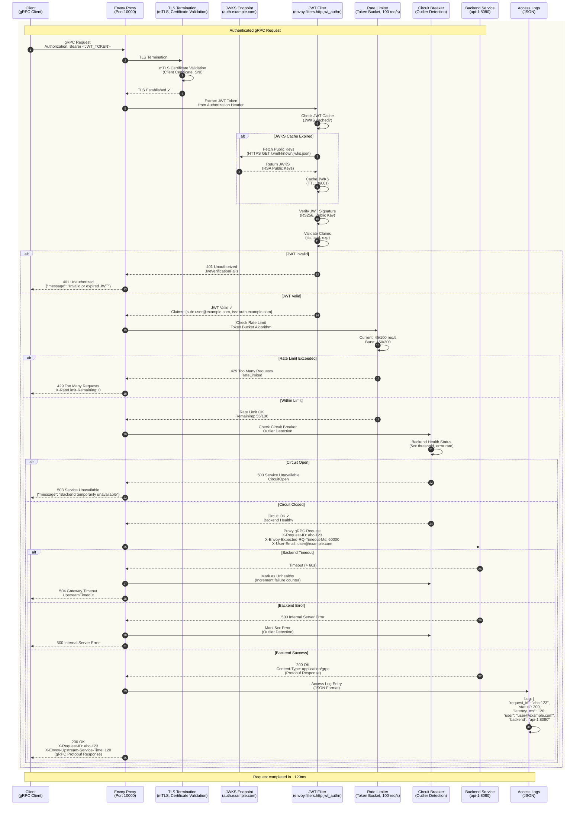

# Envoy Provider Anleitung

**Umfassende Anleitung für den Envoy Proxy Provider in GAL (Gateway Abstraction Layer)**

## Inhaltsverzeichnis

1. [Übersicht](#ubersicht)
2. [Schnellstart](#schnellstart)
3. [Installation und Setup](#installation-und-setup)
4. [Deployment-Strategien](#deployment-strategien)
5. [Konfigurationsoptionen](#konfigurationsoptionen)
6. [Provider-Vergleich](#provider-vergleich)

**Weitere Dokumentation:**
- [Feature-Implementierungen](ENVOY_FEATURES.md) - Details zu Auth, Rate Limiting, Circuit Breaker, Request Mirroring
- [Migration & Best Practices](ENVOY_DEPLOYMENT.md) - Migration, Best Practices, Troubleshooting

---
## Übersicht

**Envoy Proxy** ist ein moderner, hochperformanter **Cloud-Native Proxy** und **Service Mesh Sidecar**, entwickelt von Lyft und jetzt Teil der **Cloud Native Computing Foundation (CNCF)**. Envoy ist die Grundlage für viele Service Mesh Lösungen wie **Istio**, **Consul Connect** und **AWS App Mesh**.

### Envoy Architektur-Überblick

Das folgende Architektur-Diagramm zeigt die Hauptkomponenten von Envoy Proxy als API Gateway:

```mermaid
graph TB
    subgraph Client["Client Layer"]
        WebBrowser["Web Browser"]
        MobileApp["Mobile App"]
        gRPCClient["gRPC Client"]
    end

    subgraph Envoy["Envoy Proxy Layer"]
        subgraph Listeners["Listeners (Ingress)"]
            HTTPListener["HTTP Listener<br/>(Port 10000)"]
            HTTPSListener["HTTPS Listener<br/>(Port 443)"]
            AdminListener["Admin Interface<br/>(Port 9901)"]
        end

        subgraph FilterChains["Filter Chains"]
            HTTPConnectionMgr["HTTP Connection Manager"]

            subgraph HTTPFilters["HTTP Filters"]
                JWTFilter["JWT Authentication<br/>(envoy.filters.http.jwt_authn)"]
                RBACFilter["RBAC Authorization<br/>(envoy.filters.http.rbac)"]
                RateLimitFilter["Rate Limiting<br/>(envoy.filters.http.ratelimit)"]
                LuaFilter["Lua Scripting<br/>(envoy.filters.http.lua)"]
                CORSFilter["CORS Policy<br/>(envoy.filters.http.cors)"]
                RouterFilter["Router<br/>(envoy.filters.http.router)"]
            end
        end

        subgraph Clusters["Clusters (Upstreams)"]
            ClusterLB["Load Balancing<br/>(Round Robin, Least Request, Ring Hash)"]
            HealthChecks["Health Checks<br/>(Active + Passive)"]
            HTTP2Support["HTTP/2 & gRPC<br/>(Native Support)"]
        end
    end

    subgraph Backend["Backend Services Layer"]
        RESTBackend["REST API<br/>(backend-1:8080)"]
        gRPCService1["gRPC Service 1<br/>(grpc-svc:50051)"]
        gRPCService2["gRPC Service 2<br/>(grpc-svc:50052)"]
    end

    subgraph CrossCutting["Cross-Cutting Concerns"]
        subgraph Security["Security"]
            TLS["TLS/mTLS<br/>(Certificate Validation, SNI)"]
            JWTAuth["JWT Authentication<br/>(JWKS Remote, RS256/ES256)"]
        end

        subgraph TrafficMgmt["Traffic Management"]
            RateLimiting["Rate Limiting<br/>(Token Bucket, Global/Local)"]
            CircuitBreaker["Circuit Breaker<br/>(Outlier Detection, Passive HC)"]
        end

        subgraph Observability["Observability"]
            AccessLogs["Access Logs<br/>(JSON, Structured)"]
            Stats["Metrics<br/>(/stats, Prometheus)"]
            Tracing["Distributed Tracing<br/>(Zipkin, Jaeger, OTel)"]
        end

        subgraph ServiceMesh["Service Mesh"]
            Istio["Istio Control Plane<br/>(xDS API)"]
            Consul["Consul Connect<br/>(Service Discovery)"]
        end
    end

    %% Request Flow
    WebBrowser --> HTTPListener
    MobileApp --> HTTPSListener
    gRPCClient --> HTTPListener

    HTTPListener --> HTTPConnectionMgr
    HTTPSListener --> HTTPConnectionMgr

    HTTPConnectionMgr --> JWTFilter
    JWTFilter --> RBACFilter
    RBACFilter --> RateLimitFilter
    RateLimitFilter --> LuaFilter
    LuaFilter --> CORSFilter
    CORSFilter --> RouterFilter

    RouterFilter --> ClusterLB
    ClusterLB --> HealthChecks
    HealthChecks --> HTTP2Support

    HTTP2Support --> RESTBackend
    HTTP2Support --> gRPCService1
    HTTP2Support --> gRPCService2

    %% Cross-Cutting
    HTTPConnectionMgr -.-> TLS
    JWTFilter -.-> JWTAuth
    RateLimitFilter -.-> RateLimiting
    HealthChecks -.-> CircuitBreaker
    RouterFilter -.-> AccessLogs
    RouterFilter -.-> Stats
    RouterFilter -.-> Tracing
    Envoy -.-> Istio
    Envoy -.-> Consul

    %% Admin
    AdminListener -.->|Metrics| Stats
    AdminListener -.->|Config Dump| Envoy

    %% Styling
    classDef clientStyle fill:#E3F2FD,stroke:#01579B,stroke-width:2px,color:#000
    classDef gatewayStyle fill:#FFF3E0,stroke:#E65100,stroke-width:3px,color:#000
    classDef backendStyle fill:#F1F8E9,stroke:#558B2F,stroke-width:2px,color:#000
    classDef authStyle fill:#FCE4EC,stroke:#C2185B,stroke-width:2px,color:#000
    classDef trafficStyle fill:#F3E5F5,stroke:#7B1FA2,stroke-width:2px,color:#000
    classDef monitorStyle fill:#E0F2F1,stroke:#00695C,stroke-width:2px,color:#000
    classDef storageStyle fill:#FFF9C4,stroke:#F57F17,stroke-width:2px,color:#000
    classDef meshStyle fill:#E8EAF6,stroke:#3F51B5,stroke-width:2px,color:#000

    class WebBrowser,MobileApp,gRPCClient clientStyle
    class HTTPListener,HTTPSListener,AdminListener,HTTPConnectionMgr,ClusterLB,HealthChecks,HTTP2Support gatewayStyle
    class JWTFilter,RBACFilter,RateLimitFilter,LuaFilter,CORSFilter,RouterFilter storageStyle
    class RESTBackend,gRPCService1,gRPCService2 backendStyle
    class TLS,JWTAuth authStyle
    class RateLimiting,CircuitBreaker trafficStyle
    class AccessLogs,Stats,Tracing monitorStyle
    class Istio,Consul meshStyle
```



**Diagramm-Erklärung:**

- **Client Layer**: Verschiedene Client-Typen (Web Browser, Mobile Apps, gRPC Clients)
- **Envoy Proxy Layer**: Zentrale Komponenten
  - **Listeners**: HTTP (10000), HTTPS (443), Admin (9901)
  - **Filter Chains**: HTTP Connection Manager orchestriert Filter-Pipeline
  - **HTTP Filters**: JWT Auth → RBAC → Rate Limit → Lua → CORS → Router
  - **Clusters**: Load Balancing (Round Robin, Least Request, Ring Hash), Health Checks, HTTP/2 & gRPC Support
- **Backend Services**: REST APIs und gRPC Services
- **Cross-Cutting Concerns**:
  - **Security**: TLS/mTLS, JWT Authentication mit JWKS Remote
  - **Traffic Management**: Rate Limiting (Token Bucket), Circuit Breaker (Outlier Detection)
  - **Observability**: Access Logs (JSON), Metrics (Prometheus), Distributed Tracing (Zipkin/Jaeger/OTel)
  - **Service Mesh**: Istio Control Plane (xDS API), Consul Connect

### Warum Envoy?

- ✅ **Modern & Cloud-Native** - Gebaut für Kubernetes und Microservices
- ✅ **Feature-reich** - Umfassendste Feature-Set aller Provider
- ✅ **Observability** - Eingebaute Metrics, Tracing, Logging
- ✅ **Performance** - C++ implementiert, extrem schnell
- ✅ **Extensibility** - Filter-basierte Architektur, Lua Support
- ✅ **Service Mesh Ready** - Perfekt für Istio, Envoy Gateway
- ✅ **Hot Reload** - Configuration Changes ohne Downtime

### GAL + Envoy = Perfekte Kombination

GAL vereinfacht Envoy's komplexe YAML-Konfiguration drastisch:

| Feature | Envoy (nativ) | GAL für Envoy |
|---------|---------------|---------------|
| Konfigurationsgröße | 200+ Zeilen | 30 Zeilen |
| Lernkurve | Steil (Wochen) | Flach (Stunden) |
| Fehleranfälligkeit | Hoch | Niedrig |
| Wartbarkeit | Schwierig | Einfach |
| Provider-Wechsel | Unmöglich | 1 Command |

### Envoy Feature-Matrix

| Feature | Envoy Support | GAL Implementation |
|---------|---------------|-------------------|
| **Traffic Management** | | |
| Rate Limiting | ✅ Native (envoy.filters.http.ratelimit) | ✅ Vollständig |
| Circuit Breaker | ✅ Native (outlier_detection) | ✅ Vollständig |
| Health Checks | ✅ Active + Passive | ✅ Vollständig |
| Load Balancing | ✅ Round Robin, Least Request, Ring Hash, etc. | ✅ Vollständig |
| Timeout & Retry | ✅ Umfassend (per-try timeout, retry policy) | ✅ Vollständig |
| **Security** | | |
| Basic Auth | ⚠️ Via Lua/External | ⚠️ Lua Filter |
| JWT Validation | ✅ Native (envoy.filters.http.jwt_authn) | ✅ Vollständig |
| API Key Auth | ⚠️ Via External Auth | ⚠️ External Service |
| CORS | ✅ Native (cors policy) | ✅ Vollständig |
| **Advanced** | | |
| WebSocket | ✅ Native (HTTP/1.1 Upgrade) | ✅ Vollständig |
| gRPC | ✅ Native (HTTP/2) | ✅ Vollständig |
| Body Transformation | ✅ Via Lua Filter | ✅ Lua Implementation |
| Request/Response Headers | ✅ Native | ✅ Vollständig |
| **Observability** | | |
| Access Logs | ✅ Structured (JSON, text) | ✅ Vollständig |
| Metrics (Prometheus) | ✅ Native | ✅ Vollständig |
| Distributed Tracing | ✅ Zipkin, Jaeger, OpenTelemetry | ✅ Vollständig |

---

## Schnellstart

### Beispiel 1: Einfacher Reverse Proxy

```yaml
version: "1.0"
provider: envoy

global:
  host: 0.0.0.0
  port: 10000
  admin_port: 9901

services:
  - name: api_service
    type: rest
    protocol: http
    upstream:
      host: api-backend.default.svc.cluster.local
      port: 8080
    routes:
      - path_prefix: /api
```

**Generierte Envoy-Konfiguration** (~150 Zeilen):
```bash
gal generate --config config.yaml --provider envoy > envoy.yaml
```

Enthält:
- Static Resources (clusters, listeners)
- HTTP Connection Manager
- Route Configuration
- Cluster mit Health Checks

### Beispiel 2: Load Balancing mit Health Checks

```yaml
services:
  - name: api_service
    upstream:
      targets:
        - host: api-1.default.svc.cluster.local
          port: 8080
        - host: api-2.default.svc.cluster.local
          port: 8080
        - host: api-3.default.svc.cluster.local
          port: 8080
      health_check:
        active:
          enabled: true
          interval: "10s"
          timeout: "5s"
          http_path: "/health"
          healthy_threshold: 2
          unhealthy_threshold: 3
      load_balancer:
        algorithm: round_robin
    routes:
      - path_prefix: /api
```

**Generiert**:
- Cluster mit 3 Endpoints
- Active Health Checks (HTTP GET /health)
- Round Robin Load Balancing

### Beispiel 3: Complete Production Setup

```yaml
services:
  - name: api_service
    upstream:
      targets:
        - host: api-1.svc
          port: 8080
      health_check:
        active:
          enabled: true
          interval: "10s"
          http_path: "/health"
      load_balancer:
        algorithm: least_request
    routes:
      - path_prefix: /api
        rate_limit:
          enabled: true
          requests_per_second: 100
          burst: 200
        authentication:
          enabled: true
          type: jwt
          jwt:
            issuer: "https://auth.example.com"
            audiences: ["api"]
        cors:
          enabled: true
          allowed_origins: ["https://app.example.com"]
          allowed_methods: ["GET", "POST", "PUT", "DELETE"]
        timeout:
          connect: "5s"
          read: "60s"
        retry:
          enabled: true
          attempts: 3
          retry_on:
            - connect_timeout
            - http_5xx
```

---

## Installation und Setup

### 1. Envoy Binary Installation

#### Option A: Docker (Empfohlen)

```bash
# Official Envoy Image
docker pull envoyproxy/envoy:v1.28-latest

# Envoy starten mit GAL-generierter Config
docker run -d \
  --name envoy \
  -p 10000:10000 \
  -p 9901:9901 \
  -v $(pwd)/envoy.yaml:/etc/envoy/envoy.yaml \
  envoyproxy/envoy:v1.28-latest
```

#### Option B: Binary Download

```bash
# Linux (Ubuntu/Debian)
curl -L https://github.com/envoyproxy/envoy/releases/download/v1.28.0/envoy-1.28.0-linux-x86_64 \
  -o /usr/local/bin/envoy
chmod +x /usr/local/bin/envoy

# macOS (via Homebrew)
brew install envoy
```

#### Option C: Kubernetes Deployment

```yaml
apiVersion: apps/v1
kind: Deployment
metadata:
  name: envoy-gateway
spec:
  replicas: 3
  selector:
    matchLabels:
      app: envoy
  template:
    metadata:
      labels:
        app: envoy
    spec:
      containers:
      - name: envoy
        image: envoyproxy/envoy:v1.28-latest
        ports:
        - containerPort: 10000
          name: http
        - containerPort: 9901
          name: admin
        volumeMounts:
        - name: config
          mountPath: /etc/envoy
      volumes:
      - name: config
        configMap:
          name: envoy-config
---
apiVersion: v1
kind: Service
metadata:
  name: envoy-gateway
spec:
  type: LoadBalancer
  selector:
    app: envoy
  ports:
  - port: 80
    targetPort: 10000
    name: http
  - port: 9901
    targetPort: 9901
    name: admin
```

### 2. GAL Config generieren

```bash
# GAL installieren
pip install gal-gateway

# Config generieren
gal generate --config gateway.yaml --provider envoy > envoy.yaml

# Validieren
envoy --mode validate -c envoy.yaml

# Starten
envoy -c envoy.yaml
```

### 3. Admin Interface prüfen

```bash
# Stats
curl http://localhost:9901/stats

# Config Dump
curl http://localhost:9901/config_dump

# Clusters Status
curl http://localhost:9901/clusters
```

---

## Deployment-Strategien

### Deployment-Entscheidungsbaum

Der folgende Entscheidungsbaum hilft bei der Auswahl der richtigen Envoy-Deployment-Strategie:

```mermaid
flowchart TD
    Start([Envoy Deployment<br/>planen]) --> Q1{Welches<br/>Deployment-Szenario?}

    Q1 -->|Docker<br/>Standalone| Scenario1[Szenario 1:<br/>Docker Standalone]
    Q1 -->|Kubernetes<br/>Sidecar| Scenario2[Szenario 2:<br/>Kubernetes Sidecar]
    Q1 -->|Kubernetes<br/>Ingress| Scenario3[Szenario 3:<br/>Envoy Gateway API]
    Q1 -->|Service Mesh<br/>(Istio)| Scenario4[Szenario 4:<br/>Istio Control Plane]
    Q1 -->|gRPC<br/>Load Balancer| Scenario5[Szenario 5:<br/>gRPC Heavy Workload]

    %% Scenario 1: Docker Standalone
    Scenario1 --> S1A[1. envoy.yaml<br/>vorbereiten]
    S1A --> S1B[2. GAL Config generieren<br/>gal generate -p envoy]
    S1B --> S1C[3. Config validieren<br/>envoy --mode validate]
    S1C --> S1D[4. Docker Container starten<br/>Port 10000, 9901]
    S1D --> S1E[5. Admin Interface prüfen<br/>/stats, /config_dump]
    S1E --> S1Done[Standalone Envoy Gateway<br/>für Development]

    %% Scenario 2: Kubernetes Sidecar
    Scenario2 --> S2A[1. Sidecar Injection<br/>aktivieren]
    S2A --> S2B[2. Service Mesh Config<br/>(Istio, Consul Connect)]
    S2B --> S2C[3. GAL Config als<br/>ConfigMap mounten]
    S2C --> S2D[4. Pod mit Envoy Sidecar<br/>deployen]
    S2D --> S2E[5. xDS API Connection<br/>verifizieren]
    S2E --> S2Done[Service Mesh<br/>mit Envoy Sidecar]

    %% Scenario 3: Kubernetes Ingress
    Scenario3 --> S3A[1. Envoy Gateway API<br/>Controller installieren]
    S3A --> S3B[2. Gateway Class<br/>definieren]
    S3B --> S3C[3. Gateway Resource<br/>mit Listeners erstellen]
    S3C --> S3D[4. HTTPRoute Resources<br/>für Routing]
    S3D --> S3E[5. kubectl apply<br/>& verify]
    S3E --> S3Done[Kubernetes-native<br/>Envoy Ingress]

    %% Scenario 4: Istio Service Mesh
    Scenario4 --> S4A[1. Istio Control Plane<br/>installieren (istioctl)]
    S4A --> S4B[2. Namespace mit<br/>istio-injection=enabled]
    S4B --> S4C[3. VirtualService<br/>& DestinationRule]
    S4C --> S4D[4. Envoy Proxy Config<br/>via Istio Pilot (xDS)]
    S4D --> S4E[5. Observability Setup<br/>(Kiali, Jaeger, Prometheus)]
    S4E --> S4Done[Full Service Mesh<br/>mit Istio + Envoy]

    %% Scenario 5: gRPC Load Balancer
    Scenario5 --> S5A[1. HTTP/2 Native<br/>Config aktivieren]
    S5A --> S5B[2. gRPC Service<br/>Discovery Setup]
    S5B --> S5C[3. Load Balancing für<br/>gRPC (Least Request)]
    S5C --> S5D[4. Health Checks<br/>(gRPC Health Protocol)]
    S5D --> S5E[5. Monitoring<br/>(gRPC Metrics)]
    S5E --> S5Done[High-Performance<br/>gRPC Load Balancer]

    %% Styling
    classDef questionStyle fill:#FFF3E0,stroke:#E65100,stroke-width:2px,color:#000
    classDef scenarioStyle fill:#E8F5E9,stroke:#2E7D32,stroke-width:3px,color:#000
    classDef stepStyle fill:#E3F2FD,stroke:#01579B,stroke-width:2px,color:#000
    classDef finalStyle fill:#F3E5F5,stroke:#6A1B9A,stroke-width:2px,color:#000

    class Start,Q1 questionStyle
    class Scenario1,Scenario2,Scenario3,Scenario4,Scenario5 scenarioStyle
    class S1A,S1B,S1C,S1D,S1E,S2A,S2B,S2C,S2D,S2E,S3A,S3B,S3C,S3D,S3E,S4A,S4B,S4C,S4D,S4E,S5A,S5B,S5C,S5D,S5E stepStyle
    class S1Done,S2Done,S3Done,S4Done,S5Done finalStyle
```

**Deployment-Strategien im Überblick:**

| Szenario | Use Case | Komplexität | Hauptmerkmale |
|----------|----------|-------------|---------------|
| **1. Docker Standalone** | Development, Testing, Simple Setup | Niedrig | envoy.yaml + Docker, Admin Interface |
| **2. Kubernetes Sidecar** | Service Mesh, Microservices | Mittel | Envoy Sidecar pro Pod, xDS API |
| **3. Kubernetes Ingress** | Edge Proxy, Kubernetes-native | Mittel | Gateway API, Gateway Class, HTTPRoute |
| **4. Istio Service Mesh** | Full Service Mesh, Production | Hoch | Istio Control Plane, VirtualService, Observability |
| **5. gRPC Load Balancer** | gRPC-heavy Workloads | Mittel | HTTP/2 Native, gRPC Health Checks, Least Request LB |

**Static vs. Dynamic Configuration:**

| Mode | Config Type | Use Case | Pros | Cons |
|------|-------------|----------|------|------|
| **Static Resources** | envoy.yaml (YAML File) | Standalone, Simple Setups | Einfach, Versionierbar | Kein Hot Reload |
| **Dynamic (xDS API)** | Control Plane (Istio, Consul) | Service Mesh, K8s | Hot Reload, Dynamic Discovery | Komplexer Setup |

**Entscheidungshilfe:**

- 🚀 **Docker Standalone** für Development, Testing, PoCs
- ☸️ **Kubernetes Sidecar** für Microservices mit Service Mesh Requirements
- 🌐 **Envoy Gateway API** für Cloud-Native Kubernetes Ingress
- 🔗 **Istio** für Full Service Mesh mit Observability, mTLS, Traffic Management
- ⚡ **gRPC Load Balancer** für gRPC-heavy Workloads mit HTTP/2 Native Support

---

## Konfigurationsoptionen

### Global Configuration

```yaml
global:
  host: 0.0.0.0           # Listener Address
  port: 10000             # HTTP Port
  admin_port: 9901        # Admin Interface Port
```

**Generiert**:
```yaml
admin:
  address:
    socket_address:
      address: 0.0.0.0
      port_value: 9901

static_resources:
  listeners:
  - name: listener_0
    address:
      socket_address:
        address: 0.0.0.0
        port_value: 10000
```

### Upstream Configuration

```yaml
upstream:
  host: backend.svc        # Single host
  port: 8080
  # ODER
  targets:                 # Multiple targets
    - host: backend-1.svc
      port: 8080
      weight: 1
    - host: backend-2.svc
      port: 8080
      weight: 2
```

**Generiert Cluster**:
```yaml
clusters:
- name: api_service_cluster
  connect_timeout: 5s
  type: STRICT_DNS
  lb_policy: ROUND_ROBIN
  load_assignment:
    cluster_name: api_service_cluster
    endpoints:
    - lb_endpoints:
      - endpoint:
          address:
            socket_address:
              address: backend-1.svc
              port_value: 8080
        load_balancing_weight: 1
      - endpoint:
          address:
            socket_address:
              address: backend-2.svc
              port_value: 8080
        load_balancing_weight: 2
```

### Request Flow durch Envoy

Das folgende Sequenzdiagramm zeigt den vollständigen Request-Ablauf durch Envoy Proxy mit allen Features:



**Flow-Erklärung:**

1. **Client Request**: gRPC Client sendet Request mit JWT Token im Authorization Header
2. **TLS Termination**: Envoy terminiert TLS/mTLS, validiert Client-Zertifikat, prüft SNI
3. **JWT Token Extraction**: JWT Filter extrahiert Bearer Token aus Authorization Header
4. **JWKS Fetch** (wenn Cache abgelaufen): JWT Filter holt Public Keys von JWKS Endpoint
5. **JWT Validation**:
   - Verifiziert Signatur mit Public Key (RS256 oder ES256)
   - Prüft Claims: Issuer (`iss`), Audience (`aud`), Expiration (`exp`)
6. **Rate Limiting Check**: Token Bucket Algorithmus, 100 req/s Limit
   - Zählt aktuelle Requests: 45/100 (Remaining: 55)
   - Prüft Burst: 150/200
7. **Circuit Breaker Check**: Outlier Detection
   - Prüft Backend Health Status (5xx threshold, error rate)
   - Circuit States: CLOSED (healthy) → OPEN (unhealthy) → HALF_OPEN (testing)
8. **Backend Proxy**: Envoy forwarded gRPC Request mit enriched Headers
   - `X-Request-ID`: Eindeutige Request-ID für Tracing
   - `X-Envoy-Expected-RQ-Timeout-Ms`: Timeout in Millisekunden
   - `X-User-Email`: Extrahiert aus JWT Claims
9. **Response Processing**: Backend antwortet, Envoy fügt Envoy-spezifische Headers hinzu
   - `X-Envoy-Upstream-Service-Time`: Backend Response Time
10. **Access Logging**: Request wird als JSON geloggt mit Status, Latency, User, Backend

**Alternative Flows:**

- **JWT Invalid** (401): Ungültiger/abgelaufener Token → JwtVerificationFails
- **Rate Limit Exceeded** (429): Zu viele Requests → RateLimited
- **Circuit Open** (503): Backend unhealthy → CircuitOpen (Service Unavailable)
- **Backend Timeout** (504): Backend antwortet nicht → UpstreamTimeout
- **Backend Error** (500): Backend 5xx → Outlier Detection zählt Fehler

**Envoy Request Flow Vorteile:**

- ✅ **Filter-basierte Architektur**: Modulare Pipeline, einfach erweiterbar
- ✅ **Native JWT Support**: Keine externe Dependencies, JWKS Caching eingebaut
- ✅ **Passive Health Checks**: Outlier Detection für automatisches Circuit Breaking
- ✅ **Rich Observability**: X-Request-ID, Upstream-Service-Time, strukturierte Logs
- ✅ **gRPC Native**: HTTP/2 native, kein zusätzlicher Overhead

---

## Feature-Implementierungen

### 1. Load Balancing

Envoy unterstützt die meisten Load Balancing Algorithmen:

```yaml
load_balancer:
  algorithm: round_robin    # ROUND_ROBIN
  # algorithm: least_conn    # LEAST_REQUEST
  # algorithm: ip_hash       # RING_HASH (Consistent Hashing)
  # algorithm: weighted      # ROUND_ROBIN mit Weights
```

**Generierte Envoy Config**:
```yaml
lb_policy: ROUND_ROBIN      # oder LEAST_REQUEST, RING_HASH
```

**Algorithmen**:
- `round_robin` → `ROUND_ROBIN` (Default)
- `least_conn` → `LEAST_REQUEST` (bevorzugt Server mit wenigsten aktiven Requests)
- `ip_hash` → `RING_HASH` (Consistent Hashing, Session Persistence)
- `weighted` → `ROUND_ROBIN` + `load_balancing_weight`

### 2. Health Checks

**Active Health Checks**:
```yaml
health_check:
  active:
    enabled: true
    interval: "10s"           # Probe-Intervall
    timeout: "5s"             # Probe-Timeout
    http_path: "/health"      # Health Endpoint
    healthy_threshold: 2      # Erfolge bis "healthy"
    unhealthy_threshold: 3    # Fehler bis "unhealthy"
    healthy_status_codes: [200, 204]
```

**Generiert**:
```yaml
health_checks:
- timeout: 5s
  interval: 10s
  unhealthy_threshold: 3
  healthy_threshold: 2
  http_health_check:
    path: /health
    expected_statuses:
    - start: 200
      end: 201
    - start: 204
      end: 205
```

**Passive Health Checks** (Outlier Detection):
```yaml
health_check:
  passive:
    enabled: true
    max_failures: 5           # Max Fehler
    failure_window: "30s"     # Zeitfenster
```

**Generiert**:
```yaml
outlier_detection:
  consecutive_5xx: 5
  interval: 30s
  base_ejection_time: 30s
  max_ejection_percent: 50
```

### 3. Rate Limiting

```yaml
rate_limit:
  enabled: true
  requests_per_second: 100
  burst: 200
  response_status: 429
```

**Generiert** (Global Rate Limit Service):
```yaml
http_filters:
- name: envoy.filters.http.ratelimit
  typed_config:
    "@type": type.googleapis.com/envoy.extensions.filters.http.ratelimit.v3.RateLimit
    domain: gal_ratelimit
    rate_limit_service:
      grpc_service:
        envoy_grpc:
          cluster_name: rate_limit_service
```

**Hinweis**: Envoy benötigt einen externen Rate Limit Service (z.B. [lyft/ratelimit](https://github.com/envoyproxy/ratelimit)).

### 4. Authentication

**JWT Validation**:
```yaml
authentication:
  enabled: true
  type: jwt
  jwt:
    issuer: "https://auth.example.com"
    audiences: ["api"]
    jwks_uri: "https://auth.example.com/.well-known/jwks.json"
```

**Generiert**:
```yaml
http_filters:
- name: envoy.filters.http.jwt_authn
  typed_config:
    "@type": type.googleapis.com/envoy.extensions.filters.http.jwt_authn.v3.JwtAuthentication
    providers:
      jwt_provider:
        issuer: https://auth.example.com
        audiences:
        - api
        remote_jwks:
          http_uri:
            uri: https://auth.example.com/.well-known/jwks.json
            cluster: jwt_cluster
          cache_duration: 3600s
    rules:
    - match:
        prefix: /api
      requires:
        provider_name: jwt_provider
```

**Basic Auth** (via Lua Filter):
```yaml
authentication:
  enabled: true
  type: basic
  basic_auth:
    users:
      admin: password123
```

**Generiert Lua Filter** für Basic Auth Validation.

### 5. CORS

```yaml
cors:
  enabled: true
  allowed_origins: ["https://app.example.com"]
  allowed_methods: ["GET", "POST", "PUT", "DELETE"]
  allowed_headers: ["Content-Type", "Authorization"]
  allow_credentials: true
  max_age: 86400
```

**Generiert**:
```yaml
cors:
  allow_origin_string_match:
  - exact: https://app.example.com
  allow_methods: "GET,POST,PUT,DELETE"
  allow_headers: "Content-Type,Authorization"
  allow_credentials: true
  max_age: "86400"
```

### 6. Timeout & Retry

```yaml
timeout:
  connect: "5s"
  read: "60s"
  idle: "300s"
retry:
  enabled: true
  attempts: 3
  backoff: exponential
  base_interval: "25ms"
  max_interval: "250ms"
  retry_on:
    - connect_timeout
    - http_5xx
```

**Generiert**:
```yaml
# Cluster-level
connect_timeout: 5s

# Route-level
timeout: 60s
idle_timeout: 300s
retry_policy:
  num_retries: 3
  per_try_timeout: 25ms
  retry_on: "connect-failure,5xx"
```

### 7. Circuit Breaker

```yaml
circuit_breaker:
  enabled: true
  max_failures: 5
  timeout: "30s"
  unhealthy_status_codes: [500, 502, 503, 504]
```

**Generiert** (Outlier Detection):
```yaml
outlier_detection:
  consecutive_5xx: 5
  interval: 30s
  base_ejection_time: 30s
  max_ejection_percent: 50
  enforcing_consecutive_5xx: 100
```

### 8. WebSocket

```yaml
websocket:
  enabled: true
  idle_timeout: "600s"
  ping_interval: "30s"
```

**Generiert**:
```yaml
upgrade_configs:
- upgrade_type: websocket
http_protocol_options:
  idle_timeout: 600s
```

### 9. Request/Response Headers

```yaml
headers:
  request_add:
    X-Request-ID: "{{uuid}}"
    X-Forwarded-Proto: "https"
  request_remove:
    - X-Internal-Secret
  response_add:
    X-Gateway: "GAL-Envoy"
  response_remove:
    - X-Powered-By
```

**Generiert**:
```yaml
request_headers_to_add:
- header:
    key: X-Request-ID
    value: "%REQ(X-REQUEST-ID)%"
  append: false
request_headers_to_remove:
- X-Internal-Secret
response_headers_to_add:
- header:
    key: X-Gateway
    value: GAL-Envoy
response_headers_to_remove:
- X-Powered-By
```

### 10. Body Transformation

```yaml
body_transformation:
  enabled: true
  request:
    add_fields:
      trace_id: "{{uuid}}"
    remove_fields:
      - secret_key
  response:
    filter_fields:
      - password
```

**Generiert Lua Filter**:
```yaml
http_filters:
- name: envoy.filters.http.lua
  typed_config:
    "@type": type.googleapis.com/envoy.extensions.filters.http.lua.v3.Lua
    inline_code: |
      function envoy_on_request(request_handle)
        -- Transform request body
      end
      function envoy_on_response(response_handle)
        -- Transform response body
      end
```

---

## Provider-Vergleich

### Envoy vs. Andere Provider

| Feature | Envoy | Kong | APISIX | Traefik | Nginx | HAProxy |
|---------|-------|------|--------|---------|-------|---------|
| **Performance** | ⭐⭐⭐⭐⭐ | ⭐⭐⭐⭐ | ⭐⭐⭐⭐⭐ | ⭐⭐⭐⭐ | ⭐⭐⭐⭐⭐ | ⭐⭐⭐⭐⭐ |
| **Feature-Set** | ⭐⭐⭐⭐⭐ | ⭐⭐⭐⭐⭐ | ⭐⭐⭐⭐⭐ | ⭐⭐⭐⭐ | ⭐⭐⭐ | ⭐⭐⭐⭐ |
| **Observability** | ⭐⭐⭐⭐⭐ | ⭐⭐⭐⭐ | ⭐⭐⭐⭐ | ⭐⭐⭐ | ⭐⭐ | ⭐⭐⭐ |
| **Cloud-Native** | ⭐⭐⭐⭐⭐ | ⭐⭐⭐⭐ | ⭐⭐⭐⭐⭐ | ⭐⭐⭐⭐⭐ | ⭐⭐ | ⭐⭐ |
| **Lernkurve** | ⭐⭐ | ⭐⭐⭐ | ⭐⭐⭐ | ⭐⭐⭐⭐ | ⭐⭐⭐⭐ | ⭐⭐⭐ |
| **Dokumentation** | ⭐⭐⭐⭐⭐ | ⭐⭐⭐⭐⭐ | ⭐⭐⭐⭐ | ⭐⭐⭐⭐ | ⭐⭐⭐⭐⭐ | ⭐⭐⭐⭐ |

**Envoy Stärken**:
- ✅ **Umfassendstes Feature-Set** aller Provider
- ✅ **Native Observability** (Metrics, Tracing, Logging)
- ✅ **Service Mesh Ready** (Istio, Consul, Linkerd)
- ✅ **Modern & Cloud-Native**
- ✅ **Hot Reload** ohne Downtime
- ✅ **gRPC Native** (HTTP/2)

**Envoy Schwächen**:
- ❌ **Steile Lernkurve** (komplexe YAML-Config)
- ❌ **Verbose Config** (sehr lang)
- ⚠️ **Basic Auth** nicht nativ (Lua/External)
- ⚠️ **Rate Limiting** benötigt externen Service

---

