# Envoy Migration & Best Practices

**Migration, Best Practices und Troubleshooting für Envoy Proxy Provider in GAL**

**Navigation:**
- [← Zurück zur Envoy Übersicht](ENVOY.md)
- [← Feature-Implementierungen](ENVOY_FEATURES.md)

## Inhaltsverzeichnis

1. [Migration zu/von Envoy Gateway](#migration-zuvon-envoy-gateway)
2. [Best Practices](#best-practices)
3. [Troubleshooting](#troubleshooting)
4. [Zusammenfassung](#zusammenfassung)

---
## Migration zu/von Envoy Gateway

### Migrations-Flow

Der folgende Ablauf zeigt den typischen Migrationsprozess von/zu Envoy Gateway:

```mermaid
flowchart LR
    subgraph Sources["Quell-Provider"]
        Nginx["Nginx<br/>(nginx.conf)"]
        Kong["Kong<br/>(kong.yaml)"]
        Traefik["Traefik<br/>(traefik.yaml)"]
        HAProxy["HAProxy<br/>(haproxy.cfg)"]
    end

    subgraph GAL["GAL - Gateway Abstraction Layer"]
        Import["GAL Import<br/>(gal import -i config)"]
        Config["GAL Config<br/>(Provider-agnostisch)"]
        Export["GAL Export<br/>(gal generate -p envoy)"]
    end

    subgraph Envoy["Envoy Gateway"]
        EnvoyYAML["envoy.yaml<br/>(Static Resources)"]
        Validate["Validation<br/>(envoy --mode validate)"]

        subgraph Deploy["Deployment"]
            Docker["Docker<br/>(docker run envoyproxy/envoy)"]
            K8s["Kubernetes<br/>(ConfigMap + Deployment)"]
            Istio["Istio<br/>(ServiceMesh + xDS)"]
        end

        Live["Live Gateway<br/>(Port 10000, Admin 9901)"]
    end

    subgraph Migration["Migrations-Schritte"]
        M1["1. Source Provider<br/>Config Export"]
        M2["2. GAL Import<br/>(Auto-Conversion)"]
        M3["3. Config Review<br/>(JWT, TLS, Filters)"]
        M4["4. Envoy YAML<br/>generieren"]
        M5["5. Validate & Test<br/>(envoy --mode validate)"]
        M6["6. Canary Deployment<br/>(10% → 50% → 100%)"]
    end

    subgraph Monitoring["Monitoring"]
        Prometheus["Prometheus<br/>(/stats endpoint)"]
        Grafana["Grafana<br/>(Envoy Dashboard)"]
        Jaeger["Jaeger<br/>(Distributed Tracing)"]
    end

    %% Flow
    Nginx --> M1
    Kong --> M1
    Traefik --> M1
    HAProxy --> M1

    M1 --> Import
    Import --> M2
    M2 --> Config
    Config --> M3
    M3 --> Export
    Export --> M4
    M4 --> EnvoyYAML
    EnvoyYAML --> M5
    M5 --> Validate

    Validate --> Docker
    Validate --> K8s
    Validate --> Istio

    Docker --> M6
    K8s --> M6
    Istio --> M6

    M6 --> Live
    Live --> Prometheus
    Live --> Grafana
    Live --> Jaeger

    %% Annotations
    Import -.->|Unterstützt:<br/>Nginx, Kong, Traefik,<br/>HAProxy| Config
    Config -.->|Provider-neutral:<br/>services, routes,<br/>upstream, filters| Export
    Export -.->|Auto-generiert:<br/>Listeners, Filters,<br/>Clusters, Routes| EnvoyYAML
    Validate -.->|Prüft:<br/>YAML Syntax,<br/>Filter Config,<br/>Cluster Health| Deploy
    Live -.->|Admin API:<br/>/stats, /config_dump,<br/>/clusters| Monitoring

    %% Styling
    classDef sourceStyle fill:#E3F2FD,stroke:#01579B,stroke-width:2px,color:#000
    classDef galStyle fill:#FFF3E0,stroke:#E65100,stroke-width:3px,color:#000
    classDef envoyStyle fill:#F1F8E9,stroke:#558B2F,stroke-width:2px,color:#000
    classDef stepStyle fill:#FCE4EC,stroke:#C2185B,stroke-width:2px,color:#000
    classDef monitorStyle fill:#E0F2F1,stroke:#00695C,stroke-width:2px,color:#000

    class Nginx,Kong,Traefik,HAProxy sourceStyle
    class Import,Config,Export galStyle
    class EnvoyYAML,Validate,Docker,K8s,Istio,Live envoyStyle
    class M1,M2,M3,M4,M5,M6 stepStyle
    class Prometheus,Grafana,Jaeger monitorStyle
```



**Migration-Erklärung:**

- **Quell-Provider:** Unterstützte Gateway-Provider für Migration zu Envoy
  - **Nginx:** nginx.conf mit upstream blocks, locations, rate limiting
  - **Kong:** Declarative YAML (services, routes, plugins)
  - **Traefik:** Dynamic Configuration (routers, services, middlewares)
  - **HAProxy:** haproxy.cfg mit frontends, backends, ACLs

- **GAL Migration Engine:** Automatisierter Migration-Workflow
  1. **Import:** Lese Source Provider Config (`gal import -i nginx.conf -p nginx`)
  2. **Config:** Provider-agnostische GAL Config (services, routes, upstream, filters)
  3. **Export:** Generiere Envoy Static Resources (`gal generate -p envoy`)

- **Envoy Gateway:** Deployment-Optionen
  - **envoy.yaml:** Static Resources (listeners, filter_chains, clusters, routes)
  - **Validation:** `envoy --mode validate -c envoy.yaml` prüft Syntax
  - **Deployment:**
    - **Docker:** Standalone mit `docker run envoyproxy/envoy`
    - **Kubernetes:** ConfigMap + Deployment/DaemonSet
    - **Istio:** Service Mesh mit xDS API (dynamic config)

- **Migrations-Schritte:** Best Practices für sichere Migration
  1. **Source Export:** Config extrahieren aus Quell-Provider
  2. **GAL Import:** Automatische Konvertierung zu GAL Config
  3. **Config Review:** Manuelle Überprüfung (JWT Filters, TLS Settings, Custom Filters)
  4. **Envoy YAML generieren:** `gal generate -p envoy > envoy.yaml`
  5. **Validate & Test:** Syntax-Check + funktionale Tests
  6. **Canary Deployment:** Graduelles Rollout (10% → 50% → 100% Traffic)

- **Monitoring:** Observability nach Migration
  - **Prometheus:** Scrape `/stats` Endpoint für Metrics
  - **Grafana:** Envoy Dashboard für Visualisierung
  - **Jaeger:** Distributed Tracing für Request-Flow

### Migrations-Checkliste

**Vor der Migration:**

- [ ] Source Provider Config exportieren/sichern
- [ ] Alle Features dokumentieren (Rate Limiting, Auth, Load Balancing)
- [ ] JWT/TLS Requirements klären
- [ ] Backend Service Endpoints verifizieren
- [ ] Envoy Version auswählen (v1.28+ empfohlen)

**GAL Import/Export:**

```bash
# 1. Nginx → GAL
gal import -i nginx.conf -p nginx -o gal-config.yaml

# 2. GAL → Envoy
gal generate -c gal-config.yaml -p envoy > envoy.yaml

# 3. Config validieren
envoy --mode validate -c envoy.yaml

# 4. Docker Testing
docker run -d \
  --name envoy-test \
  -p 10000:10000 -p 9901:9901 \
  -v $(pwd)/envoy.yaml:/etc/envoy/envoy.yaml \
  envoyproxy/envoy:v1.28-latest

# 5. Admin Interface prüfen
curl http://localhost:9901/config_dump | jq .
curl http://localhost:9901/clusters
curl http://localhost:9901/stats
```

**Während der Migration:**

- [ ] Envoy Config Review (Listeners, Filters, Clusters)
- [ ] JWT Filter Config prüfen (JWKS URI, Issuer, Audience)
- [ ] Rate Limiting Config validieren (External Service erforderlich?)
- [ ] Health Checks testen (Active + Passive)
- [ ] Performance/Load Tests durchführen
- [ ] Logs parallel überwachen (Old vs. New Gateway)
- [ ] Canary Deployment (10% Traffic → 50% → 100%)
- [ ] Rollback-Trigger definieren (Error Rate, Latency p99)

**Nach der Migration:**

- [ ] Traffic vollständig auf Envoy umstellen
- [ ] Alter Gateway noch 24h parallel laufen lassen
- [ ] Metrics vergleichen (Latency p50/p95/p99, Error Rate, Throughput)
- [ ] Access Logs auf Anomalien prüfen
- [ ] Admin API Monitoring Setup (Prometheus + Grafana)
- [ ] Alte Gateway-Instanz dekommissionieren
- [ ] Dokumentation aktualisieren (Runbooks, Troubleshooting)

### Provider-spezifische Migration Notes

**Von Nginx:**
- ✅ **Upstream Blocks** → Envoy Clusters
- ✅ **Location Blocks** → Envoy Routes
- ✅ **Rate Limiting** → `envoy.filters.http.ratelimit` (External Service!)
- ⚠️ **Complex nginx.conf** kann manuelle Filter-Anpassung benötigen

**Von Kong:**
- ✅ **Services** → Envoy Clusters
- ✅ **Routes** → Envoy Routes
- ✅ **JWT Plugin** → `envoy.filters.http.jwt_authn`
- ✅ **CORS Plugin** → `envoy.filters.http.cors`
- ⚠️ **Kong Plugins** müssen auf Envoy Filters gemappt werden

**Von Traefik:**
- ✅ **Routers** → Envoy Routes
- ✅ **Services** → Envoy Clusters
- ✅ **Middlewares** → Envoy HTTP Filters
- ⚠️ **Let's Encrypt** muss manuell konfiguriert werden

**Von HAProxy:**
- ✅ **Frontend** → Envoy Listeners
- ✅ **Backend** → Envoy Clusters
- ✅ **ACLs** → Envoy Route Matching
- ⚠️ **HAProxy-spezifische Features** benötigen Lua/Filter-Anpassung

### Häufige Migration-Probleme

**Problem 1: Rate Limiting funktioniert nicht**

Envoy benötigt einen **External Rate Limit Service** (z.B. [lyft/ratelimit](https://github.com/envoyproxy/ratelimit)).

**Lösung:**
```bash
# Rate Limit Service deployen
kubectl apply -f https://github.com/envoyproxy/ratelimit/releases/latest/download/ratelimit.yaml

# Oder Local Rate Limiting verwenden (ohne External Service)
# envoy.filters.http.local_ratelimit
```

**Problem 2: JWT Validation schlägt fehl**

**Diagnose:**
```bash
# Config Dump prüfen
curl http://localhost:9901/config_dump | jq '.configs[] | select(.["@type"] | contains("jwt_authn"))'

# Logs prüfen
docker logs envoy-test | grep jwt
```

**Lösung:**
- Prüfe `issuer` stimmt überein mit JWT `iss` Claim
- Prüfe `audiences` enthält JWT `aud` Claim
- Prüfe JWKS URI ist erreichbar: `curl https://auth.example.com/.well-known/jwks.json`

**Problem 3: Backend Connection Failed**

**Diagnose:**
```bash
# Clusters Status
curl http://localhost:9901/clusters | grep api_service

# Health Status
curl http://localhost:9901/clusters | grep health_flags
```

**Lösung:**
- Prüfe DNS-Auflösung: `nslookup backend.svc`
- Prüfe Backend-Health: `curl http://backend.svc:8080/health`
- Erhöhe Connection Timeout: `connect_timeout: 10s`

**Problem 4: High Memory Usage**

Envoy kann mehr Memory als Nginx/HAProxy verwenden.

**Lösung:**
```yaml
# Resource Limits setzen
circuit_breakers:
  thresholds:
  - max_connections: 512
    max_requests: 512
    max_pending_requests: 256

# Buffer Limits
per_connection_buffer_limit_bytes: 32768
```

---

## Best Practices

### 1. Verwende Admin Interface für Debugging

```bash
# Live Config anzeigen
curl -s http://localhost:9901/config_dump | jq .

# Cluster Health prüfen
curl -s http://localhost:9901/clusters | grep health_flags
```

### 2. Enable Access Logs

```yaml
access_log:
- name: envoy.access_loggers.file
  typed_config:
    "@type": type.googleapis.com/envoy.extensions.access_loggers.file.v3.FileAccessLog
    path: /dev/stdout
    log_format:
      json_format:
        start_time: "%START_TIME%"
        method: "%REQ(:METHOD)%"
        path: "%REQ(X-ENVOY-ORIGINAL-PATH?:PATH)%"
        response_code: "%RESPONSE_CODE%"
        duration: "%DURATION%"
```

### 3. Configure Resource Limits

```yaml
circuit_breakers:
  thresholds:
  - priority: DEFAULT
    max_connections: 1024
    max_pending_requests: 1024
    max_requests: 1024
    max_retries: 3
```

### 4. Use Health Checks

Immer Active + Passive Health Checks kombinieren:
```yaml
health_check:
  active:
    enabled: true
    interval: "10s"
  passive:
    enabled: true
    max_failures: 5
```

### 5. Tune Timeouts

```yaml
timeout:
  connect: "5s"       # Kurz für schnelles Failover
  read: "60s"         # Lang genug für normale Requests
  idle: "300s"        # 5 Minuten Keep-Alive
```

### 6. Enable Retry mit Exponential Backoff

```yaml
retry:
  enabled: true
  attempts: 3
  backoff: exponential
  base_interval: "25ms"
  max_interval: "250ms"
```

### 7. Monitoring & Alerting

- ✅ **Prometheus Metrics** scrapen
- ✅ **Grafana Dashboards** für Envoy
- ✅ **Alerting** auf 5xx Errors, Timeout Rates
- ✅ **Distributed Tracing** (Jaeger/Zipkin)

---

## Troubleshooting

### Problem 1: Config Validation Errors

**Symptom**: `envoy --mode validate` schlägt fehl

**Lösung**:
```bash
# Detaillierte Fehlermeldung
envoy --mode validate -c envoy.yaml --log-level debug

# GAL Config erneut generieren
gal generate --config gateway.yaml --provider envoy > envoy.yaml
```

### Problem 2: Upstream Connection Failed

**Symptom**: `503 Service Unavailable`, Logs zeigen "upstream connect error"

**Diagnose**:
```bash
# Cluster Status prüfen
curl http://localhost:9901/clusters | grep api_service

# Health Check Status
curl http://localhost:9901/clusters | grep health_flags
```

**Lösung**:
- Prüfe DNS-Auflösung: `nslookup backend.svc`
- Prüfe Backend-Health: `curl http://backend.svc:8080/health`
- Erhöhe Connection Timeout: `timeout.connect: "10s"`

### Problem 3: Rate Limiting funktioniert nicht

**Symptom**: Requests werden nicht gedrosselt

**Lösung**:
Envoy benötigt einen **External Rate Limit Service**:

```bash
# lyft/ratelimit deployen
kubectl apply -f https://github.com/envoyproxy/ratelimit/releases/latest/download/ratelimit.yaml
```

Oder verwende **Local Rate Limiting**:
```yaml
http_filters:
- name: envoy.filters.http.local_ratelimit
  typed_config:
    stat_prefix: http_local_rate_limiter
    token_bucket:
      max_tokens: 200
      tokens_per_fill: 100
      fill_interval: 1s
```

### Problem 4: JWT Validation schlägt fehl

**Symptom**: `401 Unauthorized`, JWT ist gültig

**Diagnose**:
```bash
# JWT Token dekodieren
echo "eyJhbGc..." | base64 -d | jq .

# JWKS URI prüfen
curl https://auth.example.com/.well-known/jwks.json
```

**Lösung**:
- Prüfe `issuer` stimmt überein
- Prüfe `audiences` ist korrekt
- Prüfe JWKS URI ist erreichbar

### Problem 5: High Latency

**Symptom**: Langsame Response Times

**Diagnose**:
```bash
# Stats prüfen
curl http://localhost:9901/stats | grep duration

# Tracing aktivieren (Jaeger)
curl http://localhost:9901/stats | grep tracing
```

**Lösung**:
- Reduziere Retry-Versuche
- Erhöhe Connection Pool Size
- Enable HTTP/2 für Backend
- Tune Timeout-Werte

### Problem 6: Memory/CPU Usage hoch

**Symptom**: Hoher Resource-Verbrauch

**Lösung**:
```yaml
# Resource Limits setzen
circuit_breakers:
  thresholds:
  - max_connections: 512
    max_requests: 512

# Buffer Limits
per_connection_buffer_limit_bytes: 32768
```

---

## Zusammenfassung

**Envoy Proxy** ist der **feature-reichste und modernste** API Gateway Provider in GAL:

✅ **Stärken**:
- Umfassendstes Feature-Set
- Native Observability
- Service Mesh Ready
- Hot Reload
- gRPC Native

⚠️ **Herausforderungen**:
- Steile Lernkurve (GAL löst dies!)
- Verbose Configuration (GAL vereinfacht)
- Rate Limiting benötigt External Service
- Basic Auth nicht nativ

**GAL macht Envoy zugänglich** - von 200+ Zeilen Envoy-YAML zu 30 Zeilen GAL-YAML!

**Nächste Schritte**:
- Vergleiche [Kong](KONG.md), [APISIX](APISIX.md), [Traefik](TRAEFIK.md)
- Probiere [WebSocket Support](WEBSOCKET.md) aus
- Implementiere [Circuit Breaker](CIRCUIT_BREAKER.md)

**Siehe auch**:
- [Official Envoy Docs](https://www.envoyproxy.io/docs)
- [Envoy GitHub](https://github.com/envoyproxy/envoy)
- [Envoy Slack](https://envoyproxy.slack.com)
