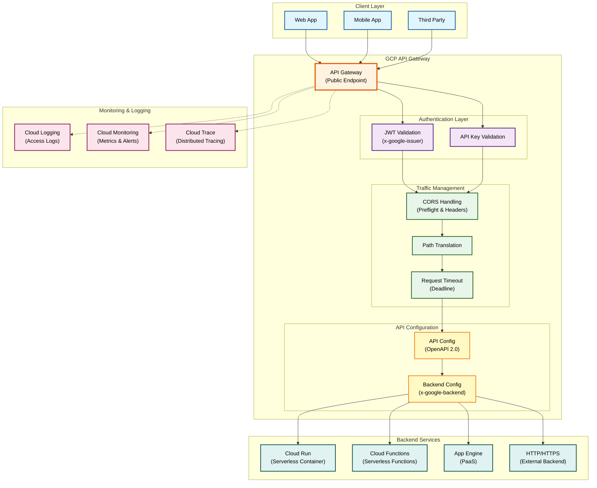
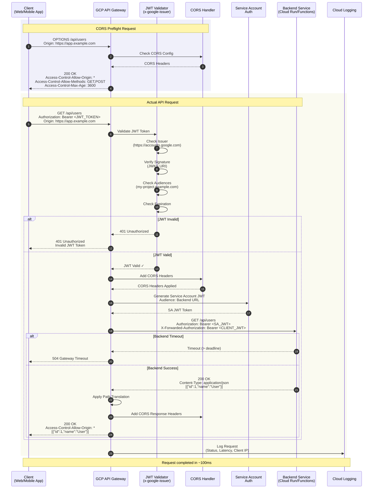

# GCP API Gateway Provider Anleitung

**Umfassende Anleitung für GCP API Gateway Provider in GAL (Gateway Abstraction Layer)**

## Inhaltsverzeichnis

1. [Übersicht](#ubersicht)
2. [GCP API Gateway Architektur](#gcp-api-gateway-architektur)
3. [Schnellstart](#schnellstart)
4. [Konfigurationsoptionen](#konfigurationsoptionen)

**Weitere Dokumentation:**
- [Feature-Implementierungen](GCP_APIGATEWAY_FEATURES.md) - Provider-spezifische Features, Backend Services
- [Deployment & Migration](GCP_APIGATEWAY_DEPLOYMENT.md) - Deployment, Import/Export, Migration, Best Practices

---
## Übersicht

GCP API Gateway ist ein vollständig verwalteter Service von Google Cloud Platform, der es Entwicklern ermöglicht, sichere und skalierbare APIs für ihre Backend-Services zu erstellen, zu deployen und zu verwalten.

GAL unterstützt GCP API Gateway als **Cloud-Provider** mit vollständiger Import/Export-Funktionalität über OpenAPI 2.0 (Swagger) mit `x-google-*` Extensions.

### Motivation

**Warum GCP API Gateway mit GAL?**

- **Cloud-Native**: Perfekt für GCP-basierte Microservices-Architekturen
- **Serverless**: Nahtlose Integration mit Cloud Run und Cloud Functions
- **Skalierbarkeit**: Automatische Skalierung ohne Infrastruktur-Management
- **GCP-Ökosystem**: Integration mit Cloud IAM, Cloud Logging, Cloud Monitoring
- **Pay-per-Use**: Nur bezahlen für tatsächliche API-Aufrufe
- **Multi-Region**: Globale Verfügbarkeit mit Load Balancing

---

## GCP API Gateway Architektur

### API Gateway Komponenten



### Request Flow

Das folgende Sequenzdiagramm zeigt den vollständigen Request-Ablauf durch GCP API Gateway:



**Flow-Erklärung:**

1. **CORS Preflight (OPTIONS):** Browser sendet Preflight-Request
2. **CORS Validation:** Gateway prüft Origin und gibt erlaubte Methods/Headers zurück
3. **Actual Request:** Client sendet echten Request mit JWT Token
4. **JWT Validation:** Gateway validiert Token gegen Issuer und JWKS URI
5. **Audience Check:** Gateway prüft ob Token-Audience in Config erlaubt ist
6. **Service Account Auth:** Gateway generiert SA JWT für Backend-Authentifizierung
7. **Backend Request:** Gateway forwarded Request mit SA Auth an Backend
8. **Response:** Backend antwortet, Gateway fügt CORS Headers hinzu
9. **Logging:** Request wird in Cloud Logging persistiert

### Backend-Typen

| Backend | Beschreibung | Verwendung |
|---------|-------------|------------|
| **Cloud Run** | Serverless Container | Microservices, REST APIs |
| **Cloud Functions** | Event-driven Functions | Webhooks, leichtgewichtige APIs |
| **App Engine** | PaaS Platform | Legacy Apps, komplexe Anwendungen |
| **HTTP/HTTPS** | Externes HTTP Backend | Bestehende Services, Hybrid Cloud |

---

## Schnellstart

### 1. Voraussetzungen

- GCP Account mit API Gateway API aktiviert
- `gcloud` CLI installiert und konfiguriert
- GAL installiert (`pip install gal-gateway`)
- Service Account mit API Gateway Berechtigungen

### 2. Einfache HTTP Backend API

**GAL Konfiguration** (`config.yaml`):

```yaml
version: "1.0"
provider: gcp_apigateway

global_config:
  gcp_apigateway:
    # GCP Project
    project_id: "my-gcp-project"
    api_id: "user-api"
    api_display_name: "User Management API"
    region: "us-central1"

    # Backend
    backend_address: "https://backend.example.com"
    backend_protocol: "https"
    backend_deadline: 30.0

    # CORS
    cors_enabled: true
    cors_allow_origins:
      - "*"

services:
  - name: user_service
    type: rest
    protocol: http

    upstream:
      targets:
        - host: backend.example.com
          port: 443

    routes:
      - path_prefix: /api/users
        methods:
          - GET
          - POST

      - path_prefix: /api/users/{id}
        methods:
          - GET
          - PUT
          - DELETE
```

**OpenAPI 2.0 generieren:**

```bash
gal generate -c config.yaml -p gcp_apigateway > openapi.yaml
```

**Deployment:**

```bash
# 1. API erstellen
gcloud api-gateway apis create user-api \
  --project=my-gcp-project

# 2. API Config deployen
gcloud api-gateway api-configs create user-api-config \
  --api=user-api \
  --openapi-spec=openapi.yaml \
  --project=my-gcp-project

# 3. Gateway erstellen
gcloud api-gateway gateways create user-api-gateway \
  --api=user-api \
  --api-config=user-api-config \
  --location=us-central1 \
  --project=my-gcp-project
```

**Gateway URL abrufen:**

```bash
gcloud api-gateway gateways describe user-api-gateway \
  --location=us-central1 \
  --project=my-gcp-project \
  --format="value(defaultHostname)"
```

**API testen:**

```bash
GATEWAY_URL=$(gcloud api-gateway gateways describe user-api-gateway \
  --location=us-central1 --project=my-gcp-project \
  --format="value(defaultHostname)")

curl "https://${GATEWAY_URL}/api/users"
```

---

## Konfigurationsoptionen

### GCP API Gateway Config (`GCPAPIGatewayConfig`)

#### API-Konfiguration

```yaml
global_config:
  gcp_apigateway:
    # API Identifikation
    api_id: "my-api"                    # API ID (eindeutig im Projekt)
    api_display_name: "My API"          # Display Name
    api_config_id: "my-api-config"      # API Config ID
    gateway_id: "my-api-gateway"        # Gateway ID

    # GCP Project & Region
    project_id: "my-gcp-project"        # GCP Project ID (REQUIRED)
    region: "us-central1"               # Gateway Region
```

**Verfügbare Regionen:**
- `us-central1`, `us-east1`, `us-west1`
- `europe-west1`, `europe-west2`, `europe-west3`
- `asia-northeast1`, `asia-southeast1`

#### Backend-Konfiguration

```yaml
global_config:
  gcp_apigateway:
    # Backend Service
    backend_address: "https://service.run.app"   # Backend URL (REQUIRED)
    backend_protocol: "https"                    # http | https

    # Path Translation
    backend_path_translation: "APPEND_PATH_TO_ADDRESS"
    # APPEND_PATH_TO_ADDRESS: Backend URL + Request Path
    # CONSTANT_ADDRESS:       Backend URL (ohne Request Path)

    # Timeout
    backend_deadline: 30.0                      # Request timeout (Sekunden)

    # Backend Authentication
    backend_disable_auth: false                 # Backend Auth deaktivieren
    backend_jwt_audience: ""                    # JWT Audience für Backend
```

**Path Translation Beispiele:**

| Translation | Backend URL | Request | Final URL |
|------------|-------------|---------|-----------|
| `APPEND_PATH_TO_ADDRESS` | `https://api.example.com` | `/users/123` | `https://api.example.com/users/123` |
| `CONSTANT_ADDRESS` | `https://api.example.com/v1` | `/users/123` | `https://api.example.com/v1` |

#### JWT Authentication

```yaml
global_config:
  gcp_apigateway:
    # JWT Validation (x-google-issuer, x-google-jwks_uri)
    jwt_issuer: "https://accounts.google.com"
    jwt_jwks_uri: "https://www.googleapis.com/oauth2/v3/certs"
    jwt_audiences:
      - "https://my-project.example.com"
      - "my-mobile-app"
```

**Unterstützte JWT Issuer:**

1. **Google Sign-In:**
   - Issuer: `https://accounts.google.com`
   - JWKS URI: `https://www.googleapis.com/oauth2/v3/certs`

2. **Firebase Authentication:**
   - Issuer: `https://securetoken.google.com/PROJECT_ID`
   - JWKS URI: `https://www.googleapis.com/service_accounts/v1/metadata/x509/securetoken@system.gserviceaccount.com`

3. **Custom JWT Provider:**
   - Eigener Issuer und JWKS Endpoint

#### CORS Configuration

```yaml
global_config:
  gcp_apigateway:
    # CORS Settings
    cors_enabled: true
    cors_allow_origins:
      - "https://app.example.com"
      - "https://admin.example.com"
    cors_allow_methods:
      - GET
      - POST
      - PUT
      - DELETE
      - OPTIONS
    cors_allow_headers:
      - Content-Type
      - Authorization
      - X-Custom-Header
    cors_expose_headers:
      - X-Request-Id
    cors_max_age: 3600  # Preflight Cache (Sekunden)
```

#### Service Account Authentication

```yaml
global_config:
  gcp_apigateway:
    # Service Account für Backend Auth
    service_account_email: "api-gateway@my-project.iam.gserviceaccount.com"
```

**Service Account Setup:**

```bash
# 1. Service Account erstellen
gcloud iam service-accounts create api-gateway \
  --display-name="API Gateway Service Account" \
  --project=my-project

# 2. Backend Berechtigung erteilen (z.B. Cloud Run)
gcloud run services add-iam-policy-binding my-service \
  --member="serviceAccount:api-gateway@my-project.iam.gserviceaccount.com" \
  --role="roles/run.invoker" \
  --region=us-central1

# 3. Bei API Config Deployment angeben
gcloud api-gateway api-configs create my-config \
  --api=my-api \
  --openapi-spec=openapi.yaml \
  --backend-auth-service-account=api-gateway@my-project.iam.gserviceaccount.com \
  --project=my-project
```

---

