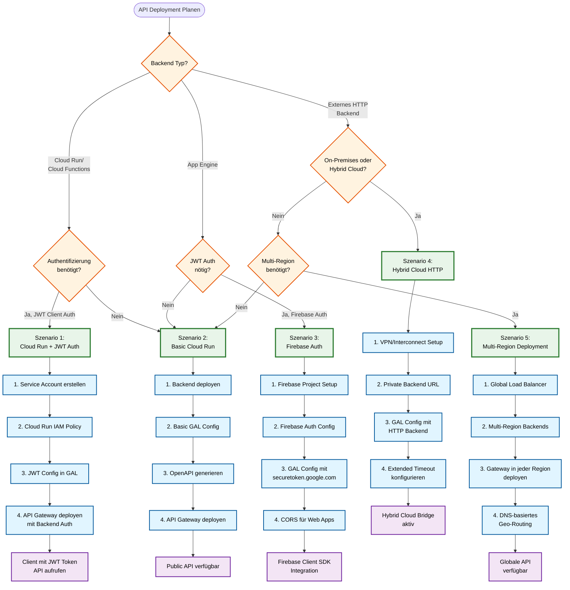

# GCP API Gateway Deployment & Migration

**Deployment, Import/Export, Migration und Best Practices für GCP API Gateway Provider in GAL**

**Navigation:**
- [← Zurück zur GCP API Gateway Übersicht](GCP_APIGATEWAY.md)
- [← Feature-Implementierungen](GCP_APIGATEWAY_FEATURES.md)

## Inhaltsverzeichnis

1. [Deployment-Strategien](#deployment-strategien)
2. [Import/Export](#importexport)
3. [Migration & Best Practices](#migration--best-practices)
4. [Troubleshooting](#troubleshooting)
5. [Performance & Limits](#performance--limits)
6. [Kosten](#kosten)
7. [Security Best Practices](#security-best-practices)
8. [Weiterführende Ressourcen](#weiterfuhrende-ressourcen)

---
## Deployment-Strategien

### Deployment-Entscheidungsbaum

Der folgende Entscheidungsbaum hilft bei der Auswahl der richtigen Deployment-Strategie:



**Deployment-Strategien im Überblick:**

| Szenario | Use Case | Hauptmerkmale |
|----------|----------|---------------|
| **1. Cloud Run + JWT** | Production APIs mit User Auth | JWT Validation, Service Account Backend Auth |
| **2. Basic Cloud Run** | Einfache APIs, interne Services | Minimal Config, schnelles Setup |
| **3. Firebase Auth** | Mobile/Web Apps | Firebase Integration, CORS Support |
| **4. Hybrid Cloud** | On-Premises Integration | VPN/Interconnect, Extended Timeouts |
| **5. Multi-Region** | Globale Services | Geo-Distribution, High Availability |

### 1. Cloud Run Backend

**Szenario:** Serverless Container als Backend

```yaml
version: "1.0"
provider: gcp_apigateway

global_config:
  gcp_apigateway:
    project_id: "my-project"
    api_id: "cloudrun-api"
    region: "us-central1"

    # Cloud Run Service
    backend_address: "https://my-service-abc123-uc.a.run.app"
    backend_deadline: 60.0

    # Service Account Auth
    service_account_email: "api-gateway@my-project.iam.gserviceaccount.com"
    backend_jwt_audience: "https://my-service-abc123-uc.a.run.app"

    # JWT für Client Auth
    jwt_issuer: "https://accounts.google.com"
    jwt_jwks_uri: "https://www.googleapis.com/oauth2/v3/certs"

services:
  - name: api_service
    type: rest
    protocol: http

    upstream:
      targets:
        - host: my-service-abc123-uc.a.run.app
          port: 443

    routes:
      - path_prefix: /api/v1
        methods:
          - GET
          - POST
          - PUT
          - DELETE
```

**Deployment:**

```bash
# 1. Cloud Run Service deployen
gcloud run deploy my-service \
  --image=gcr.io/my-project/my-service:latest \
  --region=us-central1 \
  --platform=managed \
  --no-allow-unauthenticated

# 2. GAL Config generieren
gal generate -c config.yaml -p gcp_apigateway > openapi.yaml

# 3. API Gateway deployen
gcloud api-gateway apis create cloudrun-api --project=my-project

gcloud api-gateway api-configs create cloudrun-api-config \
  --api=cloudrun-api \
  --openapi-spec=openapi.yaml \
  --backend-auth-service-account=api-gateway@my-project.iam.gserviceaccount.com \
  --project=my-project

gcloud api-gateway gateways create cloudrun-api-gateway \
  --api=cloudrun-api \
  --api-config=cloudrun-api-config \
  --location=us-central1 \
  --project=my-project
```

### 2. Firebase Authentication

**Szenario:** Mobile/Web App mit Firebase Auth

```yaml
version: "1.0"
provider: gcp_apigateway

global_config:
  gcp_apigateway:
    project_id: "my-firebase-project"
    api_id: "firebase-api"
    region: "us-central1"

    backend_address: "https://backend.example.com"

    # Firebase Auth
    jwt_issuer: "https://securetoken.google.com/my-firebase-project"
    jwt_jwks_uri: "https://www.googleapis.com/service_accounts/v1/metadata/x509/securetoken@system.gserviceaccount.com"
    jwt_audiences:
      - "my-firebase-project"

    # CORS für Web Apps
    cors_enabled: true
    cors_allow_origins:
      - "https://app.example.com"
    cors_allow_headers:
      - Content-Type
      - Authorization
      - Firebase-Instance-ID-Token

services:
  - name: api
    type: rest
    protocol: http

    upstream:
      targets:
        - host: backend.example.com
          port: 443

    routes:
      - path_prefix: /api/users
        methods:
          - GET
          - POST
          - PUT
          - DELETE
```

**Client-Code (JavaScript):**

```javascript
// Firebase Auth Token holen
const user = firebase.auth().currentUser;
const token = await user.getIdToken();

// API Gateway Request
const response = await fetch('https://GATEWAY_URL/api/users', {
  method: 'GET',
  headers: {
    'Authorization': `Bearer ${token}`,
    'Content-Type': 'application/json'
  }
});
```

### 3. Multi-Region Deployment

**Szenario:** Globale API mit Multi-Region Load Balancing

```yaml
version: "1.0"
provider: gcp_apigateway

global_config:
  gcp_apigateway:
    project_id: "global-project"
    api_id: "global-api"
    region: "us-central1"  # Primary Region

    # Global Load Balancer
    backend_address: "https://global-lb.example.com"

    jwt_issuer: "https://accounts.google.com"
    jwt_jwks_uri: "https://www.googleapis.com/oauth2/v3/certs"

    cors_enabled: true
    cors_allow_origins:
      - "*"

services:
  - name: global_api
    type: rest
    protocol: http

    upstream:
      targets:
        - host: global-lb.example.com
          port: 443

    routes:
      - path_prefix: /api/v1
        methods:
          - GET
          - POST
          - PUT
          - DELETE
```

**Multi-Region Deployment:**

```bash
# Deploy in us-central1
gcloud api-gateway gateways create global-api-gateway-us \
  --api=global-api \
  --api-config=global-api-config \
  --location=us-central1 \
  --project=global-project

# Deploy in europe-west1
gcloud api-gateway gateways create global-api-gateway-eu \
  --api=global-api \
  --api-config=global-api-config \
  --location=europe-west1 \
  --project=global-project

# Deploy in asia-northeast1
gcloud api-gateway gateways create global-api-gateway-asia \
  --api=global-api \
  --api-config=global-api-config \
  --location=asia-northeast1 \
  --project=global-project
```

**DNS Load Balancing:**

```
global-api.example.com:
  - us.global-api.example.com → us-central1 Gateway
  - eu.global-api.example.com → europe-west1 Gateway
  - asia.global-api.example.com → asia-northeast1 Gateway
```

### 4. Hybrid Cloud (HTTP Backend)

**Szenario:** On-Premises Backend mit GCP API Gateway

```yaml
version: "1.0"
provider: gcp_apigateway

global_config:
  gcp_apigateway:
    project_id: "hybrid-project"
    api_id: "hybrid-api"
    region: "us-central1"

    # On-Prem Backend (via VPN/Interconnect)
    backend_address: "https://10.0.1.50:8080"
    backend_protocol: "https"
    backend_deadline: 60.0

    cors_enabled: true

services:
  - name: onprem_api
    type: rest
    protocol: http

    upstream:
      targets:
        - host: "10.0.1.50"
          port: 8080

    routes:
      - path_prefix: /api/legacy
        methods:
          - GET
          - POST
```

---

## Import/Export

### Export: GAL → GCP

**GAL Config in OpenAPI 2.0 exportieren:**

```bash
# Export to OpenAPI 2.0 (Swagger)
gal generate -c config.yaml -p gcp_apigateway > openapi.yaml

# Validate OpenAPI Spec
gcloud api-gateway api-configs validate \
  --openapi-spec=openapi.yaml \
  --project=my-project
```

**Generated OpenAPI 2.0:**

```yaml
swagger: "2.0"
info:
  title: "User API"
  version: "1.0.0"
  description: "User Management API"

schemes:
  - https

x-google-backend:
  address: "https://backend.example.com"
  path_translation: "APPEND_PATH_TO_ADDRESS"
  deadline: 30.0

securityDefinitions:
  google_jwt:
    authorizationUrl: ""
    flow: "implicit"
    type: "oauth2"
    x-google-issuer: "https://accounts.google.com"
    x-google-jwks_uri: "https://www.googleapis.com/oauth2/v3/certs"
    x-google-audiences: "https://my-project.example.com"

paths:
  /api/users:
    get:
      summary: "Get users"
      operationId: "getUsers"
      security:
        - google_jwt: []
      responses:
        200:
          description: "Success"
    post:
      summary: "Create user"
      operationId: "createUser"
      security:
        - google_jwt: []
      responses:
        201:
          description: "Created"
    options:
      summary: "CORS preflight"
      operationId: "corsUsers"
      responses:
        200:
          description: "CORS response"
          headers:
            Access-Control-Allow-Origin:
              type: "string"
              description: "*"
            Access-Control-Allow-Methods:
              type: "string"
              description: "GET, POST, OPTIONS"
            Access-Control-Allow-Headers:
              type: "string"
              description: "Content-Type, Authorization"
            Access-Control-Max-Age:
              type: "string"
              description: "3600"
```

### Import: GCP → GAL

**Bestehende GCP API Gateway Konfiguration importieren:**

```bash
# 1. API Config exportieren (via gcloud)
gcloud api-gateway api-configs describe my-api-config \
  --api=my-api \
  --project=my-project \
  --format=json > api-config.json

# 2. OpenAPI Spec extrahieren
# (OpenAPI Spec ist in gatewayServiceAccount.openApiDocuments[0].document)

# 3. GAL Import
gal import -i openapi.yaml -p gcp_apigateway -o gal-config.yaml
```

**Importierte GAL Config:**

```yaml
version: "1.0"
provider: gal

global_config:
  gcp_apigateway:
    api_id: "my-api"
    api_display_name: "My API"
    project_id: "my-project"
    region: "us-central1"
    backend_address: "https://backend.example.com"
    backend_path_translation: "APPEND_PATH_TO_ADDRESS"
    backend_deadline: 30.0
    jwt_issuer: "https://accounts.google.com"
    jwt_jwks_uri: "https://www.googleapis.com/oauth2/v3/certs"
    jwt_audiences:
      - "https://my-project.example.com"
    cors_enabled: true
    cors_allow_origins:
      - "*"

services:
  - name: imported-api
    type: rest
    protocol: https
    upstream:
      targets:
        - host: backend.example.com
          port: 443
    routes:
      - path_prefix: /api/users
        methods:
          - GET
          - POST
```

---

## Migration & Best Practices

### Migration von anderen Providern

Der folgende Ablauf zeigt den typischen Migrationsprozess von anderen Gateway-Providern zu GCP API Gateway:

```mermaid
flowchart LR
    subgraph Source["Quell-Provider"]
        AWS["AWS API Gateway<br/>(OpenAPI 3.0)"]
        Azure["Azure APIM<br/>(OpenAPI 3.0)"]
        Kong["Kong Gateway<br/>(Kong Config)"]
        Nginx["Nginx<br/>(nginx.conf)"]
    end

    subgraph GAL["GAL - Gateway Abstraction Layer"]
        Import["GAL Import<br/>gal import -i spec.yaml"]
        Config["GAL Config<br/>(Provider-agnostisch)"]
        Export["GAL Export<br/>gal generate -p gcp_apigateway"]
    end

    subgraph GCP["GCP API Gateway"]
        OpenAPI["OpenAPI 2.0<br/>(x-google-* Extensions)"]
        Validate["Validation<br/>gcloud api-configs validate"]
        Deploy["Deployment<br/>API + Config + Gateway"]
        Live["Live Gateway<br/>(Public Endpoint)"]
    end

    subgraph Migration["Migrations-Schritte"]
        M1["1. Export aus<br/>Quell-Provider"]
        M2["2. GAL Import<br/>(Auto-Conversion)"]
        M3["3. Config anpassen<br/>(GCP-spezifisch)"]
        M4["4. OpenAPI 2.0<br/>generieren"]
        M5["5. Validieren &<br/>Deployen"]
        M6["6. Testing &<br/>Cutover"]
    end

    %% Flow
    AWS --> M1
    Azure --> M1
    Kong --> M1
    Nginx --> M1

    M1 --> Import
    Import --> M2
    M2 --> Config
    Config --> M3
    M3 --> Export
    Export --> M4
    M4 --> OpenAPI
    OpenAPI --> M5
    M5 --> Validate
    Validate --> Deploy
    Deploy --> M6
    M6 --> Live

    %% Annotations
    Import -.->|Unterstützt:<br/>AWS, Azure, Kong,<br/>Nginx, OpenAPI| Config
    Config -.->|Provider-neutral:<br/>services, routes,<br/>upstream| Export
    Export -.->|Auto-generiert:<br/>x-google-backend,<br/>x-google-issuer| OpenAPI
    Validate -.->|Prüft:<br/>OpenAPI 2.0,<br/>Extensions| Deploy

    %% Styling
    classDef sourceStyle fill:#ffebee,stroke:#c62828,stroke-width:2px,color:#000
    classDef galStyle fill:#e8f5e9,stroke:#2e7d32,stroke-width:3px,color:#000
    classDef gcpStyle fill:#e3f2fd,stroke:#1565c0,stroke-width:2px,color:#000
    classDef stepStyle fill:#fff3e0,stroke:#ef6c00,stroke-width:2px,color:#000

    class AWS,Azure,Kong,Nginx sourceStyle
    class Import,Config,Export galStyle
    class OpenAPI,Validate,Deploy,Live gcpStyle
    class M1,M2,M3,M4,M5,M6 stepStyle
```



**Migrations-Checkliste:**

| Phase | Schritte | Tools | Validierung |
|-------|----------|-------|-------------|
| **1. Export** | Quell-Config extrahieren | `aws apigateway get-export`<br/>`az apim api export` | Syntax Check |
| **2. Import** | GAL Import durchführen | `gal import -i spec.yaml -p aws` | Schema Validation |
| **3. Anpassung** | GCP-spezifische Config | Edit `global_config.gcp_apigateway` | Manual Review |
| **4. Export** | OpenAPI 2.0 generieren | `gal generate -p gcp_apigateway` | OpenAPI 2.0 Syntax |
| **5. Deployment** | GCP Deployment | `gcloud api-gateway` | API Config Validation |
| **6. Testing** | Funktionstests | curl, Postman, CI/CD | Response Comparison |

#### Von AWS API Gateway

**AWS → GCP Mapping:**

| AWS | GCP | Notizen |
|-----|-----|---------|
| `x-amazon-apigateway-integration` | `x-google-backend` | Backend Config |
| Lambda Authorizer | `x-google-issuer` (JWT) | Custom Auth → JWT |
| Cognito User Pool | `x-google-issuer` (Firebase) | OAuth2 → Firebase Auth |
| API Key | API Key | Beide unterstützt |
| OpenAPI 3.0 | OpenAPI 2.0 | **Version downgrade nötig** |

**Migration Steps:**

```bash
# 1. AWS API exportieren
aws apigateway get-export \
  --rest-api-id abc123 \
  --stage-name prod \
  --export-type oas30 \
  --accepts application/yaml \
  aws-openapi.yaml

# 2. In GAL importieren
gal import -i aws-openapi.yaml -p aws_apigateway -o gal-config.yaml

# 3. Provider auf GCP ändern
# Editiere gal-config.yaml: provider: gcp_apigateway

# 4. GCP-spezifische Config hinzufügen
# Füge global_config.gcp_apigateway hinzu

# 5. GCP OpenAPI generieren
gal generate -c gal-config.yaml -p gcp_apigateway > gcp-openapi.yaml
```

#### Von Azure APIM

**Azure → GCP Mapping:**

| Azure APIM | GCP | Notizen |
|------------|-----|---------|
| Backend Service | `x-google-backend` | Backend URL |
| JWT Validation Policy | `x-google-issuer` | JWT Config |
| CORS Policy | CORS Headers | OPTIONS Methods |
| Rate Limiting | Nicht unterstützt | Use Cloud Armor |

### Best Practices

#### 1. Service Account Berechtigungen

**Minimale Berechtigungen:**

```bash
# API Gateway Service Account
gcloud projects add-iam-policy-binding my-project \
  --member="serviceAccount:api-gateway@my-project.iam.gserviceaccount.com" \
  --role="roles/apigateway.admin"

# Cloud Run Invoker (für Backend Auth)
gcloud run services add-iam-policy-binding my-service \
  --member="serviceAccount:api-gateway@my-project.iam.gserviceaccount.com" \
  --role="roles/run.invoker" \
  --region=us-central1
```

#### 2. Timeout-Konfiguration

```yaml
global_config:
  gcp_apigateway:
    # Kurze Timeouts für Read Operations
    backend_deadline: 10.0

    # Längere Timeouts für Write Operations (per-route)
    # Nutze x-google-backend auf Operation-Level
```

**Per-Operation Timeouts:**

```yaml
# In generiertem OpenAPI 2.0:
paths:
  /api/users:
    get:
      x-google-backend:
        deadline: 5.0   # Schnelle Read
    post:
      x-google-backend:
        deadline: 30.0  # Langsamere Write
```

#### 3. CORS für SPAs

```yaml
global_config:
  gcp_apigateway:
    cors_enabled: true
    cors_allow_origins:
      - "https://app.example.com"
      - "http://localhost:3000"  # Development
    cors_allow_methods:
      - GET
      - POST
      - PUT
      - DELETE
      - OPTIONS
    cors_allow_headers:
      - Content-Type
      - Authorization
      - X-Requested-With
    cors_expose_headers:
      - X-Request-Id
      - X-RateLimit-Remaining
    cors_max_age: 7200  # 2 Stunden Cache
```

#### 4. JWT Audience Validation

```yaml
global_config:
  gcp_apigateway:
    jwt_issuer: "https://accounts.google.com"
    jwt_jwks_uri: "https://www.googleapis.com/oauth2/v3/certs"

    # Spezifische Audiences
    jwt_audiences:
      - "https://my-project.example.com"      # Web App
      - "com.example.mobile.android"          # Android App
      - "com.example.mobile.ios"              # iOS App
```

#### 5. Cloud Run Backend Best Practices

```yaml
global_config:
  gcp_apigateway:
    backend_address: "https://my-service-abc123-uc.a.run.app"

    # Längerer Timeout für Cloud Run Cold Starts
    backend_deadline: 60.0

    # Service Account Auth aktivieren
    service_account_email: "api-gateway@my-project.iam.gserviceaccount.com"
    backend_jwt_audience: "https://my-service-abc123-uc.a.run.app"
```

**Cloud Run Service mit Min Instances:**

```bash
# Verhindere Cold Starts
gcloud run services update my-service \
  --min-instances=1 \
  --region=us-central1
```

#### 6. Monitoring & Logging

**Cloud Logging aktivieren:**

```bash
# API Gateway Logs anzeigen
gcloud logging read "resource.type=api AND resource.labels.service=GATEWAY_ID" \
  --limit=50 \
  --project=my-project
```

**Cloud Monitoring Metrics:**

- `apigateway.googleapis.com/request_count` - Request Count
- `apigateway.googleapis.com/request_latencies` - Latenz
- `apigateway.googleapis.com/error_count` - Error Count

**Alert erstellen:**

```bash
gcloud alpha monitoring policies create \
  --notification-channels=CHANNEL_ID \
  --display-name="API Gateway High Error Rate" \
  --condition-display-name="Error Rate > 5%" \
  --condition-threshold-value=0.05 \
  --condition-threshold-duration=300s \
  --metric-type="apigateway.googleapis.com/error_count"
```

---

## Troubleshooting

### Häufige Probleme

#### 1. 503 Service Unavailable

**Problem:** Gateway antwortet mit 503

**Ursachen:**
- Backend Service nicht erreichbar
- Backend Timeout überschritten
- Service Account hat keine Berechtigung

**Lösung:**

```bash
# Backend Erreichbarkeit prüfen
curl -I https://backend.example.com/api/health

# Timeout erhöhen
backend_deadline: 60.0

# Service Account Berechtigung prüfen
gcloud run services get-iam-policy my-service \
  --region=us-central1 \
  --project=my-project
```

#### 2. 401 Unauthorized (JWT)

**Problem:** JWT Token wird abgelehnt

**Ursachen:**
- Falscher Issuer
- JWKS URI nicht erreichbar
- Token expired
- Audience mismatch

**Lösung:**

```bash
# JWT Token dekodieren und prüfen
echo "TOKEN" | cut -d. -f2 | base64 -d | jq .

# Prüfe:
# - iss (Issuer) = jwt_issuer Config
# - aud (Audience) in jwt_audiences Config
# - exp (Expiration) noch gültig
```

**Config korrigieren:**

```yaml
global_config:
  gcp_apigateway:
    # Issuer muss exakt mit Token 'iss' übereinstimmen
    jwt_issuer: "https://accounts.google.com"

    # JWKS URI muss erreichbar sein
    jwt_jwks_uri: "https://www.googleapis.com/oauth2/v3/certs"

    # Mindestens eine Audience muss mit Token 'aud' übereinstimmen
    jwt_audiences:
      - "https://my-project.example.com"
```

#### 3. CORS Preflight Failed

**Problem:** Browser blockiert Request wegen CORS

**Ursachen:**
- CORS nicht aktiviert
- Origin nicht in `cors_allow_origins`
- OPTIONS Method fehlt

**Lösung:**

```yaml
global_config:
  gcp_apigateway:
    cors_enabled: true
    cors_allow_origins:
      - "https://app.example.com"  # WICHTIG: Exakte Origin
      - "*"  # Oder Wildcard für Development
    cors_allow_methods:
      - GET
      - POST
      - PUT
      - DELETE
      - OPTIONS  # WICHTIG: OPTIONS muss enthalten sein
    cors_allow_headers:
      - Content-Type
      - Authorization
```

**Browser Console prüfen:**

```
Access to fetch at 'https://GATEWAY_URL/api/users' from origin 'https://app.example.com'
has been blocked by CORS policy: No 'Access-Control-Allow-Origin' header is present
```

#### 4. Backend Timeout

**Problem:** Request timeout nach 30 Sekunden

**Lösung:**

```yaml
global_config:
  gcp_apigateway:
    # Globaler Timeout erhöhen
    backend_deadline: 120.0  # Maximum: 120 Sekunden
```

**Per-Operation Timeout:**

Editiere generiertes `openapi.yaml`:

```yaml
paths:
  /api/long-running:
    post:
      x-google-backend:
        address: "https://backend.example.com"
        deadline: 120.0
```

#### 5. API Config Deployment Failed

**Problem:** `gcloud api-gateway api-configs create` schlägt fehl

**Fehler:**

```
ERROR: (gcloud.api-gateway.api-configs.create) INVALID_ARGUMENT:
Invalid OpenAPI spec: swagger version must be 2.0
```

**Lösung:**

```bash
# GAL generiert automatisch OpenAPI 2.0 für GCP
gal generate -c config.yaml -p gcp_apigateway > openapi.yaml

# Prüfe Version im openapi.yaml
grep "swagger:" openapi.yaml
# Sollte sein: swagger: "2.0"
```

**Andere OpenAPI Fehler:**

```bash
# OpenAPI Spec validieren
gcloud api-gateway api-configs validate \
  --openapi-spec=openapi.yaml \
  --project=my-project

# Zeigt detaillierte Fehler mit Zeilennummern
```

---

## Performance & Limits

### GCP API Gateway Limits

| Limit | Wert | Notizen |
|-------|------|---------|
| Max Request Size | 10 MB | Request Body |
| Max Response Size | 10 MB | Response Body |
| Max Timeout | 120 Sekunden | Backend Deadline |
| Max APIs pro Project | 500 | Soft Limit |
| Max Gateways pro Region | 100 | Soft Limit |
| Max API Configs pro API | 500 | Soft Limit |

**Limits erhöhen:**

```bash
# Support kontaktieren für höhere Limits
gcloud support cases create \
  --summary="API Gateway Quota Increase Request" \
  --description="Need higher limits for production workload"
```

### Performance Optimierung

#### 1. Backend Latency reduzieren

```yaml
global_config:
  gcp_apigateway:
    # Cloud Run in gleicher Region deployen
    region: "us-central1"
    backend_address: "https://service-us-central1.run.app"
```

#### 2. CORS Preflight Cache

```yaml
global_config:
  gcp_apigateway:
    # Längerer CORS Cache reduziert Preflight Requests
    cors_max_age: 86400  # 24 Stunden
```

#### 3. Cloud Run Min Instances

```bash
# Verhindere Cold Starts
gcloud run services update my-service \
  --min-instances=1 \
  --max-instances=100 \
  --region=us-central1
```

#### 4. CDN für statische Responses

```bash
# Cloud CDN aktivieren (für cacheable Responses)
# Nutze Cloud Load Balancer + Cloud CDN vor API Gateway
```

---

## Kosten

### Preismodell

**GCP API Gateway Pricing (Stand 2025):**

| Komponente | Preis | Einheit |
|-----------|-------|---------|
| API Calls | $3.00 | pro 1M Calls |
| API Calls (ab 2B) | $1.50 | pro 1M Calls |
| Data Transfer (Egress) | $0.12 | pro GB (nach GCP Free Tier) |

**Beispiel-Rechnung (1M Requests/Monat):**

```
API Gateway:
- 1M API Calls: $3.00

Cloud Run Backend:
- 1M Requests: ~$0.40
- CPU: ~$2.00
- Memory: ~$1.00

Total: ~$6.40/Monat
```

### Kosten-Optimierung

1. **Request Batching:** Mehrere Requests zu einem kombinieren
2. **Caching:** Cloud CDN oder Backend Caching nutzen
3. **Minimal Responses:** Nur nötige Daten zurückgeben
4. **Compression:** gzip Compression aktivieren

---

## Security Best Practices

### 1. JWT Authentication

```yaml
global_config:
  gcp_apigateway:
    # IMMER JWT für Production APIs
    jwt_issuer: "https://accounts.google.com"
    jwt_jwks_uri: "https://www.googleapis.com/oauth2/v3/certs"
    jwt_audiences:
      - "https://my-project.example.com"
```

### 2. Service Account Backend Auth

```yaml
global_config:
  gcp_apigateway:
    # Backend Auth für Cloud Run/Functions
    service_account_email: "api-gateway@my-project.iam.gserviceaccount.com"
    backend_jwt_audience: "https://backend.run.app"
```

### 3. Cloud Armor Integration

```bash
# DDoS Protection & WAF
gcloud compute security-policies create api-protection \
  --description="API Gateway Protection"

# Rate Limiting Rule
gcloud compute security-policies rules create 1000 \
  --security-policy=api-protection \
  --expression="true" \
  --action=rate-based-ban \
  --rate-limit-threshold-count=100 \
  --rate-limit-threshold-interval-sec=60
```

### 4. VPC Service Controls

```bash
# API Gateway in VPC Service Perimeter einschließen
gcloud access-context-manager perimeters create api-perimeter \
  --title="API Gateway Perimeter" \
  --resources=projects/PROJECT_NUMBER \
  --restricted-services=apigateway.googleapis.com
```

### 5. Audit Logging

```bash
# Admin Activity Logs (automatisch aktiviert)
# Data Access Logs aktivieren
gcloud logging sinks create api-audit-sink \
  bigquery.googleapis.com/projects/my-project/datasets/audit_logs \
  --log-filter='resource.type="api"'
```

---

## Weiterführende Ressourcen

### GCP Dokumentation

- [API Gateway Overview](https://cloud.google.com/api-gateway/docs/overview)
- [OpenAPI Extensions](https://cloud.google.com/endpoints/docs/openapi/openapi-extensions)
- [Authentication](https://cloud.google.com/api-gateway/docs/authenticate-service-account)
- [Monitoring](https://cloud.google.com/api-gateway/docs/monitoring)

### GAL Dokumentation

- [Schnellstart](QUICKSTART.md)
- [Provider Übersicht](PROVIDERS.md)
- [Authentication Guide](AUTHENTICATION.md)
- [CORS Guide](CORS.md)

### Tools

- [gcloud CLI](https://cloud.google.com/sdk/gcloud)
- [OpenAPI Validator](https://validator.swagger.io/)
- [JWT Debugger](https://jwt.io/)

---

**Letzte Aktualisierung:** 2025-10-20
**GAL Version:** 1.4.0
**Feature Status:** ✅ Production Ready
