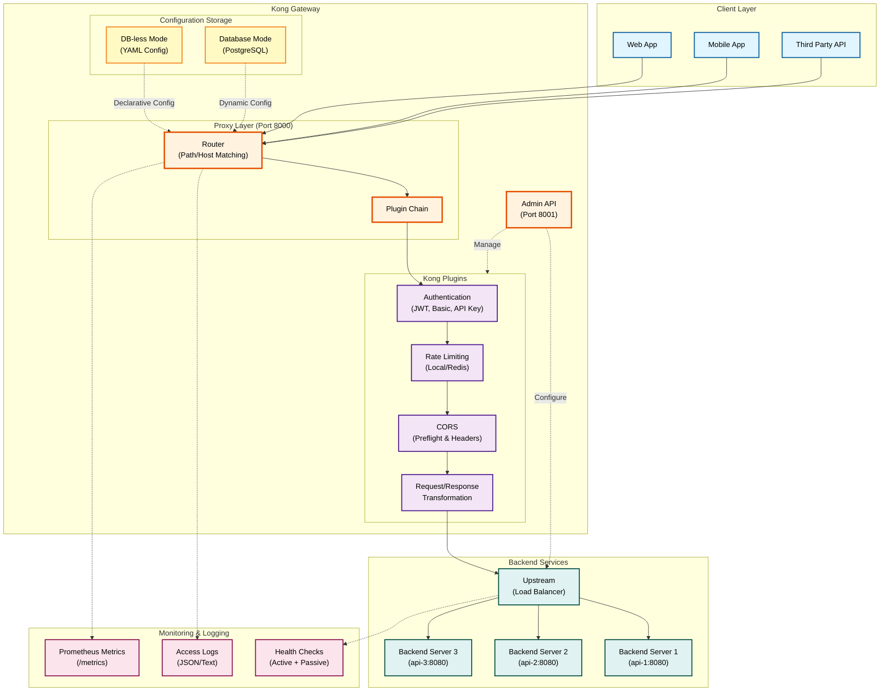
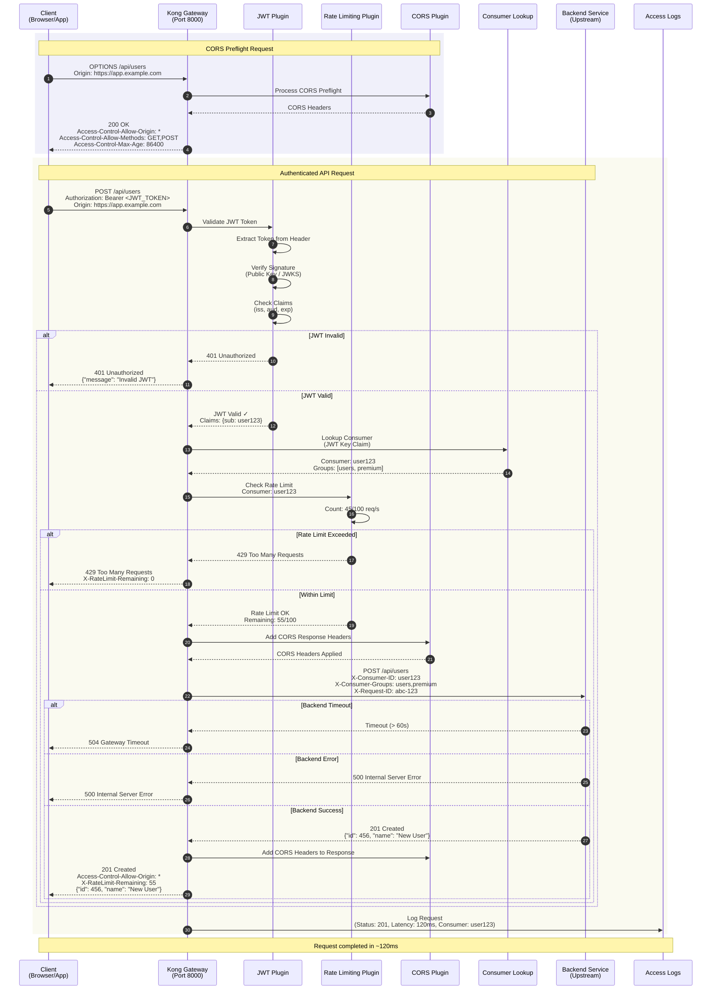

# Kong Gateway Provider Anleitung

**Umfassende Anleitung für Kong Gateway Provider in GAL (Gateway Abstraction Layer)**

## Inhaltsverzeichnis

1. [Übersicht](#ubersicht)
2. [Schnellstart](#schnellstart)
3. [Installation und Setup](#installation-und-setup)
4. [Deployment-Strategien](#deployment-strategien)
5. [Konfigurationsoptionen](#konfigurationsoptionen)
6. [Provider-Vergleich](#provider-vergleich)

**Weitere Dokumentation:**
- [Feature-Implementierungen](KONG_FEATURES.md) - Details zu Plugins, Auth, Rate Limiting, Circuit Breaker
- [Migration & Best Practices](KONG_DEPLOYMENT.md) - Migration, Best Practices, Troubleshooting

---
## Übersicht

**Kong Gateway** ist ein **Open-Source API Gateway** und **Service Mesh**, gebaut auf **Nginx** und **OpenResty (Lua)**. Kong ist bekannt für seine **Plugin-Architektur** und **einfache Verwaltung**.

### Warum Kong?

- ✅ **Plugin-Ökosystem** - 300+ Plugins (Community + Enterprise)
- ✅ **DB-less Mode** - Deklarative Konfiguration (YAML)
- ✅ **Developer-Friendly** - Einfache Admin API
- ✅ **Performance** - Basiert auf Nginx + OpenResty
- ✅ **Kong Manager** - Web UI für Verwaltung (Enterprise)
- ✅ **Cloud-Native** - Kubernetes-ready, Helm Charts
- ✅ **Service Mesh** - Kong Mesh (Kuma-basiert)

### Kong Gateway Komponenten



**Diagramm-Erklärung:**

- **Client Layer**: Verschiedene Client-Typen (Web, Mobile, APIs)
- **Kong Gateway**: Zentrale Komponenten
  - **Admin API** (Port 8001): Verwaltung und Konfiguration
  - **Proxy Layer** (Port 8000): Request-Handling und Routing
  - **Plugin Chain**: Kong's Plugin-Architektur für Features
- **Backend Services**: Load Balanced Upstream Targets
- **Monitoring**: Observability via Prometheus, Logs, Health Checks
- **DB-less vs. Database Mode**: Zwei Deployment-Optionen

### Kong Feature-Matrix

| Feature | Kong Support | GAL Implementation |
|---------|--------------|-------------------|
| **Traffic Management** | | |
| Rate Limiting | ✅ Native Plugin | ✅ Vollständig |
| Circuit Breaker | ⚠️ Via Plugin | ⚠️ Plugin Config |
| Health Checks | ✅ Passive + Active | ✅ Vollständig |
| Load Balancing | ✅ Native | ✅ Vollständig |
| Timeout & Retry | ✅ Native | ✅ Vollständig |
| **Security** | | |
| Basic Auth | ✅ Native Plugin | ✅ Vollständig |
| JWT Validation | ✅ Native Plugin | ✅ Vollständig |
| API Key Auth | ✅ Native Plugin | ✅ Vollständig |
| CORS | ✅ Native Plugin | ✅ Vollständig |
| **Advanced** | | |
| WebSocket | ✅ Native | ✅ Vollständig |
| gRPC | ✅ Native | ✅ Vollständig |
| Body Transformation | ✅ Plugins | ✅ Vollständig |
| Request/Response Headers | ✅ Plugins | ✅ Vollständig |

---

## Schnellstart

### Request Flow

Das folgende Sequenzdiagramm zeigt den vollständigen Request-Ablauf durch Kong Gateway:



**Flow-Erklärung:**

1. **CORS Preflight (OPTIONS):** Browser sendet Preflight-Request für Cross-Origin Requests
2. **CORS Plugin:** Kong validiert Origin und gibt erlaubte Methods/Headers zurück
3. **Actual Request:** Client sendet echten Request mit JWT Token
4. **JWT Plugin:** Validiert Token-Signatur, Issuer, Audience, Expiration
5. **Consumer Lookup:** Kong identifiziert Consumer basierend auf JWT Key Claim
6. **Rate Limiting Plugin:** Prüft ob Consumer innerhalb des Rate Limits ist (z.B. 100 req/s)
7. **Backend Request:** Kong forwarded Request mit zusätzlichen Headers (Consumer-ID, Groups)
8. **Response:** Backend antwortet, Kong fügt CORS Headers und Rate Limit Info hinzu
9. **Access Logs:** Request wird mit Status, Latency, Consumer-Info geloggt

**Kong Plugin Chain Vorteile:**
- ✅ Modulare Architektur - Plugins können einzeln aktiviert/deaktiviert werden
- ✅ Consumer-basiertes Rate Limiting - Pro User/API Key unterschiedliche Limits
- ✅ Context-Weitergabe - Consumer-Informationen werden an Backend weitergegeben
- ✅ Performance - Plugin Chain läuft in Nginx Worker Threads (Lua)

### Beispiel 1: Einfacher API Gateway

```yaml
version: "1.0"
provider: kong

global:
  host: 0.0.0.0
  port: 8000
  admin_port: 8001

services:
  - name: api_service
    type: rest
    protocol: http
    upstream:
      host: api-backend
      port: 8080
    routes:
      - path_prefix: /api
```

**Generiert** (Kong Declarative Config):
```yaml
_format_version: '3.0'
services:
- name: api_service
  protocol: http
  host: api-backend
  port: 8080
  routes:
  - name: api_service_route
    paths:
    - /api
```

### Beispiel 2: Mit Authentication + Rate Limiting

```yaml
services:
  - name: api_service
    upstream:
      host: api-backend
      port: 8080
    routes:
      - path_prefix: /api
        authentication:
          enabled: true
          type: jwt
          jwt:
            issuer: "https://auth.example.com"
        rate_limit:
          enabled: true
          requests_per_second: 100
```

**Generiert**:
```yaml
services:
- name: api_service
  plugins:
  - name: jwt
    config:
      claims_to_verify: [iss]
      key_claim_name: iss
      issuer: https://auth.example.com
  - name: rate-limiting
    config:
      second: 100
      policy: local
```

---

## Installation und Setup

### 1. Kong Installation

#### Option A: Docker (Empfohlen)

```bash
# Kong in DB-less Mode (Declarative Config)
docker run -d \
  --name kong \
  -e "KONG_DATABASE=off" \
  -e "KONG_DECLARATIVE_CONFIG=/kong.yaml" \
  -e "KONG_PROXY_ACCESS_LOG=/dev/stdout" \
  -e "KONG_ADMIN_ACCESS_LOG=/dev/stdout" \
  -e "KONG_PROXY_ERROR_LOG=/dev/stderr" \
  -e "KONG_ADMIN_ERROR_LOG=/dev/stderr" \
  -p 8000:8000 \
  -p 8443:8443 \
  -p 8001:8001 \
  -p 8444:8444 \
  -v $(pwd)/kong.yaml:/kong.yaml \
  kong:3.4

# Admin API prüfen
curl http://localhost:8001/
```

#### Option B: Kubernetes (Helm)

```bash
# Kong Helm Repo hinzufügen
helm repo add kong https://charts.konghq.com
helm repo update

# Kong installieren (DB-less)
helm install kong kong/kong \
  --set ingressController.enabled=true \
  --set env.database=off \
  --set env.declarative_config=/kong.yaml
```

### 2. GAL Config generieren

```bash
# Config generieren
gal generate --config gateway.yaml --provider kong > kong.yaml

# Kong mit Config starten
docker run -d --name kong \
  -e "KONG_DATABASE=off" \
  -e "KONG_DECLARATIVE_CONFIG=/kong.yaml" \
  -p 8000:8000 -p 8001:8001 \
  -v $(pwd)/kong.yaml:/kong.yaml \
  kong:3.4
```

### 3. Verify Setup

```bash
# Services prüfen
curl http://localhost:8001/services

# Routes prüfen
curl http://localhost:8001/routes

# Test Request
curl http://localhost:8000/api
```

---

## Deployment-Strategien

### Deployment-Entscheidungsbaum

Der folgende Entscheidungsbaum hilft bei der Auswahl der richtigen Kong-Deployment-Strategie:


**Deployment-Strategien im Überblick:**

| Szenario | Use Case | Hauptmerkmale | Mode |
|----------|----------|---------------|------|
| **1. JWT + Rate Limiting** | Production APIs mit User Auth | JWT Validation, Consumer-based Rate Limiting | DB-less oder Database |
| **2. API Key Auth** | Public APIs, Subscription Management | API Keys, Usage Plans, Rate Limits | DB-less empfohlen |
| **3. Basic Auth + CORS** | Internal APIs, Browser Apps | Basic Auth, CORS für SPAs | DB-less |
| **4. Kubernetes Ingress** | Cloud-native Microservices | KongPlugin CRDs, Ingress Resources | Kubernetes |
| **5. Load Balanced Upstream** | High-Availability APIs | Multiple Targets, Health Checks, Failover | DB-less oder Database |

**DB-less vs. Database Mode:**

| Feature | DB-less Mode | Database Mode |
|---------|-------------|---------------|
| **Config** | Declarative YAML | Admin API (Dynamic) |
| **Performance** | Schneller (kein DB Overhead) | Etwas langsamer |
| **Deployment** | Einfacher (keine DB nötig) | Komplexer (PostgreSQL) |
| **Runtime Changes** | Reload nötig | Sofort via Admin API |
| **Use Case** | Production, GitOps | Dynamic Subscriptions, Kong Manager |
| **GAL Empfehlung** | ✅ Bevorzugt | ⚠️ Für spezielle Use Cases |

**Entscheidungshilfe:**
- 🚀 **DB-less Mode** für statische Konfigurationen, GitOps, Container-Deployments
- 🔄 **Database Mode** für dynamische Consumer-Verwaltung, Kong Manager UI
- ☸️ **Kubernetes** für Cloud-native Microservices mit Ingress Controller
- 🌐 **Load Balancing** für High-Availability Production APIs

---

## Konfigurationsoptionen

### Global Configuration

```yaml
global:
  host: 0.0.0.0      # Proxy Listen Address
  port: 8000         # HTTP Port
  admin_port: 8001   # Admin API Port
```

### Service Configuration

```yaml
services:
  - name: api_service
    protocol: http          # http, https, grpc, grpcs
    upstream:
      host: backend.svc
      port: 8080
      # Timeouts (in Milliseconds!)
      connect_timeout: 60000
      read_timeout: 60000
      write_timeout: 60000
```

**Kong Besonderheit**: Timeouts in **Millisekunden** (nicht Sekunden)!

---

## Feature-Implementierungen

### 1. Load Balancing

```yaml
upstream:
  targets:
    - host: backend-1
      port: 8080
      weight: 100
    - host: backend-2
      port: 8080
      weight: 200
  load_balancer:
    algorithm: round_robin  # round_robin, least_conn, ip_hash
```

**Generiert**:
```yaml
upstreams:
- name: api_service_upstream
  algorithm: round-robin
  targets:
  - target: backend-1:8080
    weight: 100
  - target: backend-2:8080
    weight: 200
```

### 2. Health Checks

```yaml
health_check:
  active:
    enabled: true
    interval: "10s"
    timeout: "5s"
    http_path: "/health"
    healthy_threshold: 2
    unhealthy_threshold: 3
```

**Generiert**:
```yaml
upstreams:
- name: api_service_upstream
  healthchecks:
    active:
      type: http
      http_path: /health
      timeout: 5
      interval: 10
      healthy:
        successes: 2
      unhealthy:
        http_failures: 3
```

### 3. Rate Limiting

```yaml
rate_limit:
  enabled: true
  requests_per_second: 100
  burst: 200
```

**Generiert**:
```yaml
plugins:
- name: rate-limiting
  config:
    second: 100
    policy: local
    hide_client_headers: false
```

### 4. Authentication

**JWT**:
```yaml
authentication:
  enabled: true
  type: jwt
  jwt:
    issuer: "https://auth.example.com"
    audiences: ["api"]
```

**Generiert**:
```yaml
plugins:
- name: jwt
  config:
    claims_to_verify: [iss, aud]
    key_claim_name: iss
```

**Basic Auth**:
```yaml
authentication:
  enabled: true
  type: basic
  basic_auth:
    users:
      admin: password123
```

**Generiert**:
```yaml
plugins:
- name: basic-auth
consumers:
- username: admin
  basicauth_credentials:
  - username: admin
    password: password123
```

**API Key**:
```yaml
authentication:
  enabled: true
  type: api_key
  api_key:
    key_name: X-API-Key
    in_location: header
```

**Generiert**:
```yaml
plugins:
- name: key-auth
  config:
    key_names: [X-API-Key]
```

### 5. CORS

```yaml
cors:
  enabled: true
  allowed_origins: ["https://app.example.com"]
  allowed_methods: ["GET", "POST", "PUT", "DELETE"]
  allowed_headers: ["Content-Type", "Authorization"]
  allow_credentials: true
  max_age: 86400
```

**Generiert**:
```yaml
plugins:
- name: cors
  config:
    origins: ["https://app.example.com"]
    methods: ["GET", "POST", "PUT", "DELETE"]
    headers: ["Content-Type", "Authorization"]
    credentials: true
    max_age: 86400
```

### 6. Timeout & Retry

```yaml
timeout:
  connect: "10s"
  send: "60s"
  read: "120s"
retry:
  enabled: true
  attempts: 3
```

**Generiert**:
```yaml
services:
- name: api_service
  connect_timeout: 10000    # Milliseconds!
  write_timeout: 60000
  read_timeout: 120000
  retries: 3
```

**Wichtig**: Kong verwendet **Millisekunden** für Timeouts!

### 7. Request/Response Headers

```yaml
headers:
  request_add:
    X-Request-ID: "{{uuid}}"
  request_remove:
    - X-Internal-Secret
  response_add:
    X-Gateway: "Kong"
  response_remove:
    - X-Powered-By
```

**Generiert**:
```yaml
plugins:
- name: request-transformer
  config:
    add:
      headers: ["X-Request-ID:{{uuid}}"]
    remove:
      headers: ["X-Internal-Secret"]
- name: response-transformer
  config:
    add:
      headers: ["X-Gateway:Kong"]
    remove:
      headers: ["X-Powered-By"]
```

### 8. Body Transformation

```yaml
body_transformation:
  enabled: true
  request:
    add_fields:
      trace_id: "{{uuid}}"
    remove_fields:
      - secret_key
  response:
    filter_fields:
      - password
```

**Generiert**:
```yaml
plugins:
- name: request-transformer
  config:
    add:
      json: ["trace_id:{{uuid}}"]
    remove:
      json: ["secret_key"]
- name: response-transformer
  config:
    remove:
      json: ["password"]
```

---

## Provider-Vergleich

### Kong vs. Andere Provider

| Feature | Kong | Envoy | APISIX | Traefik | Nginx | HAProxy |
|---------|------|-------|--------|---------|-------|---------|
| **Ease of Use** | ⭐⭐⭐⭐⭐ | ⭐⭐ | ⭐⭐⭐ | ⭐⭐⭐⭐ | ⭐⭐⭐⭐ | ⭐⭐⭐ |
| **Plugin Ecosystem** | ⭐⭐⭐⭐⭐ | ⭐⭐⭐ | ⭐⭐⭐⭐ | ⭐⭐⭐ | ⭐⭐ | ⭐⭐ |
| **Admin API** | ⭐⭐⭐⭐⭐ | ⭐⭐ | ⭐⭐⭐⭐⭐ | ⭐⭐⭐ | ⭐⭐ | ⭐⭐ |
| **Documentation** | ⭐⭐⭐⭐⭐ | ⭐⭐⭐⭐⭐ | ⭐⭐⭐⭐ | ⭐⭐⭐⭐ | ⭐⭐⭐⭐⭐ | ⭐⭐⭐⭐ |
| **Enterprise Support** | ⭐⭐⭐⭐⭐ | ⭐⭐⭐ | ⭐⭐⭐⭐ | ⭐⭐⭐ | ⭐⭐⭐⭐ | ⭐⭐⭐ |

**Kong Stärken**:
- ✅ **Einfachste Konfiguration** aller Provider
- ✅ **300+ Plugins** (Community + Enterprise)
- ✅ **Admin API** für dynamische Verwaltung
- ✅ **Kong Manager** (Web UI - Enterprise)
- ✅ **DB-less Mode** (Declarative Config)
- ✅ **Beste Dokumentation**

**Kong Schwächen**:
- ❌ **Enterprise Features** kostenpflichtig
- ⚠️ **Performance** etwas niedriger als Nginx/HAProxy
- ⚠️ **Retry** keine konditionalen Bedingungen

---

