# Kong Gateway Migration & Best Practices

**Migration, Best Practices und Troubleshooting für Kong Gateway Provider in GAL**

**Navigation:**
- [← Zurück zur Kong Übersicht](KONG.md)
- [← Feature-Implementierungen](KONG_FEATURES.md)

## Inhaltsverzeichnis

1. [Migration zu/von Kong Gateway](#migration-zuvon-kong-gateway)
2. [Best Practices](#best-practices)
3. [Troubleshooting](#troubleshooting)
4. [Zusammenfassung](#zusammenfassung)

---
## Migration zu/von Kong Gateway

### Migrations-Flow

Der folgende Ablauf zeigt den typischen Migrationsprozess von/zu Kong Gateway:

```mermaid
flowchart LR
    subgraph Source["Quell-Provider"]
        Nginx["Nginx<br/>(nginx.conf)"]
        Envoy["Envoy<br/>(envoy.yaml)"]
        APISIX["APISIX<br/>(apisix.yaml)"]
        AWS["AWS API Gateway<br/>(OpenAPI 3.0)"]
    end

    subgraph GAL["GAL - Gateway Abstraction Layer"]
        Import["GAL Import<br/>gal import -i config"]
        Config["GAL Config<br/>(Provider-agnostisch)"]
        Export["GAL Export<br/>gal generate -p kong"]
    end

    subgraph Kong["Kong Gateway"]
        Declarative["Declarative Config<br/>(kong.yaml)"]
        Validate["Validation<br/>kong config parse"]
        Deploy["Deployment"]

        subgraph DeployMode["Deployment Mode"]
            DBless["DB-less Mode<br/>(Empfohlen)"]
            Database["Database Mode<br/>(PostgreSQL)"]
        end

        Live["Live Gateway<br/>(Port 8000)"]
    end

    subgraph Migration["Migrations-Schritte"]
        M1["1. Export aus<br/>Quell-Provider"]
        M2["2. GAL Import<br/>(Auto-Conversion)"]
        M3["3. Config anpassen<br/>(Kong Plugins)"]
        M4["4. Kong YAML<br/>generieren"]
        M5["5. Validieren<br/>& Testen"]
        M6["6. Production<br/>Deployment"]
    end

    %% Flow
    Nginx --> M1
    Envoy --> M1
    APISIX --> M1
    AWS --> M1

    M1 --> Import
    Import --> M2
    M2 --> Config
    Config --> M3
    M3 --> Export
    Export --> M4
    M4 --> Declarative
    Declarative --> M5
    M5 --> Validate
    Validate --> Deploy
    Deploy --> DBless
    Deploy --> Database
    DBless --> M6
    Database --> M6
    M6 --> Live

    %% Annotations
    Import -.->|Unterstützt:<br/>Nginx, Envoy, AWS,<br/>OpenAPI| Config
    Config -.->|Provider-neutral:<br/>services, routes,<br/>upstream| Export
    Export -.->|Auto-generiert:<br/>Plugins, Services,<br/>Routes, Upstreams| Declarative
    Validate -.->|Prüft:<br/>YAML Syntax,<br/>Plugin Config| Deploy
    DBless -.->|docker run mit<br/>KONG_DECLARATIVE_CONFIG| Live
    Database -.->|Admin API:<br/>POST /services| Live

    %% Styling
    classDef sourceStyle fill:#ffebee,stroke:#c62828,stroke-width:2px,color:#000
    classDef galStyle fill:#e8f5e9,stroke:#2e7d32,stroke-width:3px,color:#000
    classDef kongStyle fill:#e3f2fd,stroke:#1565c0,stroke-width:2px,color:#000
    classDef stepStyle fill:#fff3e0,stroke:#ef6c00,stroke-width:2px,color:#000
    classDef modeStyle fill:#f3e5f5,stroke:#6a1b9a,stroke-width:2px,color:#000

    class Nginx,Envoy,APISIX,AWS sourceStyle
    class Import,Config,Export galStyle
    class Declarative,Validate,Deploy,Live kongStyle
    class M1,M2,M3,M4,M5,M6 stepStyle
    class DBless,Database modeStyle
```



**Migrations-Checkliste:**

| Phase | Schritte | Tools | Validierung |
|-------|----------|-------|-------------|
| **1. Export** | Quell-Config extrahieren | Provider-spezifisch | Syntax Check |
| **2. Import** | GAL Import durchführen | `gal import -i config -p <provider>` | Schema Validation |
| **3. Anpassung** | Kong-spezifische Config | Edit `services`, configure Plugins | Manual Review |
| **4. Export** | Kong YAML generieren | `gal generate -p kong` | YAML Syntax |
| **5. Validation** | Kong Config validieren | `kong config parse kong.yaml` | Plugin Config Check |
| **6. Testing** | Lokales Testing | Docker: `kong start` | Functional Tests |
| **7. Deployment** | Production Deployment | Kubernetes/Docker | Health Checks |

**Provider-Spezifische Migration Notes:**

**Von Nginx:**
- ✅ **Upstream Blocks** → Kong Upstreams
- ✅ **Location Blocks** → Kong Routes
- ✅ **Rate Limiting Zones** → Kong Rate Limiting Plugin
- ⚠️ **Complex nginx.conf** kann manuelle Anpassung benötigen

**Von Envoy:**
- ✅ **Clusters** → Kong Upstreams
- ✅ **Routes** → Kong Routes
- ✅ **JWT Filters** → Kong JWT Plugin
- ⚠️ **Lua Filters** müssen neu implementiert werden

**Von AWS API Gateway:**
- ✅ **REST API** → Kong Service + Routes
- ✅ **Lambda Integration** → HTTP Integration zu Lambda Function URL
- ✅ **Cognito Auth** → Kong JWT Plugin
- ❌ **API Keys** müssen als Kong Consumers neu erstellt werden

**Von APISIX:**
- ✅ **Routes** → Kong Routes (1:1 Mapping)
- ✅ **Upstreams** → Kong Upstreams
- ✅ **Plugins** → Kong Plugins (meist kompatibel)
- ✅ **Consumers** → Kong Consumers

**Migrations-Beispiel (Nginx → Kong):**

```bash
# 1. Nginx Config exportieren
nginx -T > nginx-full.conf

# 2. GAL Import
gal import -i nginx-full.conf -p nginx -o gal-config.yaml

# 3. Kong Config generieren
gal generate -c gal-config.yaml -p kong > kong.yaml

# 4. Validieren
kong config parse kong.yaml

# 5. Lokales Testing
docker run -d \
  --name kong \
  -e "KONG_DATABASE=off" \
  -e "KONG_DECLARATIVE_CONFIG=/kong.yaml" \
  -p 8000:8000 \
  -v $(pwd)/kong.yaml:/kong.yaml \
  kong:3.4

# 6. Test Requests
curl http://localhost:8000/api/test

# 7. Production Deployment (wenn Tests erfolgreich)
kubectl apply -f kong-deployment.yaml
```

**Rollback-Strategie:**

Bei Problemen während der Migration:

1. **Keep Nginx/alte Gateway running** während Kong-Testing
2. **DNS/Load Balancer** zeigt noch auf altes Gateway
3. **Smoke Tests** auf Kong durchführen
4. **Graduelle Migration** via Traffic Splitting (10% → 50% → 100%)
5. **Schneller Rollback** durch DNS-Switch zurück

**Migrations-Timeline:**

- **Tag 1-3:** Export, GAL Import, Config Review
- **Tag 4-7:** Kong Deployment Testing, Plugin-Konfiguration
- **Tag 8-10:** Smoke Tests, Performance Tests
- **Tag 11-14:** Graduelle Traffic-Migration (Canary)
- **Tag 15+:** 100% Traffic auf Kong, altes Gateway dekommissionieren

---

## Best Practices

### 1. Verwende DB-less Mode für Production

```yaml
# DB-less ist einfacher und stabiler
KONG_DATABASE=off
KONG_DECLARATIVE_CONFIG=/kong.yaml
```

### 2. Enable Access Logs

```yaml
# JSON-Format für strukturierte Logs
KONG_PROXY_ACCESS_LOG=/dev/stdout
KONG_ADMIN_ACCESS_LOG=/dev/stdout
KONG_LOG_LEVEL=info
```

### 3. Configure Resource Limits

```yaml
# Nginx Worker Limits
KONG_NGINX_WORKER_PROCESSES=auto
KONG_NGINX_WORKER_CONNECTIONS=4096
```

### 4. Use Health Checks

Immer Active Health Checks konfigurieren:
```yaml
healthchecks:
  active:
    type: http
    http_path: /health
```

### 5. Tune Timeouts

```yaml
# In Milliseconds!
connect_timeout: 60000    # 60 Sekunden
read_timeout: 60000
write_timeout: 60000
```

### 6. Rate Limiting Strategy

```yaml
# Local Policy (einfach)
rate-limiting:
  policy: local

# Redis Policy (distributed)
rate-limiting:
  policy: redis
  redis_host: redis.svc
```

### 7. Security Headers

```yaml
plugins:
- name: response-transformer
  config:
    add:
      headers:
      - X-Frame-Options:DENY
      - X-Content-Type-Options:nosniff
```

---

## Troubleshooting

### Problem 1: Config Validation Errors

**Symptom**: Kong startet nicht, Config-Fehler

**Lösung**:
```bash
# Validate Config
kong config parse /path/to/kong.yaml

# GAL Config erneut generieren
gal generate --config gateway.yaml --provider kong > kong.yaml
```

### Problem 2: Upstream Connection Failed

**Symptom**: `502 Bad Gateway`

**Diagnose**:
```bash
# Services Status prüfen
curl http://localhost:8001/services/api_service

# Upstream Health prüfen
curl http://localhost:8001/upstreams/api_service_upstream/health
```

### Problem 3: Rate Limiting nicht aktiv

**Symptom**: Requests werden nicht gedrosselt

**Lösung**:
```yaml
# Prüfe Plugin Config
plugins:
- name: rate-limiting
  config:
    second: 100       # Requests pro Sekunde
    policy: local     # Muss gesetzt sein
```

### Problem 4: JWT Validation schlägt fehl

**Symptom**: `401 Unauthorized`

**Diagnose**:
```bash
# Consumer mit JWT Credential erstellen
curl -X POST http://localhost:8001/consumers/test-user
curl -X POST http://localhost:8001/consumers/test-user/jwt \
  -d "key=issuer-key"
```

### Problem 5: Timeout zu kurz

**Symptom**: `504 Gateway Timeout`

**Lösung**:
```yaml
# Timeouts erhöhen (in MS!)
services:
- name: api_service
  connect_timeout: 120000   # 120 Sekunden
  read_timeout: 120000
```

### Problem 6: Memory Usage hoch

**Symptom**: Hoher RAM-Verbrauch

**Lösung**:
```yaml
# Worker Processes reduzieren
KONG_NGINX_WORKER_PROCESSES=2
KONG_MEM_CACHE_SIZE=128m
```

---

## Zusammenfassung

**Kong Gateway** ist der **developer-freundlichste** API Gateway Provider:

✅ **Stärken**:
- Einfachste Konfiguration
- 300+ Plugins
- Beste Admin API
- DB-less Mode
- Beste Dokumentation

⚠️ **Herausforderungen**:
- Enterprise Features kostenpflichtig
- Etwas niedriger Performance als Nginx/HAProxy
- Retry ohne konditionale Bedingungen

**GAL macht Kong noch einfacher** - automatische Plugin-Konfiguration aus GAL-YAML!

**Nächste Schritte**:
- Vergleiche [Envoy](ENVOY.md), [APISIX](APISIX.md), [Traefik](TRAEFIK.md)
- Probiere [Kong Plugins](https://docs.konghq.com/hub/)
- Explore [Kong Enterprise](https://konghq.com/products/kong-enterprise)

**Siehe auch**:
- [Kong Docs](https://docs.konghq.com/)
- [Kong GitHub](https://github.com/Kong/kong)
- [Kong Community Forum](https://discuss.konghq.com/)
