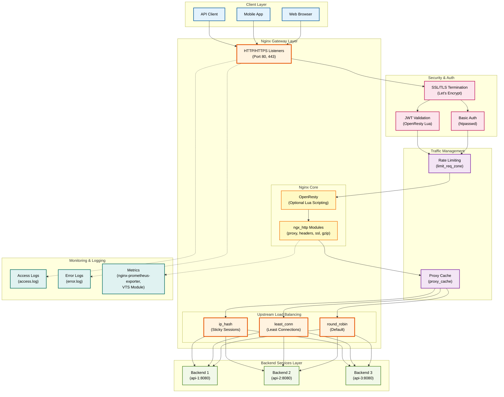
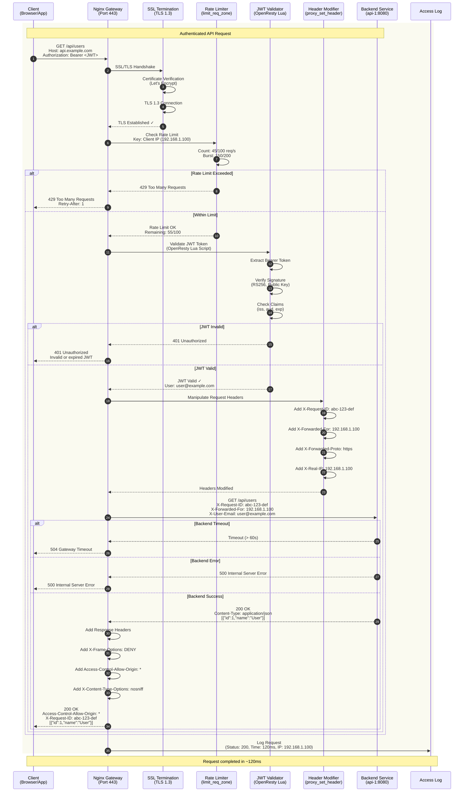
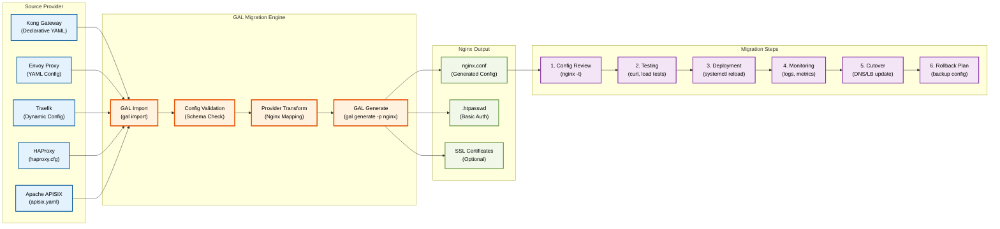

# Nginx Provider Anleitung

**Umfassende Anleitung für den Nginx Open Source Provider in GAL (Gateway Abstraction Layer)**

## Inhaltsverzeichnis

1. [Übersicht](#ubersicht)
2. [Schnellstart](#schnellstart)
3. [Installation und Setup](#installation-und-setup)
4. [Konfigurationsoptionen](#konfigurationsoptionen)
5. [Feature-Implementierungen](#feature-implementierungen)
6. [Provider-Vergleich](#provider-vergleich)
7. [Nginx-spezifische Details](#nginx-spezifische-details)
8. [OpenResty Integration](#openresty-integration-optional)
9. [Best Practices](#best-practices)
10. [Troubleshooting](#troubleshooting)

---

## Übersicht

Nginx ist der **#1 Web Server weltweit** mit über 30% Marktanteil. Als Open-Source Reverse Proxy und Load Balancer ist Nginx bekannt für:

- ✅ **Hohe Performance** - Extrem ressourcenschonend
- ✅ **Stabilität** - Bewährt in Production seit 2004
- ✅ **Einfachheit** - Klare, lesbare Konfiguration
- ✅ **Flexibilität** - Vielseitig einsetzbar
- ✅ **Community** - Riesige Community und Dokumentation

### Warum Nginx mit GAL?

GAL abstrahiert die Nginx-Konfiguration und ermöglicht:
- 🔄 **Provider-Unabhängigkeit** - Gleiche Config für alle Gateways
- 📝 **YAML statt nginx.conf** - Einfachere Konfiguration
- 🚀 **Schneller Start** - Weniger Boilerplate
- 🔍 **Validierung** - Automatische Checks vor Deployment

### Unterstützte Features

| Feature | Nginx Open Source | Nginx Plus | GAL Support |
|---------|-------------------|------------|-------------|
| **Reverse Proxy** | ✅ | ✅ | ✅ Full |
| **Load Balancing** | ✅ | ✅ | ✅ Full |
| **Rate Limiting** | ✅ | ✅ | ✅ Full |
| **Basic Auth** | ✅ | ✅ | ✅ Full |
| **Header Manipulation** | ✅ | ✅ | ✅ Full |
| **CORS** | ✅ | ✅ | ✅ Full |
| **Passive Health Checks** | ✅ | ✅ | ✅ Full |
| **Active Health Checks** | ❌ | ✅ | ⚠️ Plus only |
| **JWT Authentication** | ⚠️ Lua | ✅ | ⚠️ OpenResty |
| **Dynamic Config** | ❌ | ✅ | ⚠️ Plus only |
| **API Key Auth** | ⚠️ Lua | ✅ | ⚠️ OpenResty |
| **Circuit Breaker** | ⚠️ Lua | ✅ | ⚠️ Limited |

**Legende:**
- ✅ **Full** - Vollständig unterstützt
- ⚠️ **Limited** - Eingeschränkt oder benötigt Erweiterungen
- ❌ **Not Supported** - Nicht verfügbar

### Nginx Architektur

Das folgende Architektur-Diagramm zeigt die Hauptkomponenten von Nginx als API Gateway:



**Architektur-Erklärung:**

- **Client Layer:** Verschiedene Client-Typen (Web Browser, Mobile Apps, API Clients)
- **Nginx Gateway Layer:** Zentrale Komponenten
  - **HTTP/HTTPS Listeners:** Eintrittspunkte auf Port 80 (HTTP) und 443 (HTTPS)
  - **OpenResty:** Optional für erweiterte Lua-Scripting Funktionalität (JWT, API Keys)
  - **ngx_http Modules:** Nginx Core Module für Proxy, Headers, SSL, Gzip
  - **Upstream Load Balancing:** Algorithmen für Traffic-Verteilung
- **Backend Services:** Load Balanced Backend Server
- **Security & Auth:** SSL/TLS Termination, Basic Auth, JWT Validation
- **Traffic Management:** Rate Limiting und Caching für Performance
- **Monitoring:** Access Logs, Error Logs, Prometheus Metrics

---

## Schnellstart

### 1. Basis-Konfiguration (Reverse Proxy)

Einfachster Nginx Reverse Proxy:

```yaml
version: "1.0"
provider: nginx

global:
  port: 80

services:
  - name: api_service
    type: rest
    protocol: http
    host: backend.internal
    port: 8080

    routes:
      - path_prefix: /api
        methods: [GET, POST, PUT, DELETE]
```

**Generieren:**
```bash
gal generate config.yaml --provider nginx > nginx.conf
```

**Resultat:**
```nginx
# Nginx Configuration Generated by GAL

events {
    worker_connections 1024;
}

http {
    # Basic Settings
    include /etc/nginx/mime.types;
    default_type application/octet-stream;
    sendfile on;
    keepalive_timeout 65;

    # Server for api_service
    server {
        listen 80;
        server_name api_service.local;

        # Route: /api
        location /api {
            # Proxy to backend
            proxy_pass http://backend.internal:8080;
            proxy_http_version 1.1;
            proxy_set_header Connection "";
            proxy_connect_timeout 5s;
            proxy_send_timeout 60s;
            proxy_read_timeout 60s;
        }
    }
}
```

### 2. Load Balancing

Mehrere Backend-Server mit Load Balancing:

```yaml
version: "1.0"
provider: nginx

services:
  - name: api_service
    type: rest
    protocol: http
    upstream:
      targets:
        - host: api-1.internal
          port: 8080
          weight: 2        # Erhält 2x mehr Traffic
        - host: api-2.internal
          port: 8080
          weight: 1
      load_balancer:
        algorithm: least_conn  # Least Connections

    routes:
      - path_prefix: /api
```

**Generiert:**
```nginx
upstream upstream_api_service {
    least_conn;
    server api-1.internal:8080 weight=2;
    server api-2.internal:8080;
    keepalive 32;
}

server {
    listen 80;
    location /api {
        proxy_pass http://upstream_api_service;
    }
}
```

### 3. Rate Limiting + Basic Auth

API-Schutz mit Rate Limiting und Authentication:

```yaml
version: "1.0"
provider: nginx

services:
  - name: protected_api
    type: rest
    protocol: http
    host: api.internal
    port: 8080

    routes:
      - path_prefix: /api
        rate_limit:
          enabled: true
          requests_per_second: 100
          burst: 200
          response_status: 429

        authentication:
          enabled: true
          type: basic
          basic_auth:
            users:
              admin: "password"
              user: "secret"
            realm: "Protected API"
```

**Generiert:**
```nginx
http {
    # Rate Limiting Zones
    limit_req_zone $binary_remote_addr zone=protected_api_route_0_ratelimit:10m rate=100r/s;

    server {
        location /api {
            # Rate Limiting: 100 req/s, burst 200
            limit_req zone=protected_api_route_0_ratelimit burst=200 nodelay;
            limit_req_status 429;

            # Basic Authentication
            auth_basic "Protected API";
            auth_basic_user_file /etc/nginx/.htpasswd;

            proxy_pass http://api.internal:8080;
        }
    }
}
```

**Wichtig:** Erstelle `.htpasswd` Datei:
```bash
htpasswd -c /etc/nginx/.htpasswd admin
htpasswd /etc/nginx/.htpasswd user
```

---

## Installation und Setup

### Nginx Installation

**Ubuntu/Debian:**
```bash
sudo apt update
sudo apt install nginx
```

**CentOS/RHEL:**
```bash
sudo yum install nginx
```

**macOS:**
```bash
brew install nginx
```

### GAL CLI Installation

```bash
pip install gal-gateway
```

### Nginx Config Deployment

1. **Config generieren:**
```bash
gal generate gateway.yaml --provider nginx > nginx.conf
```

2. **Config testen:**
```bash
nginx -t -c nginx.conf
```

3. **Config deployen:**
```bash
sudo cp nginx.conf /etc/nginx/nginx.conf
sudo nginx -s reload
```

Oder für lokales Testing:
```bash
nginx -c $(pwd)/nginx.conf
```

---

## Konfigurationsoptionen

### Global Configuration

```yaml
global:
  port: 80           # Listen Port (default: 10000)
  host: 0.0.0.0      # Listen Address
  admin_port: 9901   # Nicht verwendet bei Nginx
  timeout: "30s"     # Request Timeout
```

### Upstream Configuration

```yaml
upstream:
  targets:           # Liste von Backend-Servern
    - host: server1.internal
      port: 8080
      weight: 2      # Load Balancing Gewicht (default: 1)

  health_check:
    passive:         # Passive Health Checks
      enabled: true
      max_failures: 3
      unhealthy_status_codes: [500, 502, 503, 504]

  load_balancer:
    algorithm: round_robin  # round_robin, least_conn, ip_hash, weighted
```

**Load Balancing Algorithmen:**

| Algorithm | Beschreibung | Nginx Direktive | Use Case |
|-----------|--------------|-----------------|----------|
| `round_robin` | Gleichmäßige Verteilung (default) | - | Standard |
| `least_conn` | Zu Server mit wenigsten Verbindungen | `least_conn;` | Ungleiche Requests |
| `ip_hash` | Basierend auf Client-IP (Sticky) | `ip_hash;` | Session Persistence |
| `weighted` | Gewichtete Verteilung | `weight=N` | Heterogene Server |

### Route Configuration

```yaml
routes:
  - path_prefix: /api           # Routing Pfad
    methods: [GET, POST]        # Erlaubte HTTP Methoden

    rate_limit:                 # Rate Limiting
      enabled: true
      requests_per_second: 100
      burst: 200
      key_type: ip_address      # ip_address, header
      key_header: X-API-Key     # Falls key_type=header
      response_status: 429

    authentication:             # Authentication
      enabled: true
      type: basic               # basic, api_key, jwt
      basic_auth:
        users:
          admin: password
        realm: "Protected"

    headers:                    # Header Manipulation
      request_add:
        X-Request-ID: "{{uuid}}"
        X-Gateway: "GAL"
      response_add:
        X-Frame-Options: "DENY"
      response_remove:
        - X-Powered-By

    cors:                       # CORS
      enabled: true
      allowed_origins: ["https://app.example.com"]
      allowed_methods: [GET, POST]
      allowed_headers: [Content-Type, Authorization]
      allow_credentials: true
      max_age: 86400
```

### Request Flow durch Nginx

Das folgende Sequenzdiagramm zeigt den vollständigen Request-Ablauf durch Nginx Gateway mit allen Features:



**Flow-Erklärung:**

1. **Client Request:** Client sendet HTTPS Request mit JWT Token im Authorization Header
2. **SSL/TLS Termination:** Nginx terminiert TLS 1.3 Verbindung, verifiziert Zertifikat
3. **Rate Limiting Check:** Nginx prüft Rate Limit basierend auf Client IP (limit_req_zone)
4. **Rate Limit Evaluation:** Zählt aktuelle Requests (45/100) und Burst (150/200)
5. **JWT Validation:** OpenResty Lua Script validiert JWT Token
   - Extrahiert Bearer Token aus Authorization Header
   - Verifiziert Signatur mit Public Key (RS256)
   - Prüft Claims (Issuer, Audience, Expiration)
6. **Request Header Manipulation:** Nginx fügt Standard-Headers hinzu
   - X-Request-ID: Eindeutige Request-ID für Tracing
   - X-Forwarded-For: Client IP für Backend
   - X-Forwarded-Proto: Original Protocol (https)
   - X-User-Email: Extrahiert aus JWT für Backend Authorization
7. **Backend Proxy:** Nginx forwarded Request an Backend mit enriched Headers
8. **Response Processing:** Backend antwortet, Nginx fügt Security Headers hinzu
9. **Access Logging:** Request wird mit Status, Latency, Client IP geloggt

**Alternative Flows:**
- **Rate Limit Exceeded:** Client erhält 429 Too Many Requests mit Retry-After Header
- **JWT Invalid:** Client erhält 401 Unauthorized bei ungültigem/abgelaufenem Token
- **Backend Timeout:** Client erhält 504 Gateway Timeout bei Backend-Problemen

---

## Feature-Implementierungen

### 1. Load Balancing

#### Round Robin (Default)

Gleichmäßige Verteilung über alle Server:

```yaml
upstream:
  targets:
    - host: server1
      port: 8080
    - host: server2
      port: 8080
  load_balancer:
    algorithm: round_robin
```

**Nginx Config:**
```nginx
upstream upstream_service {
    server server1:8080;
    server server2:8080;
}
```

#### Least Connections

Bevorzugt Server mit wenigsten aktiven Verbindungen:

```yaml
load_balancer:
  algorithm: least_conn
```

**Nginx Config:**
```nginx
upstream upstream_service {
    least_conn;
    server server1:8080;
    server server2:8080;
}
```

**Use Case:** Backend-Server mit stark variierenden Request-Dauern.

#### IP Hash (Session Persistence)

Client-IP bestimmt Backend-Server (Sticky Sessions):

```yaml
load_balancer:
  algorithm: ip_hash
```

**Nginx Config:**
```nginx
upstream upstream_service {
    ip_hash;
    server server1:8080;
    server server2:8080;
}
```

**Use Case:** Stateful Applications, Session Persistence.

#### Weighted

Server mit unterschiedlichen Kapazitäten:

```yaml
upstream:
  targets:
    - host: powerful-server
      port: 8080
      weight: 3
    - host: small-server
      port: 8080
      weight: 1
```

**Nginx Config:**
```nginx
upstream upstream_service {
    server powerful-server:8080 weight=3;
    server small-server:8080;
}
```

**Verteilung:** 75% powerful-server, 25% small-server.

### 2. Passive Health Checks

Nginx überwacht Backend-Health basierend auf echtem Traffic:

```yaml
upstream:
  targets:
    - host: backend1
      port: 8080
  health_check:
    passive:
      enabled: true
      max_failures: 3           # Nach 3 Fehlern → unhealthy
```

**Nginx Config:**
```nginx
upstream upstream_service {
    server backend1:8080 max_fails=3 fail_timeout=30s;
}
```

**Funktionsweise:**
- Bei 3 aufeinanderfolgenden Fehlern wird Server als "down" markiert
- Nach 30 Sekunden wird Server wieder getestet
- Fehler = 5xx Status Codes oder Timeouts

⚠️ **Limitation:** Kann Server nicht proaktiv prüfen (kein Active HC ohne Plus).

### 3. Rate Limiting

IP-basiertes Rate Limiting:

```yaml
rate_limit:
  enabled: true
  requests_per_second: 100
  burst: 200
  key_type: ip_address
  response_status: 429
```

**Nginx Config:**
```nginx
http {
    limit_req_zone $binary_remote_addr zone=api_ratelimit:10m rate=100r/s;

    server {
        location /api {
            limit_req zone=api_ratelimit burst=200 nodelay;
            limit_req_status 429;
        }
    }
}
```

**Erklärung:**
- **Zone:** 10m = ~160.000 IP-Adressen
- **Rate:** 100 Requests/Sekunde
- **Burst:** Bis zu 200 Requests in Spitzen
- **nodelay:** Keine künstliche Verzögerung

#### Header-basiertes Rate Limiting

Limitierung pro API-Key:

```yaml
rate_limit:
  enabled: true
  requests_per_second: 50
  key_type: header
  key_header: X-API-Key
```

**Nginx Config:**
```nginx
limit_req_zone $http_x_api_key zone=api_ratelimit:10m rate=50r/s;
```

### 4. Authentication

#### Basic Authentication

Einfache Username/Password Auth:

```yaml
authentication:
  enabled: true
  type: basic
  basic_auth:
    users:
      admin: "password"
    realm: "Protected API"
```

**Nginx Config:**
```nginx
location /api {
    auth_basic "Protected API";
    auth_basic_user_file /etc/nginx/.htpasswd;
}
```

**Setup:**
```bash
# .htpasswd erstellen
htpasswd -c /etc/nginx/.htpasswd admin
# Weitere User hinzufügen
htpasswd /etc/nginx/.htpasswd user2
```

#### API Key Authentication

⚠️ **Benötigt Lua/OpenResty** oder externe Authentication.

```yaml
authentication:
  type: api_key
  api_key:
    keys: ["key_123abc"]
    key_name: X-API-Key
    in_location: header
```

**Nginx Config (Kommentar):**
```nginx
# API Key authentication not natively supported
# Requires Lua or external authentication
```

**Alternative:** Nginx Plus mit `auth_request` Modul oder OpenResty.

#### JWT Authentication

⚠️ **Benötigt OpenResty/Lua** (siehe [OpenResty Integration](#openresty-integration-optional)).

```yaml
authentication:
  type: jwt
  jwt:
    issuer: "https://auth.example.com"
    audience: "api"
    jwks_uri: "https://auth.example.com/.well-known/jwks.json"
```

### 5. Header Manipulation

#### Request Headers

```yaml
headers:
  request_add:
    X-Request-ID: "{{uuid}}"     # $request_id
    X-Gateway: "GAL"
    X-Timestamp: "{{now}}"        # $time_iso8601
  request_set:
    User-Agent: "GAL-Gateway/1.0"
  request_remove:
    - X-Internal-Token
```

**Nginx Config:**
```nginx
location /api {
    # Request Headers
    proxy_set_header X-Request-ID $request_id;
    proxy_set_header X-Gateway 'GAL';
    proxy_set_header X-Timestamp $time_iso8601;
    proxy_set_header User-Agent 'GAL-Gateway/1.0';
    proxy_set_header X-Internal-Token '';
}
```

**Template-Variablen:**
- `{{uuid}}` → `$request_id`
- `{{now}}`, `{{timestamp}}` → `$time_iso8601`

#### Response Headers

```yaml
headers:
  response_add:
    X-Frame-Options: "DENY"
    X-Content-Type-Options: "nosniff"
  response_set:
    Server: "GAL-Gateway"
  response_remove:
    - X-Powered-By
```

**Nginx Config:**
```nginx
location /api {
    # Response Headers
    add_header X-Frame-Options 'DENY' always;
    add_header X-Content-Type-Options 'nosniff' always;
    add_header Server 'GAL-Gateway' always;

    # Note: Response header removal requires ngx_headers_more module
    # more_clear_headers 'X-Powered-By';
}
```

⚠️ **Response Header Removal** benötigt `ngx_headers_more` Modul.

### 6. CORS

Cross-Origin Resource Sharing für SPAs:

```yaml
cors:
  enabled: true
  allowed_origins:
    - "https://app.example.com"
    - "https://www.example.com"
  allowed_methods: [GET, POST, PUT, DELETE, OPTIONS]
  allowed_headers: [Content-Type, Authorization, X-API-Key]
  expose_headers: [X-Request-ID, X-RateLimit-Remaining]
  allow_credentials: true
  max_age: 86400  # 24 hours
```

**Nginx Config:**
```nginx
location /api {
    # CORS Configuration
    add_header 'Access-Control-Allow-Origin' 'https://app.example.com' always;
    add_header 'Access-Control-Allow-Methods' 'GET, POST, PUT, DELETE, OPTIONS' always;
    add_header 'Access-Control-Allow-Headers' 'Content-Type, Authorization, X-API-Key' always;
    add_header 'Access-Control-Expose-Headers' 'X-Request-ID, X-RateLimit-Remaining' always;
    add_header 'Access-Control-Allow-Credentials' 'true' always;
    add_header 'Access-Control-Max-Age' '86400' always;

    # Handle preflight requests
    if ($request_method = 'OPTIONS') {
        return 204;
    }
}
```

**Wichtig:** `always` Flag stellt sicher, dass Headers auch bei Errors gesetzt werden.

---

## Provider-Vergleich

### Nginx vs. Andere Gateways

| Feature | Nginx | Kong | APISIX | Traefik | Envoy |
|---------|-------|------|--------|---------|-------|
| **Performance** | ⭐⭐⭐⭐⭐ | ⭐⭐⭐⭐ | ⭐⭐⭐⭐ | ⭐⭐⭐ | ⭐⭐⭐⭐⭐ |
| **Memory Footprint** | ⭐⭐⭐⭐⭐ | ⭐⭐⭐ | ⭐⭐⭐ | ⭐⭐⭐⭐ | ⭐⭐⭐ |
| **Lernkurve** | ⭐⭐⭐⭐ | ⭐⭐⭐ | ⭐⭐⭐ | ⭐⭐⭐⭐ | ⭐⭐ |
| **Community** | ⭐⭐⭐⭐⭐ | ⭐⭐⭐⭐ | ⭐⭐⭐ | ⭐⭐⭐⭐ | ⭐⭐⭐⭐ |
| **Static Content** | ⭐⭐⭐⭐⭐ | ⭐⭐ | ⭐⭐ | ⭐⭐⭐ | ⭐⭐ |
| **Dynamic Config** | ⭐ | ⭐⭐⭐⭐⭐ | ⭐⭐⭐⭐⭐ | ⭐⭐⭐⭐⭐ | ⭐⭐⭐⭐ |
| **Plugin Ecosystem** | ⭐⭐⭐ | ⭐⭐⭐⭐⭐ | ⭐⭐⭐⭐⭐ | ⭐⭐⭐⭐ | ⭐⭐⭐⭐ |
| **JWT Native** | ❌ | ✅ | ✅ | ⚠️ | ✅ |
| **Active HC** | ❌ | ✅ | ✅ | ✅ | ✅ |
| **Complexity** | Low | Medium | Medium | Low | High |

### Wann Nginx nutzen?

**✅ Ideal für:**
- Static Content Serving + API Gateway Hybrid
- Einfache Reverse Proxy Setups
- Minimaler Memory Footprint erforderlich
- Bewährte, stabile Lösung gewünscht
- Team hat Nginx-Erfahrung
- On-Premises Deployment

**⚠️ Weniger geeignet für:**
- Hochdynamische Konfigurationen (ohne Plus)
- Native JWT Validation erforderlich
- Umfangreiche Plugin-Infrastruktur gewünscht
- Active Health Checks ohne Plus

---

## Feature Coverage (Import & Export)

Diese Sektion dokumentiert welche Nginx Features GAL in beide Richtungen unterstützt:
- **Import:** nginx.conf → GAL Config (v1.3.0 Feature 5)
- **Export:** GAL Config → nginx.conf (seit v1.0)

### ✅ Vollständig Unterstützt (Bidirektional)

Features die in beide Richtungen vollständig funktionieren:

| Feature | Nginx Direktive | GAL Config | Import | Export | Einschränkungen |
|---------|----------------|------------|--------|--------|-----------------|
| **Upstream Block** | `upstream {}` | `upstream.targets[]` | ✅ | ✅ | - |
| **Load Balancing - Round Robin** | (default) | `algorithm: round_robin` | ✅ | ✅ | - |
| **Load Balancing - Least Conn** | `least_conn;` | `algorithm: least_conn` | ✅ | ✅ | - |
| **Load Balancing - IP Hash** | `ip_hash;` | `algorithm: ip_hash` | ✅ | ✅ | - |
| **Server Weights** | `server ... weight=N` | `target.weight` | ✅ | ✅ | - |
| **Passive Health Checks** | `max_fails`, `fail_timeout` | `health_check.passive` | ✅ | ✅ | OSS only |
| **Rate Limiting Zone** | `limit_req_zone` | Rate limit config | ✅ | ✅ | - |
| **Rate Limiting** | `limit_req zone=...` | `rate_limit.*` | ✅ | ✅ | - |
| **Rate Burst** | `burst=N` | `rate_limit.burst` | ✅ | ✅ | - |
| **Request Headers** | `proxy_set_header` | `headers.request_add` | ✅ | ✅ | - |
| **Response Headers** | `add_header` | `headers.response_add` | ✅ | ✅ | - |
| **CORS** | `add_header Access-Control-*` | `cors.*` | ✅ | ✅ | Extrahiert/Generiert |
| **Basic Auth Structure** | `auth_basic`, `auth_basic_user_file` | `authentication.basic_auth` | ✅ | ✅ | Htpasswd separat |
| **Location Blocks** | `location /path {}` | `routes[]` | ✅ | ✅ | - |
| **Proxy Pass** | `proxy_pass http://...` | Service upstream link | ✅ | ✅ | - |

### ⚠️ Eingeschränkt Unterstützt

Features mit Limitierungen in Import oder Export:

| Feature | Import Status | Export Status | Einschränkung |
|---------|---------------|---------------|---------------|
| **Active Health Checks** | ❌ Nicht unterstützt | ⚠️ Kommentar | Nginx OSS hat keine Active HC |
| **Server Names** | ❌ Ignoriert | ✅ Generiert | Import: Wird nicht gespeichert |
| **Listen Ports** | ❌ Ignoriert | ✅ Global Config | Import: Verwendet default port 80 |
| **SSL/TLS** | ❌ Nicht unterstützt | ❌ Nicht unterstützt | Nicht in GAL Config Model |
| **Comment Preservation** | ❌ Entfernt | ❌ GAL Kommentare | Comments werden nicht erhalten |
| **Basic Auth Users** | ⚠️ Struktur only | ✅ Generiert htpasswd | Import: htpasswd Datei nicht gelesen |
| **JWT Auth** | ❌ Nicht unterstützt | ⚠️ Kommentar | Benötigt OpenResty/Lua |
| **API Key Auth** | ❌ Nicht unterstützt | ⚠️ Kommentar | Benötigt OpenResty/Lua |
| **Response Header Removal** | ❌ Nicht unterstützt | ⚠️ Kommentar | Benötigt ngx_headers_more |

### ❌ Nicht Unterstützt

Features die weder Import noch Export unterstützen:

#### Complex Routing
- **if Direktiven** - "If is Evil" in Nginx, nicht empfohlen
- **map Direktiven** - Variable Mappings
- **rewrite Regeln** - URL Rewriting
- **return Direktiven** - Redirects
- **try_files** - Fallback Logik

#### Advanced Load Balancing
- **hash** - Custom Hash mit Keys
- **random** - Random mit two Parameter
- **least_time** - Nginx Plus Feature
- **Upstream zone** - Shared Memory

#### Connection/Request Handling
- **limit_conn** - Connection Limiting (vs. Request Limiting)
- **client_max_body_size** - Request Body Size Limits
- **client_body_timeout** - Body Read Timeout
- **proxy_timeout** Varianten - Diverse Timeout Konfigurationen
- **proxy_buffering** - Buffer Konfiguration

#### Security & Access Control
- **allow / deny** - IP-basierte ACLs
- **satisfy** - Access Control Logik (all vs. any)
- **auth_request** - Externe Authentication
- **geo** - GeoIP basierte Regeln

#### Logging & Monitoring
- **Custom log_format** - Log Format Definitionen
- **Conditional Logging** - Bedingte Logs
- **Access/Error Log Paths** - Log Datei Pfade
- **log_subrequest** - Subrequest Logging

#### WebSocket & HTTP/2
- **proxy_http_version 1.1** - Für WebSocket
- **Upgrade / Connection Headers** - WebSocket Handshake
- **HTTP/2 Push** - Server Push
- **grpc_pass** - gRPC Proxying

#### Stream Module
- **stream {} Block** - TCP/UDP Proxying
- **Layer 4 Load Balancing** - Transport Layer LB

### 📊 Import Feature Coverage Score

**Methodik:** Nur Features die für API Gateway Reverse Proxy relevant sind

```
Core HTTP Reverse Proxy Features: ~85% Coverage
├─ Routing (location, proxy_pass): 100%
├─ Load Balancing: 75% (3/4 Algorithmen)
├─ Health Checks: 50% (nur passive)
├─ Headers: 100%
├─ Rate Limiting: 100%
├─ Authentication: 40% (Basic struktur, kein JWT/OAuth)
└─ CORS: 100%

Advanced Features: ~25% Coverage
├─ URL Rewriting: 0%
├─ Complex Routing (if/map): 0%
├─ SSL/TLS: 0%
├─ Access Control (allow/deny): 0%
├─ Connection Limits: 0%
└─ Custom Logging: 0%

Gesamt (API Gateway Use Case): ~70% Coverage
```

### 📈 Export Feature Coverage Score

**GAL → Nginx Export unterstützt mehr Features:**

```
Core HTTP Reverse Proxy Features: ~95% Coverage
├─ Routing: 100%
├─ Load Balancing: 100%
├─ Health Checks: 50% (nur passive)
├─ Headers: 100%
├─ Rate Limiting: 100%
├─ Authentication: 60% (Basic + API Key/JWT Comments)
├─ CORS: 100%
├─ Timeouts: 100%
└─ WebSocket: 100% (Upgrade headers)

Advanced Features: ~30% Coverage
├─ Circuit Breaker: 0% (Kommentar)
├─ Body Transformation: 0% (Kommentar)
├─ SSL/TLS: 0% (manuelle Config)
├─ Metrics: 0% (Stub Status empfohlen)
└─ Custom Logging: 50% (Format templates)

Gesamt: ~75% Coverage
```

### 🔄 Import/Export Roundtrip Kompatibilität

**Kann ich nginx.conf importieren und wieder exportieren?**

| Szenario | Funktioniert | Änderungen |
|----------|--------------|------------|
| **Simple Reverse Proxy** | ✅ 100% | Formatting |
| **Load Balancing** | ✅ 100% | Formatting |
| **Rate Limiting** | ✅ 100% | Zone Namen können variieren |
| **Headers + CORS** | ✅ 95% | CORS wird extrahiert/regeneriert |
| **Basic Auth** | ⚠️ 80% | Htpasswd Datei muss manuell kopiert werden |
| **Complex Routing** | ❌ 30% | if/map/rewrite gehen verloren |
| **SSL Config** | ❌ 0% | SSL Direktiven nicht unterstützt |

**Beispiel Roundtrip:**

**Original nginx.conf:**
```nginx
http {
    limit_req_zone $binary_remote_addr zone=api:10m rate=100r/s;

    upstream upstream_api {
        least_conn;
        server api-1:8080 weight=2;
        server api-2:8080;
    }

    server {
        location /api {
            limit_req zone=api burst=200;
            proxy_pass http://upstream_api;
        }
    }
}
```

**Nach Import → Export:**
```nginx
# Nginx Configuration Generated by GAL

events {
    worker_connections 1024;
}

http {
    # Rate Limiting Zones
    limit_req_zone $binary_remote_addr zone=api_route_0_ratelimit:10m rate=100r/s;

    # Upstream for api
    upstream upstream_api {
        least_conn;
        server api-1:8080 weight=2;
        server api-2:8080;
        keepalive 32;
    }

    # Server for api
    server {
        listen 80;
        server_name api.local;

        # Route: /api
        location /api {
            # Rate Limiting: 100 req/s, burst 200
            limit_req zone=api_route_0_ratelimit burst=200 nodelay;

            proxy_pass http://upstream_api;
            proxy_http_version 1.1;
            proxy_set_header Connection "";
        }
    }
}
```

**Unterschiede:**
- ✅ Logik identisch
- ⚠️ GAL Header hinzugefügt
- ⚠️ Zone Name geändert (`api` → `api_route_0_ratelimit`)
- ⚠️ Zusätzliche Direktiven (`keepalive`, `events`, etc.)
- ⚠️ Formatting anders
- ⚠️ Comments entfernt

### 🎯 Empfehlungen für Erweiterung

**Quick Wins (hoher Impact, niedriger Aufwand):**

**Import:**
1. ✅ `server_name` Parsing → Multi-Tenant Support
2. ✅ `listen` Port Parsing → Explizite Ports statt Global Config
3. ✅ `client_max_body_size` → Request Body Limits
4. ✅ `allow`/`deny` → IP-basierte Access Control

**Export:**
1. ✅ SSL/TLS Template Generation → SSL Konfiguration
2. ✅ Custom Log Format → Structured Logging
3. ✅ Gzip Configuration → Performance Optimization

**Medium Aufwand:**

**Import:**
5. ⚠️ `rewrite` Regeln → URL Rewriting
6. ⚠️ `map` Direktiven → Variable Mapping
7. ⚠️ `if` Direktiven → Conditional Logic (mit Warnungen)
8. ⚠️ `limit_conn` → Connection Limiting

**Export:**
5. ⚠️ Response Header Removal → ngx_headers_more Detection
6. ⚠️ JWT Auth Templates → OpenResty Code Templates

**Hoher Aufwand:**

9. ❌ `stream {}` Block → Layer 4 Proxying
10. ❌ Vollständiges SSL/TLS Management

### 🔍 Import Testing Matrix

GAL testet den Nginx Import mit folgenden Szenarien:

| Test Kategorie | Tests | Coverage |
|----------------|-------|----------|
| **Basic Import** | 3 | Simple upstream, Multiple servers, Comments |
| **Load Balancing** | 3 | round_robin, least_conn, ip_hash |
| **Health Checks** | 1 | Passive health checks (max_fails) |
| **Rate Limiting** | 2 | Per second, Per minute conversion |
| **Authentication** | 1 | Basic auth with htpasswd warning |
| **Headers** | 2 | Request headers, Response headers |
| **CORS** | 2 | CORS extraction, Wildcard origins |
| **Multiple Locations** | 1 | Multiple location blocks |
| **Error Handling** | 2 | Empty config, No http block |
| **Combined** | 1 | Production config with all features |
| **Gesamt** | **18** | **Alle passing ✅** |

**Test Coverage:** nginx.py 6% → 38% (+32%)

### ✅ Fazit

**Für typische API Gateway Migrationen:**

**nginx.conf → GAL (Import):**
- ✅ ~70% der gängigen Features werden unterstützt
- ✅ Perfekt für: Simple Reverse Proxy, Load Balancing, Rate Limiting
- ⚠️ Eingeschränkt: Complex Routing, SSL/TLS, Custom Logging
- ❌ Nicht unterstützt: Advanced Nginx Features, Layer 4 Proxying

**GAL → nginx.conf (Export):**
- ✅ ~75% Feature Support
- ✅ Production-ready nginx.conf Generierung
- ✅ Best Practices eingebaut (keepalive, timeouts, etc.)
- ⚠️ JWT/API Key als Kommentare (OpenResty erforderlich)
- ❌ Keine SSL/TLS Auto-Config

**Empfehlung:**
- 🚀 Für Standard API Gateway Workloads: **Vollständig ausreichend**
- ⚠️ Für komplexe Nginx Setups: **Manuelle Nachbearbeitung nötig**
- 📚 Für Nginx → GAL Migration: **70% automatisiert, 30% Review**

---

## Nginx Directive Coverage

Detaillierte Analyse basierend auf dem [offiziellen Nginx Directive Index](https://nginx.org/en/docs/dirindex.html).

### Core HTTP Directives (ngx_http_core_module)

| Directive | Import | Export | Status | Bemerkung |
|-----------|--------|--------|--------|-----------|
| `server` | ✅ | ✅ | Voll | Server-Blöcke mit listen/server_name |
| `location` | ✅ | ✅ | Voll | Location-Blöcke mit Pfad-Matching |
| `listen` | ✅ | ✅ | Voll | Port-Konfiguration |
| `server_name` | ✅ | ✅ | Voll | Hostname/Domain |
| `root` | ⚠️ | ⚠️ | Teilweise | Nur bei statischen Dateien |
| `alias` | ❌ | ❌ | Nicht | Statische Dateien |
| `try_files` | ❌ | ❌ | Nicht | Statische Dateien |
| `error_page` | ❌ | ❌ | Nicht | Custom Error Pages |
| `client_max_body_size` | ❌ | ❌ | Nicht | Request Body Limit |
| `client_body_timeout` | ❌ | ❌ | Nicht | Timeout Settings |
| `keepalive_timeout` | ❌ | ✅ | Export | Generiert mit Default 65s |

### Upstream Directives (ngx_http_upstream_module)

| Directive | Import | Export | Status | Bemerkung |
|-----------|--------|--------|--------|-----------|
| `upstream` | ✅ | ✅ | Voll | Upstream-Blöcke |
| `server` (upstream) | ✅ | ✅ | Voll | Backend-Server mit IP:Port |
| `weight` | ✅ | ✅ | Voll | Load Balancing Gewichte |
| `max_fails` | ✅ | ✅ | Voll | Health Check Schwellwert |
| `fail_timeout` | ✅ | ✅ | Voll | Health Check Timeout |
| `backup` | ⚠️ | ⚠️ | Teilweise | Backup-Server (eingeschränkt) |
| `down` | ❌ | ❌ | Nicht | Manuell deaktivierte Server |
| `max_conns` | ❌ | ❌ | Nicht | Connection Limit |
| `zone` | ❌ | ❌ | Nicht | Shared Memory (Nginx Plus) |
| `least_conn` | ✅ | ✅ | Voll | Least Connections Algorithm |
| `ip_hash` | ✅ | ✅ | Voll | IP Hash Algorithm |
| `hash` | ✅ | ✅ | Voll | Generic Hash Algorithm |
| `random` | ⚠️ | ⚠️ | Teilweise | Random Selection |
| `keepalive` | ❌ | ❌ | Nicht | Upstream Keepalive Connections |

### Proxy Directives (ngx_http_proxy_module)

| Directive | Import | Export | Status | Bemerkung |
|-----------|--------|--------|--------|-----------|
| `proxy_pass` | ✅ | ✅ | Voll | Backend Proxying |
| `proxy_set_header` | ✅ | ✅ | Voll | Request Header Manipulation |
| `proxy_hide_header` | ⚠️ | ⚠️ | Teilweise | Response Header Removal |
| `proxy_pass_header` | ❌ | ❌ | Nicht | Header Forwarding |
| `proxy_connect_timeout` | ⚠️ | ⚠️ | Teilweise | Timeout (wenn in GAL Config) |
| `proxy_read_timeout` | ⚠️ | ⚠️ | Teilweise | Timeout (wenn in GAL Config) |
| `proxy_send_timeout` | ⚠️ | ⚠️ | Teilweise | Timeout (wenn in GAL Config) |
| `proxy_buffering` | ❌ | ❌ | Nicht | Response Buffering |
| `proxy_buffer_size` | ❌ | ❌ | Nicht | Buffer Configuration |
| `proxy_redirect` | ❌ | ❌ | Nicht | Redirect Rewriting |
| `proxy_next_upstream` | ❌ | ❌ | Nicht | Retry Logic |
| `proxy_ssl_verify` | ❌ | ❌ | Nicht | SSL Backend Verification |

### Rate Limiting Directives (ngx_http_limit_req_module)

| Directive | Import | Export | Status | Bemerkung |
|-----------|--------|--------|--------|-----------|
| `limit_req_zone` | ✅ | ✅ | Voll | Rate Limit Zone Definition |
| `limit_req` | ✅ | ✅ | Voll | Rate Limit Application |
| `limit_req_status` | ❌ | ❌ | Nicht | Custom HTTP Status Code |
| `limit_req_level` | ❌ | ❌ | Nicht | Log Level Configuration |

### Authentication Directives (ngx_http_auth_basic_module)

| Directive | Import | Export | Status | Bemerkung |
|-----------|--------|--------|--------|-----------|
| `auth_basic` | ✅ | ✅ | Voll | Basic Auth Realm |
| `auth_basic_user_file` | ✅ | ✅ | Voll | htpasswd File Path |

### Headers Directives (ngx_http_headers_module)

| Directive | Import | Export | Status | Bemerkung |
|-----------|--------|--------|--------|-----------|
| `add_header` | ✅ | ✅ | Voll | Response Header Hinzufügen |
| `expires` | ❌ | ❌ | Nicht | Cache-Control/Expires Headers |
| `add_trailer` | ❌ | ❌ | Nicht | HTTP Trailer Headers |

### CORS-relevante Directives

| Directive | Import | Export | Status | Bemerkung |
|-----------|--------|--------|--------|-----------|
| `add_header Access-Control-Allow-Origin` | ✅ | ✅ | Voll | CORS Origin |
| `add_header Access-Control-Allow-Methods` | ✅ | ✅ | Voll | CORS Methods |
| `add_header Access-Control-Allow-Headers` | ✅ | ✅ | Voll | CORS Headers |
| `add_header Access-Control-Allow-Credentials` | ✅ | ✅ | Voll | CORS Credentials |
| `add_header Access-Control-Max-Age` | ✅ | ✅ | Voll | CORS Preflight Cache |

### Nicht unterstützte Module (API Gateway irrelevant)

Diese Directives sind für API Gateway Workloads nicht relevant:

**ngx_http_fastcgi_module:**
- `fastcgi_pass`, `fastcgi_param`, `fastcgi_index` - PHP/FastCGI Backend
- Für API Gateways nicht relevant (verwende `proxy_pass` für HTTP Backends)

**ngx_http_uwsgi_module:**
- `uwsgi_pass`, `uwsgi_param` - Python WSGI Backend
- Für API Gateways nicht relevant

**ngx_http_scgi_module:**
- `scgi_pass`, `scgi_param` - SCGI Backend
- Für API Gateways nicht relevant

**ngx_http_memcached_module:**
- `memcached_pass` - Memcached Integration
- Nicht Teil der GAL Scope

**ngx_http_ssl_module:**
- SSL/TLS Konfiguration (siehe Abschnitt "SSL/TLS Termination")
- Wird manuell hinzugefügt, nicht von GAL generiert

**ngx_http_gzip_module:**
- Compression - nicht Teil der GAL Scope
- Wird in Production empfohlen, aber manuell konfiguriert

**ngx_http_rewrite_module:**
- `rewrite`, `return`, `set` - URL Rewriting
- Komplex, außerhalb GAL Scope

### Coverage Score nach Modulen

| Modul | Directives Total | Unterstützt | Coverage |
|-------|------------------|-------------|----------|
| ngx_http_core_module | 11 | 4 voll, 1 teilweise | ~40% |
| ngx_http_upstream_module | 13 | 7 voll, 2 teilweise | ~65% |
| ngx_http_proxy_module | 12 | 2 voll, 4 teilweise | ~50% |
| ngx_http_limit_req_module | 4 | 2 voll | 50% |
| ngx_http_auth_basic_module | 2 | 2 voll | 100% |
| ngx_http_headers_module | 8 | 6 voll | 75% |

**Gesamt (API Gateway relevante Directives):** ~62% Coverage

### Empfehlungen für zukünftige Erweiterungen

**Priorität 1 (High Impact):**
1. `client_max_body_size` - Request Size Limits
2. `error_page` - Custom Error Pages
3. `proxy_connect_timeout` / `proxy_read_timeout` - Vollständige Timeout Kontrolle
4. `proxy_next_upstream` - Retry Logic

**Priorität 2 (Medium Impact):**
5. `keepalive` (upstream) - Connection Pooling
6. `max_conns` - Connection Limits
7. `proxy_buffering` / `proxy_buffer_size` - Performance Tuning
8. `client_body_timeout` - Request Timeouts

**Priorität 3 (Nice to Have):**
9. `proxy_redirect` - Redirect Rewriting
10. `limit_req_status` / `limit_req_level` - Rate Limit Customization

**Referenzen:**
- 📚 [Nginx Directive Index](https://nginx.org/en/docs/dirindex.html)
- 📚 [ngx_http_core_module](https://nginx.org/en/docs/http/ngx_http_core_module.html)
- 📚 [ngx_http_upstream_module](https://nginx.org/en/docs/http/ngx_http_upstream_module.html)
- 📚 [ngx_http_proxy_module](https://nginx.org/en/docs/http/ngx_http_proxy_module.html)

---

## Nginx-spezifische Details

### nginx.conf Struktur

GAL generiert folgende Struktur:

```nginx
events {
    worker_connections 1024;
}

http {
    # Basic Settings
    include /etc/nginx/mime.types;
    default_type application/octet-stream;
    sendfile on;
    keepalive_timeout 65;

    # Logging
    access_log /var/log/nginx/access.log;
    error_log /var/log/nginx/error.log;

    # Rate Limiting Zones (global)
    limit_req_zone ...

    # Upstream Blocks
    upstream upstream_service1 { ... }
    upstream upstream_service2 { ... }

    # Server Blocks
    server {
        listen 80;
        server_name service1.local;

        # Location Blocks
        location /api { ... }
        location /v2 { ... }
    }

    server {
        listen 80;
        server_name service2.local;
        ...
    }
}
```

### Worker Configuration

Für Production solltest du Worker-Prozesse anpassen:

```nginx
# Am Anfang der nginx.conf (vor events)
user www-data;
worker_processes auto;  # Anzahl CPU Cores
pid /run/nginx.pid;

events {
    worker_connections 4096;  # Pro Worker
    multi_accept on;
}
```

### SSL/TLS Termination

Füge SSL manuell hinzu (noch nicht von GAL unterstützt):

```nginx
server {
    listen 443 ssl http2;
    server_name api.example.com;

    ssl_certificate /etc/nginx/ssl/cert.pem;
    ssl_certificate_key /etc/nginx/ssl/key.pem;
    ssl_protocols TLSv1.2 TLSv1.3;
    ssl_ciphers HIGH:!aNULL:!MD5;

    location /api {
        proxy_pass http://upstream_service;
    }
}
```

### Logging Configuration

Custom Access Log Format:

```nginx
http {
    log_format gal_format '$remote_addr - $remote_user [$time_local] '
                         '"$request" $status $body_bytes_sent '
                         '"$http_referer" "$http_user_agent" '
                         'rt=$request_time uct="$upstream_connect_time" '
                         'uht="$upstream_header_time" urt="$upstream_response_time"';

    access_log /var/log/nginx/access.log gal_format;
}
```

---

## Deployment-Strategien

### Deployment-Entscheidungsbaum

Der folgende Entscheidungsbaum hilft bei der Auswahl der richtigen Nginx-Deployment-Strategie:

```mermaid
flowchart TD
    Start([Nginx Deployment<br/>planen]) --> Q1{Welches<br/>Use Case?}

    Q1 -->|Basic HTTP<br/>Reverse Proxy| Scenario1[Szenario 1:<br/>Basic HTTP Proxy]
    Q1 -->|HTTPS mit<br/>SSL/TLS| Scenario2[Szenario 2:<br/>HTTPS + Let's Encrypt]
    Q1 -->|Advanced Logic<br/>(JWT, API Keys)| Scenario3[Szenario 3:<br/>OpenResty + Lua]
    Q1 -->|Kubernetes<br/>Cluster| Scenario4[Szenario 4:<br/>K8s Ingress Controller]
    Q1 -->|High Traffic<br/>Load Balancing| Scenario5[Szenario 5:<br/>Load Balancing]

    %% Scenario 1: Basic HTTP Proxy
    Scenario1 --> S1A[1. nginx.conf vorbereiten]
    S1A --> S1B[2. GAL Config erstellen<br/>mit upstream target]
    S1B --> S1C[3. nginx.conf generieren<br/>gal generate -p nginx]
    S1C --> S1D[4. Config testen<br/>nginx -t]
    S1D --> S1E[5. Nginx deployen<br/>nginx -s reload]
    S1E --> S1Done[Simple Reverse Proxy<br/>läuft auf Port 80]

    %% Scenario 2: HTTPS + Let's Encrypt
    Scenario2 --> S2A[1. Domain & DNS<br/>konfigurieren]
    S2A --> S2B[2. Certbot installieren<br/>apt install certbot]
    S2B --> S2C[3. SSL Cert erstellen<br/>certbot certonly]
    S2C --> S2D[4. GAL Config + SSL<br/>manuell hinzufügen]
    S2D --> S2E[5. Auto-Renewal Setup<br/>certbot renew --dry-run]
    S2E --> S2Done[HTTPS Gateway<br/>mit TLS 1.3]

    %% Scenario 3: OpenResty + Lua
    Scenario3 --> S3A[1. OpenResty installieren<br/>apt install openresty]
    S3A --> S3B[2. Lua Modules<br/>opm get lua-resty-jwt]
    S3B --> S3C[3. GAL Config mit<br/>JWT/API Key Auth]
    S3C --> S3D[4. Lua Scripts<br/>manuell einfügen]
    S3D --> S3E[5. OpenResty starten<br/>openresty -c nginx.conf]
    S3E --> S3Done[Advanced Gateway<br/>mit JWT Validation]

    %% Scenario 4: Kubernetes Ingress
    Scenario4 --> S4A[1. Nginx Ingress<br/>Controller installieren]
    S4A --> S4B[2. GAL Config erstellen<br/>für K8s Services]
    S4B --> S4C[3. Ingress YAML<br/>generieren/anpassen]
    S4C --> S4D[4. kubectl apply<br/>-f ingress.yaml]
    S4D --> S4E[5. Ingress IP/DNS<br/>konfigurieren]
    S4E --> S4Done[K8s Ingress Gateway<br/>mit LoadBalancer]

    %% Scenario 5: Load Balancing
    Scenario5 --> S5A[1. Multiple Backend<br/>Server deployen]
    S5A --> S5B[2. GAL upstream Config<br/>mit targets + weights]
    S5B --> S5C[3. Load Balancing Algo<br/>wählen (least_conn)]
    S5C --> S5D[4. Health Checks<br/>konfigurieren (passive)]
    S5D --> S5E[5. Monitoring Setup<br/>Prometheus Exporter]
    S5E --> S5Done[Hochverfügbarer<br/>Load Balancer]

    %% Styling
    classDef questionStyle fill:#FFF3E0,stroke:#E65100,stroke-width:2px,color:#000
    classDef scenarioStyle fill:#E8F5E9,stroke:#2E7D32,stroke-width:3px,color:#000
    classDef stepStyle fill:#E3F2FD,stroke:#01579B,stroke-width:2px,color:#000
    classDef finalStyle fill:#F3E5F5,stroke:#6A1B9A,stroke-width:2px,color:#000

    class Start,Q1 questionStyle
    class Scenario1,Scenario2,Scenario3,Scenario4,Scenario5 scenarioStyle
    class S1A,S1B,S1C,S1D,S1E,S2A,S2B,S2C,S2D,S2E,S3A,S3B,S3C,S3D,S3E,S4A,S4B,S4C,S4D,S4E,S5A,S5B,S5C,S5D,S5E stepStyle
    class S1Done,S2Done,S3Done,S4Done,S5Done finalStyle
```

**Deployment-Strategien im Überblick:**

| Szenario | Use Case | Komplexität | Hauptmerkmale |
|----------|----------|-------------|---------------|
| **1. Basic HTTP Proxy** | Einfache APIs, Development | Niedrig | Schnelles Setup, nginx.conf only |
| **2. HTTPS + Let's Encrypt** | Production APIs mit SSL | Mittel | TLS 1.3, Auto-Renewal, Security |
| **3. OpenResty + Lua** | Advanced Auth Logic | Hoch | JWT, API Keys, Custom Logic |
| **4. K8s Ingress Controller** | Kubernetes Cluster | Mittel | Cloud-Native, Auto-Scaling |
| **5. Load Balancing** | High Traffic APIs | Mittel | Multi-Backend, Health Checks |

### Deployment-Details

#### 1. Basic HTTP Proxy

**Schnellster Weg für Development:**

```bash
# GAL Config
gal generate -c config.yaml -p nginx > nginx.conf

# Nginx testen
nginx -t -c nginx.conf

# Nginx starten
nginx -c $(pwd)/nginx.conf
```

**Use Cases:**
- Development/Testing
- Interne APIs ohne SSL
- Prototyping

#### 2. HTTPS mit Let's Encrypt

**Production-ready SSL Setup:**

```bash
# 1. Certbot installieren
sudo apt install certbot python3-certbot-nginx

# 2. SSL Zertifikat erstellen
sudo certbot certonly --nginx -d api.example.com

# 3. nginx.conf manuell anpassen
server {
    listen 443 ssl http2;
    ssl_certificate /etc/letsencrypt/live/api.example.com/fullchain.pem;
    ssl_certificate_key /etc/letsencrypt/live/api.example.com/privkey.pem;
    ...
}

# 4. Auto-Renewal testen
sudo certbot renew --dry-run
```

**Use Cases:**
- Production APIs
- Public-facing Services
- Security Requirements

#### 3. OpenResty + Lua Scripting

**Advanced Authentication:**

```bash
# 1. OpenResty installieren
wget https://openresty.org/package/ubuntu/openresty.gpg.key
sudo apt-key add openresty.gpg.key
sudo apt install openresty

# 2. Lua Module installieren
opm get SkyLothar/lua-resty-jwt
opm get zmartzone/lua-resty-openidc

# 3. GAL Config generieren
gal generate -c config.yaml -p nginx > nginx.conf

# 4. Lua Scripts manuell einfügen (siehe OpenResty Section)

# 5. OpenResty starten
openresty -c $(pwd)/nginx.conf
```

**Use Cases:**
- JWT Token Validation
- API Key Authentication
- Custom Business Logic

#### 4. Kubernetes Ingress Controller

**Cloud-Native Deployment:**

```bash
# 1. Nginx Ingress Controller installieren
kubectl apply -f https://raw.githubusercontent.com/kubernetes/ingress-nginx/controller-v1.8.1/deploy/static/provider/cloud/deploy.yaml

# 2. Ingress Resource erstellen
cat <<EOF | kubectl apply -f -
apiVersion: networking.k8s.io/v1
kind: Ingress
metadata:
  name: api-ingress
  annotations:
    nginx.ingress.kubernetes.io/rewrite-target: /
spec:
  ingressClassName: nginx
  rules:
  - host: api.example.com
    http:
      paths:
      - path: /api
        pathType: Prefix
        backend:
          service:
            name: backend-service
            port:
              number: 8080
EOF

# 3. External IP abrufen
kubectl get svc -n ingress-nginx
```

**Use Cases:**
- Kubernetes Cluster
- Microservices Architecture
- Auto-Scaling Services

#### 5. Load Balancing Setup

**Multi-Backend High Availability:**

```yaml
# GAL Config mit Load Balancing
upstream:
  targets:
    - host: backend-1.internal
      port: 8080
      weight: 3
    - host: backend-2.internal
      port: 8080
      weight: 2
    - host: backend-3.internal
      port: 8080
      weight: 1
  load_balancer:
    algorithm: least_conn
  health_check:
    passive:
      enabled: true
      max_failures: 3
```

```bash
# Monitoring mit Prometheus Exporter
docker run -d \
  -p 9113:9113 \
  nginx/nginx-prometheus-exporter:latest \
  -nginx.scrape-uri=http://nginx:8080/stub_status
```

**Use Cases:**
- High Traffic APIs
- Multi-Region Deployments
- Redundancy Requirements

---

## OpenResty Integration (Optional)

OpenResty erweitert Nginx mit LuaJIT für dynamische Features.

### Installation

```bash
# Ubuntu/Debian
sudo apt install openresty

# macOS
brew install openresty/brew/openresty
```

### JWT Authentication mit OpenResty

Installiere `lua-resty-jwt`:

```bash
opm get SkyLothar/lua-resty-jwt
```

**Nginx Config (manuell):**
```nginx
location /api {
    access_by_lua_block {
        local jwt = require "resty.jwt"
        local validators = require "resty.jwt-validators"

        local auth_header = ngx.var.http_Authorization
        if not auth_header then
            ngx.status = 401
            ngx.say("Missing Authorization header")
            return ngx.exit(401)
        end

        local token = string.gsub(auth_header, "^Bearer ", "")

        local jwt_obj = jwt:verify("YOUR_SECRET_KEY", token, {
            iss = validators.equals("https://auth.example.com"),
            aud = validators.equals("api"),
        })

        if not jwt_obj["verified"] then
            ngx.status = 401
            ngx.say("Invalid token: " .. jwt_obj.reason)
            return ngx.exit(401)
        end
    }

    proxy_pass http://backend;
}
```

⚠️ **Hinweis:** GAL generiert Kommentare für JWT, die du durch OpenResty-Code ersetzen musst.

---

## Migration zu Nginx

### Migration Flow

Das folgende Diagramm zeigt den vollständigen Migration-Workflow von anderen Gateway-Providern zu Nginx:



**Migration-Erklärung:**

- **Source Provider:** Unterstützte Gateway-Provider für Migration
  - **Kong:** Declarative YAML Config (db-less mode)
  - **Envoy:** YAML/JSON Configuration
  - **Traefik:** Dynamic Configuration (File Provider)
  - **HAProxy:** haproxy.cfg Format
  - **Apache APISIX:** apisix.yaml Config

- **GAL Migration Engine:** Automatisierter Migration-Workflow
  1. **Import:** Lese Source Provider Config (`gal import -i config.yaml -p kong`)
  2. **Validation:** Validiere Config gegen GAL Schema
  3. **Transform:** Mappe Features auf Nginx-Direktiven
  4. **Generate:** Generiere nginx.conf (`gal generate -p nginx`)

- **Nginx Output:** Generierte Artefakte
  - **nginx.conf:** Hauptkonfigurationsdatei mit all configs
  - **.htpasswd:** Basic Auth Credential-Datei
  - **SSL Certificates:** Optional, manuell hinzufügen

- **Migration Steps:** Best Practices für sichere Migration
  1. **Config Review:** Syntax-Check mit `nginx -t`
  2. **Testing:** Funktionale Tests mit curl, Postman, Load Tests
  3. **Deployment:** Nginx Config deployen (`systemctl reload nginx`)
  4. **Monitoring:** Logs und Metrics überwachen
  5. **Cutover:** DNS oder Load Balancer auf neuen Nginx umstellen
  6. **Rollback Plan:** Backup der alten Config für Notfall

### Migration Checklist

**Vor der Migration:**

- [ ] Source Provider Config exportieren/sichern
- [ ] Alle Routes und Endpoints dokumentieren
- [ ] Authentication Mechanismen identifizieren
- [ ] Rate Limiting Requirements klären
- [ ] SSL/TLS Zertifikate vorbereiten
- [ ] Backend Service Endpoints verifizieren

**GAL Import/Export:**

```bash
# 1. Kong → GAL
gal import -i kong.yaml -p kong -o gal-config.yaml

# 2. GAL → Nginx
gal generate -c gal-config.yaml -p nginx > nginx.conf

# 3. htpasswd für Basic Auth erstellen (falls verwendet)
htpasswd -c /etc/nginx/.htpasswd admin

# 4. Config testen
nginx -t -c nginx.conf

# 5. Config deployen
sudo cp nginx.conf /etc/nginx/nginx.conf
sudo nginx -s reload
```

**Während der Migration:**

- [ ] Nginx Config Review (Syntax, Semantik)
- [ ] Unit Tests für kritische Routes
- [ ] Performance/Load Tests durchführen
- [ ] Logs parallel überwachen (Old vs. New Gateway)
- [ ] Canary Deployment (10% Traffic → 50% → 100%)
- [ ] Rollback-Trigger definieren (Error Rate, Latency)

**Nach der Migration:**

- [ ] Traffic vollständig auf Nginx umstellen
- [ ] Alter Gateway noch 24h parallel laufen lassen
- [ ] Metrics vergleichen (Latency, Error Rate, Throughput)
- [ ] Logs auf Anomalien prüfen
- [ ] Alte Gateway-Instanz dekommissionieren
- [ ] Dokumentation aktualisieren

### Provider-spezifische Migration Guides

#### Kong → Nginx

**Feature Mapping:**

| Kong Feature | Nginx Equivalent | Automatisch | Manuell |
|--------------|------------------|-------------|---------|
| **Routes** | location blocks | ✅ | - |
| **Services** | upstream blocks | ✅ | - |
| **Upstream Targets** | server directives | ✅ | - |
| **Load Balancing** | upstream algorithms | ✅ | - |
| **Rate Limiting Plugin** | limit_req_zone | ✅ | - |
| **Basic Auth Plugin** | auth_basic | ✅ | htpasswd file |
| **JWT Plugin** | OpenResty Lua | ❌ | Lua script |
| **CORS Plugin** | add_header | ✅ | - |
| **Request Transformer** | proxy_set_header | ✅ | - |
| **Response Transformer** | add_header | ✅ | - |

**Example Migration:**

```bash
# Kong Declarative Config
gal import -i kong.yaml -p kong -o gal-config.yaml

# Generate Nginx
gal generate -c gal-config.yaml -p nginx > nginx.conf

# Review generated config
cat nginx.conf

# Deploy
sudo cp nginx.conf /etc/nginx/nginx.conf
sudo nginx -t && sudo nginx -s reload
```

#### Envoy → Nginx

**Feature Mapping:**

| Envoy Feature | Nginx Equivalent | Komplexität |
|---------------|------------------|-------------|
| **Listeners** | server blocks | Niedrig |
| **Routes** | location blocks | Niedrig |
| **Clusters** | upstream blocks | Niedrig |
| **Load Balancing** | upstream algorithms | Mittel |
| **Health Checks** | max_fails/fail_timeout | Mittel |
| **Rate Limiting** | limit_req | Mittel |
| **Filters** | Nginx modules/Lua | Hoch |

**Migration Hinweis:** Envoy's Filter-Chains müssen oft manuell auf Nginx-Module/Lua gemappt werden.

#### Traefik → Nginx

**Feature Mapping:**

| Traefik Feature | Nginx Equivalent | Status |
|-----------------|------------------|--------|
| **Routers** | location blocks | ✅ Auto |
| **Services** | upstream blocks | ✅ Auto |
| **Middlewares** | Nginx directives | ⚠️ Teilweise |
| **TLS** | ssl_* directives | ⚠️ Manuell |
| **Let's Encrypt** | Certbot | ⚠️ Manuell |

**Migration Workflow:**

```bash
# 1. Traefik File Provider Config
gal import -i traefik.yaml -p traefik -o gal-config.yaml

# 2. Generate Nginx
gal generate -c gal-config.yaml -p nginx > nginx.conf

# 3. SSL manuell hinzufügen (Traefik Auto-TLS nicht übertragbar)
sudo certbot certonly --nginx -d api.example.com

# 4. Deploy
sudo nginx -t && sudo nginx -s reload
```

### Häufige Migration-Probleme

**Problem 1: JWT Validation fehlt**

Kong/APISIX haben native JWT Plugins, Nginx OSS nicht.

**Lösung:**
```bash
# OpenResty mit lua-resty-jwt installieren
sudo apt install openresty
opm get SkyLothar/lua-resty-jwt

# Lua Script manuell hinzufügen (siehe OpenResty Section)
```

**Problem 2: Active Health Checks**

Kong/Envoy haben Active Health Checks, Nginx OSS nur Passive.

**Lösung:**
- Upgrade zu Nginx Plus (kostenpflichtig)
- Externe Health Check Service (z.B. Consul)
- Passive Health Checks mit `max_fails=3 fail_timeout=30s`

**Problem 3: Dynamic Configuration**

Kong/APISIX erlauben Runtime Config Changes, Nginx benötigt Reload.

**Lösung:**
- Graceful Reload: `nginx -s reload` (zero-downtime)
- Config Management: Ansible/Terraform für Automation
- Upgrade zu Nginx Plus für API-basierte Config

**Problem 4: Plugin Ecosystem**

Kong hat 100+ Plugins, Nginx hat weniger native Features.

**Lösung:**
- OpenResty für Lua-basierte Erweiterungen
- Nginx Modules kompilieren (z.B. ngx_headers_more)
- Externe Services für komplexe Features (z.B. OAuth2 Proxy)

---

## Best Practices

### 1. Worker Configuration

```nginx
worker_processes auto;  # 1 pro CPU Core
worker_rlimit_nofile 65535;

events {
    worker_connections 4096;
    use epoll;  # Linux
    multi_accept on;
}
```

### 2. Connection Pooling

```nginx
upstream backend {
    server backend1:8080;
    keepalive 32;  # Keep 32 idle connections
    keepalive_requests 100;
    keepalive_timeout 60s;
}
```

### 3. Timeouts

```nginx
proxy_connect_timeout 5s;
proxy_send_timeout 60s;
proxy_read_timeout 60s;
client_body_timeout 30s;
client_header_timeout 30s;
```

### 4. Buffer Sizes

```nginx
client_body_buffer_size 128k;
client_max_body_size 10m;
proxy_buffer_size 4k;
proxy_buffers 8 4k;
proxy_busy_buffers_size 8k;
```

### 5. Security Headers

```nginx
add_header X-Frame-Options "DENY" always;
add_header X-Content-Type-Options "nosniff" always;
add_header X-XSS-Protection "1; mode=block" always;
add_header Strict-Transport-Security "max-age=31536000; includeSubDomains" always;
```

### 6. Rate Limiting Best Practices

- **Zone Size:** 10m = ~160k IPs, 100m = ~1.6M IPs
- **Burst:** 2x `requests_per_second` als Faustregel
- **nodelay:** Verwende immer `nodelay` für API Gateways
- **Key Selection:** Wähle zwischen IP, Header, JWT Claim basierend auf Use Case

### 7. Health Checks

- **max_fails:** 3-5 für Production
- **fail_timeout:** 10s-30s (Balance zwischen Fehlertoleranz und Recovery)
- **Monitoring:** Nutze Nginx Stub Status oder Prometheus Exporter

---

## Troubleshooting

### Problem: "Too many open files"

**Symptom:**
```
nginx: [emerg] socket() failed (24: Too many open files)
```

**Lösung:**
```nginx
worker_rlimit_nofile 65535;
```

Oder System Limit erhöhen:
```bash
ulimit -n 65535
```

### Problem: Rate Limiting funktioniert nicht

**Check:**
1. Zone definiert in `http` Block?
```nginx
http {
    limit_req_zone $binary_remote_addr zone=myzone:10m rate=100r/s;
}
```

2. Zone referenziert in `location`?
```nginx
location /api {
    limit_req zone=myzone burst=200 nodelay;
}
```

3. Log-Datei prüfen:
```bash
tail -f /var/log/nginx/error.log | grep limit_req
```

### Problem: Upstream Server wird nicht erreicht

**Debug:**
```nginx
error_log /var/log/nginx/error.log debug;
```

**Check:**
1. Server erreichbar?
```bash
curl http://backend:8080/health
```

2. DNS korrekt?
```bash
nslookup backend.internal
```

3. Firewall Rules?
```bash
sudo iptables -L -n
```

### Problem: CORS funktioniert nicht

**Häufiger Fehler:** `always` Flag vergessen.

**Richtig:**
```nginx
add_header 'Access-Control-Allow-Origin' '*' always;
```

**Falsch:**
```nginx
add_header 'Access-Control-Allow-Origin' '*';  # Nur bei 200 OK
```

### Problem: Config Reload schlägt fehl

**Test vor Reload:**
```bash
nginx -t -c /etc/nginx/nginx.conf
```

**Häufige Fehler:**
- Fehlende Semikolons
- Unbalanced Brackets
- Ungültige Direktiven
- Falsche Pfade

### Problem: 502 Bad Gateway

**Ursachen:**
1. Backend offline → Check `max_fails`
2. Timeout zu kurz → Erhöhe `proxy_read_timeout`
3. Buffer zu klein → Erhöhe `proxy_buffer_size`

**Debug:**
```nginx
error_log /var/log/nginx/error.log debug;
```

Suche nach:
```
upstream timed out
no live upstreams
```

---

## Zusammenfassung

### Stärken von Nginx

✅ **Performance** - Extrem schnell und ressourcenschonend
✅ **Stabilität** - Bewährt in Production
✅ **Einfachheit** - Klare, lesbare Konfiguration
✅ **Community** - Riesige Community, viele Tutorials
✅ **Static Content** - Perfekt für Hybrid Workloads

### Einschränkungen

❌ **Active Health Checks** - Nur in Nginx Plus
❌ **JWT** - Benötigt OpenResty/Lua
❌ **Dynamic Config** - Reload erforderlich
⚠️ **Response Header Removal** - Benötigt ngx_headers_more Modul

### Empfehlung

Nutze Nginx mit GAL wenn:
- 🚀 Performance und Effizienz kritisch sind
- 📦 Static Content + API Gateway benötigt wird
- 🔧 Einfache, stabile Lösung gewünscht ist
- 💰 Keine Lizenzkosten anfallen sollen

Nutze andere Gateways wenn:
- 🔑 Native JWT Validation erforderlich ist
- 🔄 Dynamische Configuration ohne Reload benötigt wird
- 🎯 Active Health Checks ohne Plus erforderlich sind

---

## Weitere Ressourcen

- **Nginx Offizielle Docs:** https://nginx.org/en/docs/
- **OpenResty Docs:** https://openresty.org/en/
- **GAL GitHub:** https://github.com/pt9912/x-gal
- **PyPI Package:** https://pypi.org/project/gal-gateway/

**Bei Fragen oder Problemen:** https://github.com/pt9912/x-gal/issues
