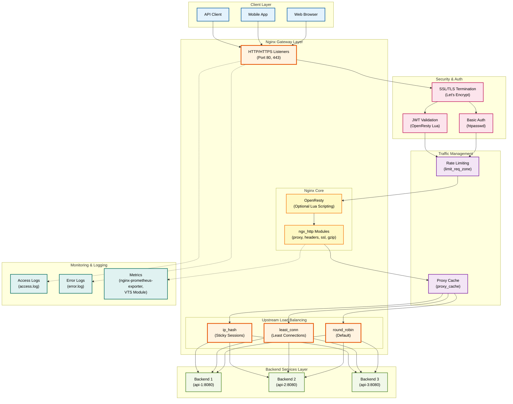
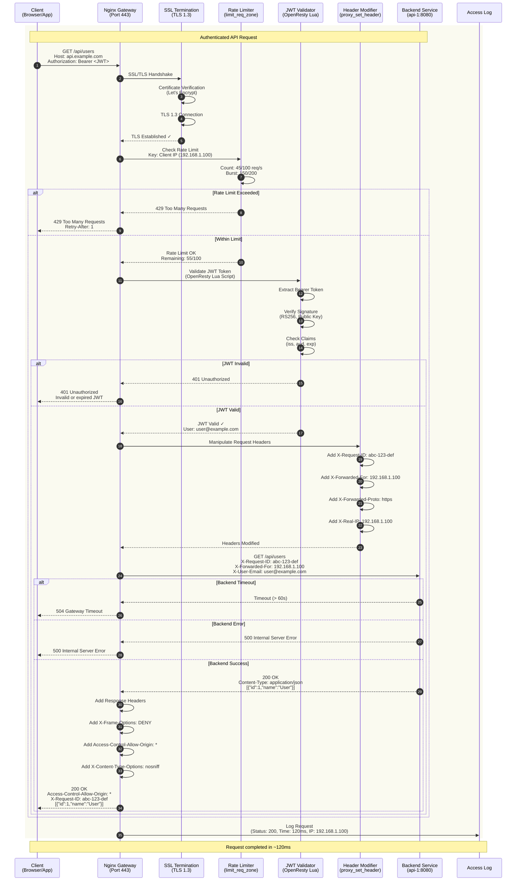

# Nginx Provider Anleitung

**Umfassende Anleitung für den Nginx Open Source Provider in GAL (Gateway Abstraction Layer)**

## Inhaltsverzeichnis

1. [Übersicht](#ubersicht)
2. [Schnellstart](#schnellstart)
3. [Installation und Setup](#installation-und-setup)
4. [Konfigurationsoptionen](#konfigurationsoptionen)
5. [Provider-Vergleich](#provider-vergleich)

**Weitere Dokumentation:**
- [Feature-Implementierungen](NGINX_FEATURES.md) - Details zu Auth, Rate Limiting, Circuit Breaker, Request Mirroring
- [Deployment & Migration](NGINX_DEPLOYMENT.md) - Deployment-Strategien, Migration, Best Practices, Troubleshooting

---
## Übersicht

Nginx ist der **#1 Web Server weltweit** mit über 30% Marktanteil. Als Open-Source Reverse Proxy und Load Balancer ist Nginx bekannt für:

- ✅ **Hohe Performance** - Extrem ressourcenschonend
- ✅ **Stabilität** - Bewährt in Production seit 2004
- ✅ **Einfachheit** - Klare, lesbare Konfiguration
- ✅ **Flexibilität** - Vielseitig einsetzbar
- ✅ **Community** - Riesige Community und Dokumentation

### Warum Nginx mit GAL?

GAL abstrahiert die Nginx-Konfiguration und ermöglicht:
- 🔄 **Provider-Unabhängigkeit** - Gleiche Config für alle Gateways
- 📝 **YAML statt nginx.conf** - Einfachere Konfiguration
- 🚀 **Schneller Start** - Weniger Boilerplate
- 🔍 **Validierung** - Automatische Checks vor Deployment

### Unterstützte Features

| Feature | Nginx Open Source | Nginx Plus | GAL Support |
|---------|-------------------|------------|-------------|
| **Reverse Proxy** | ✅ | ✅ | ✅ Full |
| **Load Balancing** | ✅ | ✅ | ✅ Full |
| **Rate Limiting** | ✅ | ✅ | ✅ Full |
| **Basic Auth** | ✅ | ✅ | ✅ Full |
| **Header Manipulation** | ✅ | ✅ | ✅ Full |
| **CORS** | ✅ | ✅ | ✅ Full |
| **Passive Health Checks** | ✅ | ✅ | ✅ Full |
| **Active Health Checks** | ❌ | ✅ | ⚠️ Plus only |
| **JWT Authentication** | ⚠️ Lua | ✅ | ⚠️ OpenResty |
| **Dynamic Config** | ❌ | ✅ | ⚠️ Plus only |
| **API Key Auth** | ⚠️ Lua | ✅ | ⚠️ OpenResty |
| **Circuit Breaker** | ⚠️ Lua | ✅ | ⚠️ Limited |

**Legende:**
- ✅ **Full** - Vollständig unterstützt
- ⚠️ **Limited** - Eingeschränkt oder benötigt Erweiterungen
- ❌ **Not Supported** - Nicht verfügbar

### Nginx Architektur

Das folgende Architektur-Diagramm zeigt die Hauptkomponenten von Nginx als API Gateway:



**Architektur-Erklärung:**

- **Client Layer:** Verschiedene Client-Typen (Web Browser, Mobile Apps, API Clients)
- **Nginx Gateway Layer:** Zentrale Komponenten
  - **HTTP/HTTPS Listeners:** Eintrittspunkte auf Port 80 (HTTP) und 443 (HTTPS)
  - **OpenResty:** Optional für erweiterte Lua-Scripting Funktionalität (JWT, API Keys)
  - **ngx_http Modules:** Nginx Core Module für Proxy, Headers, SSL, Gzip
  - **Upstream Load Balancing:** Algorithmen für Traffic-Verteilung
- **Backend Services:** Load Balanced Backend Server
- **Security & Auth:** SSL/TLS Termination, Basic Auth, JWT Validation
- **Traffic Management:** Rate Limiting und Caching für Performance
- **Monitoring:** Access Logs, Error Logs, Prometheus Metrics

---

## Schnellstart

### 1. Basis-Konfiguration (Reverse Proxy)

Einfachster Nginx Reverse Proxy:

```yaml
version: "1.0"
provider: nginx

global:
  port: 80

services:
  - name: api_service
    type: rest
    protocol: http
    host: backend.internal
    port: 8080

    routes:
      - path_prefix: /api
        methods: [GET, POST, PUT, DELETE]
```

**Generieren:**
```bash
gal generate config.yaml --provider nginx > nginx.conf
```

**Resultat:**
```nginx
# Nginx Configuration Generated by GAL

events {
    worker_connections 1024;
}

http {
    # Basic Settings
    include /etc/nginx/mime.types;
    default_type application/octet-stream;
    sendfile on;
    keepalive_timeout 65;

    # Server for api_service
    server {
        listen 80;
        server_name api_service.local;

        # Route: /api
        location /api {
            # Proxy to backend
            proxy_pass http://backend.internal:8080;
            proxy_http_version 1.1;
            proxy_set_header Connection "";
            proxy_connect_timeout 5s;
            proxy_send_timeout 60s;
            proxy_read_timeout 60s;
        }
    }
}
```

### 2. Load Balancing

Mehrere Backend-Server mit Load Balancing:

```yaml
version: "1.0"
provider: nginx

services:
  - name: api_service
    type: rest
    protocol: http
    upstream:
      targets:
        - host: api-1.internal
          port: 8080
          weight: 2        # Erhält 2x mehr Traffic
        - host: api-2.internal
          port: 8080
          weight: 1
      load_balancer:
        algorithm: least_conn  # Least Connections

    routes:
      - path_prefix: /api
```

**Generiert:**
```nginx
upstream upstream_api_service {
    least_conn;
    server api-1.internal:8080 weight=2;
    server api-2.internal:8080;
    keepalive 32;
}

server {
    listen 80;
    location /api {
        proxy_pass http://upstream_api_service;
    }
}
```

### 3. Rate Limiting + Basic Auth

API-Schutz mit Rate Limiting und Authentication:

```yaml
version: "1.0"
provider: nginx

services:
  - name: protected_api
    type: rest
    protocol: http
    host: api.internal
    port: 8080

    routes:
      - path_prefix: /api
        rate_limit:
          enabled: true
          requests_per_second: 100
          burst: 200
          response_status: 429

        authentication:
          enabled: true
          type: basic
          basic_auth:
            users:
              admin: "password"
              user: "secret"
            realm: "Protected API"
```

**Generiert:**
```nginx
http {
    # Rate Limiting Zones
    limit_req_zone $binary_remote_addr zone=protected_api_route_0_ratelimit:10m rate=100r/s;

    server {
        location /api {
            # Rate Limiting: 100 req/s, burst 200
            limit_req zone=protected_api_route_0_ratelimit burst=200 nodelay;
            limit_req_status 429;

            # Basic Authentication
            auth_basic "Protected API";
            auth_basic_user_file /etc/nginx/.htpasswd;

            proxy_pass http://api.internal:8080;
        }
    }
}
```

**Wichtig:** Erstelle `.htpasswd` Datei:
```bash
htpasswd -c /etc/nginx/.htpasswd admin
htpasswd /etc/nginx/.htpasswd user
```

---

## Installation und Setup

### Nginx Installation

**Ubuntu/Debian:**
```bash
sudo apt update
sudo apt install nginx
```

**CentOS/RHEL:**
```bash
sudo yum install nginx
```

**macOS:**
```bash
brew install nginx
```

### GAL CLI Installation

```bash
pip install gal-gateway
```

### Nginx Config Deployment

1. **Config generieren:**
```bash
gal generate gateway.yaml --provider nginx > nginx.conf
```

2. **Config testen:**
```bash
nginx -t -c nginx.conf
```

3. **Config deployen:**
```bash
sudo cp nginx.conf /etc/nginx/nginx.conf
sudo nginx -s reload
```

Oder für lokales Testing:
```bash
nginx -c $(pwd)/nginx.conf
```

---

## Konfigurationsoptionen

### Global Configuration

```yaml
global:
  port: 80           # Listen Port (default: 10000)
  host: 0.0.0.0      # Listen Address
  admin_port: 9901   # Nicht verwendet bei Nginx
  timeout: "30s"     # Request Timeout
```

### Upstream Configuration

```yaml
upstream:
  targets:           # Liste von Backend-Servern
    - host: server1.internal
      port: 8080
      weight: 2      # Load Balancing Gewicht (default: 1)

  health_check:
    passive:         # Passive Health Checks
      enabled: true
      max_failures: 3
      unhealthy_status_codes: [500, 502, 503, 504]

  load_balancer:
    algorithm: round_robin  # round_robin, least_conn, ip_hash, weighted
```

**Load Balancing Algorithmen:**

| Algorithm | Beschreibung | Nginx Direktive | Use Case |
|-----------|--------------|-----------------|----------|
| `round_robin` | Gleichmäßige Verteilung (default) | - | Standard |
| `least_conn` | Zu Server mit wenigsten Verbindungen | `least_conn;` | Ungleiche Requests |
| `ip_hash` | Basierend auf Client-IP (Sticky) | `ip_hash;` | Session Persistence |
| `weighted` | Gewichtete Verteilung | `weight=N` | Heterogene Server |

### Route Configuration

```yaml
routes:
  - path_prefix: /api           # Routing Pfad
    methods: [GET, POST]        # Erlaubte HTTP Methoden

    rate_limit:                 # Rate Limiting
      enabled: true
      requests_per_second: 100
      burst: 200
      key_type: ip_address      # ip_address, header
      key_header: X-API-Key     # Falls key_type=header
      response_status: 429

    authentication:             # Authentication
      enabled: true
      type: basic               # basic, api_key, jwt
      basic_auth:
        users:
          admin: password
        realm: "Protected"

    headers:                    # Header Manipulation
      request_add:
        X-Request-ID: "{{uuid}}"
        X-Gateway: "GAL"
      response_add:
        X-Frame-Options: "DENY"
      response_remove:
        - X-Powered-By

    cors:                       # CORS
      enabled: true
      allowed_origins: ["https://app.example.com"]
      allowed_methods: [GET, POST]
      allowed_headers: [Content-Type, Authorization]
      allow_credentials: true
      max_age: 86400
```

### Request Flow durch Nginx

Das folgende Sequenzdiagramm zeigt den vollständigen Request-Ablauf durch Nginx Gateway mit allen Features:



**Flow-Erklärung:**

1. **Client Request:** Client sendet HTTPS Request mit JWT Token im Authorization Header
2. **SSL/TLS Termination:** Nginx terminiert TLS 1.3 Verbindung, verifiziert Zertifikat
3. **Rate Limiting Check:** Nginx prüft Rate Limit basierend auf Client IP (limit_req_zone)
4. **Rate Limit Evaluation:** Zählt aktuelle Requests (45/100) und Burst (150/200)
5. **JWT Validation:** OpenResty Lua Script validiert JWT Token
   - Extrahiert Bearer Token aus Authorization Header
   - Verifiziert Signatur mit Public Key (RS256)
   - Prüft Claims (Issuer, Audience, Expiration)
6. **Request Header Manipulation:** Nginx fügt Standard-Headers hinzu
   - X-Request-ID: Eindeutige Request-ID für Tracing
   - X-Forwarded-For: Client IP für Backend
   - X-Forwarded-Proto: Original Protocol (https)
   - X-User-Email: Extrahiert aus JWT für Backend Authorization
7. **Backend Proxy:** Nginx forwarded Request an Backend mit enriched Headers
8. **Response Processing:** Backend antwortet, Nginx fügt Security Headers hinzu
9. **Access Logging:** Request wird mit Status, Latency, Client IP geloggt

**Alternative Flows:**
- **Rate Limit Exceeded:** Client erhält 429 Too Many Requests mit Retry-After Header
- **JWT Invalid:** Client erhält 401 Unauthorized bei ungültigem/abgelaufenem Token
- **Backend Timeout:** Client erhält 504 Gateway Timeout bei Backend-Problemen

---

## Feature-Implementierungen

### 1. Load Balancing

#### Round Robin (Default)

Gleichmäßige Verteilung über alle Server:

```yaml
upstream:
  targets:
    - host: server1
      port: 8080
    - host: server2
      port: 8080
  load_balancer:
    algorithm: round_robin
```

**Nginx Config:**
```nginx
upstream upstream_service {
    server server1:8080;
    server server2:8080;
}
```

#### Least Connections

Bevorzugt Server mit wenigsten aktiven Verbindungen:

```yaml
load_balancer:
  algorithm: least_conn
```

**Nginx Config:**
```nginx
upstream upstream_service {
    least_conn;
    server server1:8080;
    server server2:8080;
}
```

**Use Case:** Backend-Server mit stark variierenden Request-Dauern.

#### IP Hash (Session Persistence)

Client-IP bestimmt Backend-Server (Sticky Sessions):

```yaml
load_balancer:
  algorithm: ip_hash
```

**Nginx Config:**
```nginx
upstream upstream_service {
    ip_hash;
    server server1:8080;
    server server2:8080;
}
```

**Use Case:** Stateful Applications, Session Persistence.

#### Weighted

Server mit unterschiedlichen Kapazitäten:

```yaml
upstream:
  targets:
    - host: powerful-server
      port: 8080
      weight: 3
    - host: small-server
      port: 8080
      weight: 1
```

**Nginx Config:**
```nginx
upstream upstream_service {
    server powerful-server:8080 weight=3;
    server small-server:8080;
}
```

**Verteilung:** 75% powerful-server, 25% small-server.

### 2. Passive Health Checks

Nginx überwacht Backend-Health basierend auf echtem Traffic:

```yaml
upstream:
  targets:
    - host: backend1
      port: 8080
  health_check:
    passive:
      enabled: true
      max_failures: 3           # Nach 3 Fehlern → unhealthy
```

**Nginx Config:**
```nginx
upstream upstream_service {
    server backend1:8080 max_fails=3 fail_timeout=30s;
}
```

**Funktionsweise:**
- Bei 3 aufeinanderfolgenden Fehlern wird Server als "down" markiert
- Nach 30 Sekunden wird Server wieder getestet
- Fehler = 5xx Status Codes oder Timeouts

⚠️ **Limitation:** Kann Server nicht proaktiv prüfen (kein Active HC ohne Plus).

### 3. Rate Limiting

IP-basiertes Rate Limiting:

```yaml
rate_limit:
  enabled: true
  requests_per_second: 100
  burst: 200
  key_type: ip_address
  response_status: 429
```

**Nginx Config:**
```nginx
http {
    limit_req_zone $binary_remote_addr zone=api_ratelimit:10m rate=100r/s;

    server {
        location /api {
            limit_req zone=api_ratelimit burst=200 nodelay;
            limit_req_status 429;
        }
    }
}
```

**Erklärung:**
- **Zone:** 10m = ~160.000 IP-Adressen
- **Rate:** 100 Requests/Sekunde
- **Burst:** Bis zu 200 Requests in Spitzen
- **nodelay:** Keine künstliche Verzögerung

#### Header-basiertes Rate Limiting

Limitierung pro API-Key:

```yaml
rate_limit:
  enabled: true
  requests_per_second: 50
  key_type: header
  key_header: X-API-Key
```

**Nginx Config:**
```nginx
limit_req_zone $http_x_api_key zone=api_ratelimit:10m rate=50r/s;
```

### 4. Authentication

#### Basic Authentication

Einfache Username/Password Auth:

```yaml
authentication:
  enabled: true
  type: basic
  basic_auth:
    users:
      admin: "password"
    realm: "Protected API"
```

**Nginx Config:**
```nginx
location /api {
    auth_basic "Protected API";
    auth_basic_user_file /etc/nginx/.htpasswd;
}
```

**Setup:**
```bash
# .htpasswd erstellen
htpasswd -c /etc/nginx/.htpasswd admin
# Weitere User hinzufügen
htpasswd /etc/nginx/.htpasswd user2
```

#### API Key Authentication

⚠️ **Benötigt Lua/OpenResty** oder externe Authentication.

```yaml
authentication:
  type: api_key
  api_key:
    keys: ["key_123abc"]
    key_name: X-API-Key
    in_location: header
```

**Nginx Config (Kommentar):**
```nginx
# API Key authentication not natively supported
# Requires Lua or external authentication
```

**Alternative:** Nginx Plus mit `auth_request` Modul oder OpenResty.

#### JWT Authentication

⚠️ **Benötigt OpenResty/Lua** (siehe [OpenResty Integration](#openresty-integration-optional)).

```yaml
authentication:
  type: jwt
  jwt:
    issuer: "https://auth.example.com"
    audience: "api"
    jwks_uri: "https://auth.example.com/.well-known/jwks.json"
```

### 5. Header Manipulation

#### Request Headers

```yaml
headers:
  request_add:
    X-Request-ID: "{{uuid}}"     # $request_id
    X-Gateway: "GAL"
    X-Timestamp: "{{now}}"        # $time_iso8601
  request_set:
    User-Agent: "GAL-Gateway/1.0"
  request_remove:
    - X-Internal-Token
```

**Nginx Config:**
```nginx
location /api {
    # Request Headers
    proxy_set_header X-Request-ID $request_id;
    proxy_set_header X-Gateway 'GAL';
    proxy_set_header X-Timestamp $time_iso8601;
    proxy_set_header User-Agent 'GAL-Gateway/1.0';
    proxy_set_header X-Internal-Token '';
}
```

**Template-Variablen:**
- `{{uuid}}` → `$request_id`
- `{{now}}`, `{{timestamp}}` → `$time_iso8601`

#### Response Headers

```yaml
headers:
  response_add:
    X-Frame-Options: "DENY"
    X-Content-Type-Options: "nosniff"
  response_set:
    Server: "GAL-Gateway"
  response_remove:
    - X-Powered-By
```

**Nginx Config:**
```nginx
location /api {
    # Response Headers
    add_header X-Frame-Options 'DENY' always;
    add_header X-Content-Type-Options 'nosniff' always;
    add_header Server 'GAL-Gateway' always;

    # Note: Response header removal requires ngx_headers_more module
    # more_clear_headers 'X-Powered-By';
}
```

⚠️ **Response Header Removal** benötigt `ngx_headers_more` Modul.

### 6. CORS

Cross-Origin Resource Sharing für SPAs:

```yaml
cors:
  enabled: true
  allowed_origins:
    - "https://app.example.com"
    - "https://www.example.com"
  allowed_methods: [GET, POST, PUT, DELETE, OPTIONS]
  allowed_headers: [Content-Type, Authorization, X-API-Key]
  expose_headers: [X-Request-ID, X-RateLimit-Remaining]
  allow_credentials: true
  max_age: 86400  # 24 hours
```

**Nginx Config:**
```nginx
location /api {
    # CORS Configuration
    add_header 'Access-Control-Allow-Origin' 'https://app.example.com' always;
    add_header 'Access-Control-Allow-Methods' 'GET, POST, PUT, DELETE, OPTIONS' always;
    add_header 'Access-Control-Allow-Headers' 'Content-Type, Authorization, X-API-Key' always;
    add_header 'Access-Control-Expose-Headers' 'X-Request-ID, X-RateLimit-Remaining' always;
    add_header 'Access-Control-Allow-Credentials' 'true' always;
    add_header 'Access-Control-Max-Age' '86400' always;

    # Handle preflight requests
    if ($request_method = 'OPTIONS') {
        return 204;
    }
}
```

**Wichtig:** `always` Flag stellt sicher, dass Headers auch bei Errors gesetzt werden.

---

