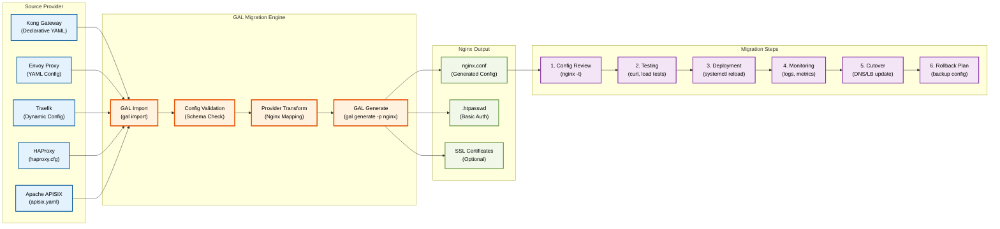

# Nginx Deployment & Migration

**Deployment-Strategien, Migration und Best Practices für Nginx Provider in GAL**

**Navigation:**
- [← Zurück zur Nginx Übersicht](NGINX.md)
- [← Feature-Implementierungen](NGINX_FEATURES.md)

## Inhaltsverzeichnis

1. [Deployment-Strategien](#deployment-strategien)
2. [Migration zu Nginx](#migration-zu-nginx)
3. [Best Practices](#best-practices)
4. [Troubleshooting](#troubleshooting)
5. [Zusammenfassung](#zusammenfassung)
6. [Weitere Ressourcen](#weitere-ressourcen)

---
## Deployment-Strategien

### Deployment-Entscheidungsbaum

Der folgende Entscheidungsbaum hilft bei der Auswahl der richtigen Nginx-Deployment-Strategie:

```mermaid
flowchart TD
    Start([Nginx Deployment<br/>planen]) --> Q1{Welches<br/>Use Case?}

    Q1 -->|Basic HTTP<br/>Reverse Proxy| Scenario1[Szenario 1:<br/>Basic HTTP Proxy]
    Q1 -->|HTTPS mit<br/>SSL/TLS| Scenario2[Szenario 2:<br/>HTTPS + Let's Encrypt]
    Q1 -->|Advanced Logic<br/>(JWT, API Keys)| Scenario3[Szenario 3:<br/>OpenResty + Lua]
    Q1 -->|Kubernetes<br/>Cluster| Scenario4[Szenario 4:<br/>K8s Ingress Controller]
    Q1 -->|High Traffic<br/>Load Balancing| Scenario5[Szenario 5:<br/>Load Balancing]

    %% Scenario 1: Basic HTTP Proxy
    Scenario1 --> S1A[1. nginx.conf vorbereiten]
    S1A --> S1B[2. GAL Config erstellen<br/>mit upstream target]
    S1B --> S1C[3. nginx.conf generieren<br/>gal generate -p nginx]
    S1C --> S1D[4. Config testen<br/>nginx -t]
    S1D --> S1E[5. Nginx deployen<br/>nginx -s reload]
    S1E --> S1Done[Simple Reverse Proxy<br/>läuft auf Port 80]

    %% Scenario 2: HTTPS + Let's Encrypt
    Scenario2 --> S2A[1. Domain & DNS<br/>konfigurieren]
    S2A --> S2B[2. Certbot installieren<br/>apt install certbot]
    S2B --> S2C[3. SSL Cert erstellen<br/>certbot certonly]
    S2C --> S2D[4. GAL Config + SSL<br/>manuell hinzufügen]
    S2D --> S2E[5. Auto-Renewal Setup<br/>certbot renew --dry-run]
    S2E --> S2Done[HTTPS Gateway<br/>mit TLS 1.3]

    %% Scenario 3: OpenResty + Lua
    Scenario3 --> S3A[1. OpenResty installieren<br/>apt install openresty]
    S3A --> S3B[2. Lua Modules<br/>opm get lua-resty-jwt]
    S3B --> S3C[3. GAL Config mit<br/>JWT/API Key Auth]
    S3C --> S3D[4. Lua Scripts<br/>manuell einfügen]
    S3D --> S3E[5. OpenResty starten<br/>openresty -c nginx.conf]
    S3E --> S3Done[Advanced Gateway<br/>mit JWT Validation]

    %% Scenario 4: Kubernetes Ingress
    Scenario4 --> S4A[1. Nginx Ingress<br/>Controller installieren]
    S4A --> S4B[2. GAL Config erstellen<br/>für K8s Services]
    S4B --> S4C[3. Ingress YAML<br/>generieren/anpassen]
    S4C --> S4D[4. kubectl apply<br/>-f ingress.yaml]
    S4D --> S4E[5. Ingress IP/DNS<br/>konfigurieren]
    S4E --> S4Done[K8s Ingress Gateway<br/>mit LoadBalancer]

    %% Scenario 5: Load Balancing
    Scenario5 --> S5A[1. Multiple Backend<br/>Server deployen]
    S5A --> S5B[2. GAL upstream Config<br/>mit targets + weights]
    S5B --> S5C[3. Load Balancing Algo<br/>wählen (least_conn)]
    S5C --> S5D[4. Health Checks<br/>konfigurieren (passive)]
    S5D --> S5E[5. Monitoring Setup<br/>Prometheus Exporter]
    S5E --> S5Done[Hochverfügbarer<br/>Load Balancer]

    %% Styling
    classDef questionStyle fill:#FFF3E0,stroke:#E65100,stroke-width:2px,color:#000
    classDef scenarioStyle fill:#E8F5E9,stroke:#2E7D32,stroke-width:3px,color:#000
    classDef stepStyle fill:#E3F2FD,stroke:#01579B,stroke-width:2px,color:#000
    classDef finalStyle fill:#F3E5F5,stroke:#6A1B9A,stroke-width:2px,color:#000

    class Start,Q1 questionStyle
    class Scenario1,Scenario2,Scenario3,Scenario4,Scenario5 scenarioStyle
    class S1A,S1B,S1C,S1D,S1E,S2A,S2B,S2C,S2D,S2E,S3A,S3B,S3C,S3D,S3E,S4A,S4B,S4C,S4D,S4E,S5A,S5B,S5C,S5D,S5E stepStyle
    class S1Done,S2Done,S3Done,S4Done,S5Done finalStyle
```

**Deployment-Strategien im Überblick:**

| Szenario | Use Case | Komplexität | Hauptmerkmale |
|----------|----------|-------------|---------------|
| **1. Basic HTTP Proxy** | Einfache APIs, Development | Niedrig | Schnelles Setup, nginx.conf only |
| **2. HTTPS + Let's Encrypt** | Production APIs mit SSL | Mittel | TLS 1.3, Auto-Renewal, Security |
| **3. OpenResty + Lua** | Advanced Auth Logic | Hoch | JWT, API Keys, Custom Logic |
| **4. K8s Ingress Controller** | Kubernetes Cluster | Mittel | Cloud-Native, Auto-Scaling |
| **5. Load Balancing** | High Traffic APIs | Mittel | Multi-Backend, Health Checks |

### Deployment-Details

#### 1. Basic HTTP Proxy

**Schnellster Weg für Development:**

```bash
# GAL Config
gal generate -c config.yaml -p nginx > nginx.conf

# Nginx testen
nginx -t -c nginx.conf

# Nginx starten
nginx -c $(pwd)/nginx.conf
```

**Use Cases:**
- Development/Testing
- Interne APIs ohne SSL
- Prototyping

#### 2. HTTPS mit Let's Encrypt

**Production-ready SSL Setup:**

```bash
# 1. Certbot installieren
sudo apt install certbot python3-certbot-nginx

# 2. SSL Zertifikat erstellen
sudo certbot certonly --nginx -d api.example.com

# 3. nginx.conf manuell anpassen
server {
    listen 443 ssl http2;
    ssl_certificate /etc/letsencrypt/live/api.example.com/fullchain.pem;
    ssl_certificate_key /etc/letsencrypt/live/api.example.com/privkey.pem;
    ...
}

# 4. Auto-Renewal testen
sudo certbot renew --dry-run
```

**Use Cases:**
- Production APIs
- Public-facing Services
- Security Requirements

#### 3. OpenResty + Lua Scripting

**Advanced Authentication:**

```bash
# 1. OpenResty installieren
wget https://openresty.org/package/ubuntu/openresty.gpg.key
sudo apt-key add openresty.gpg.key
sudo apt install openresty

# 2. Lua Module installieren
opm get SkyLothar/lua-resty-jwt
opm get zmartzone/lua-resty-openidc

# 3. GAL Config generieren
gal generate -c config.yaml -p nginx > nginx.conf

# 4. Lua Scripts manuell einfügen (siehe OpenResty Section)

# 5. OpenResty starten
openresty -c $(pwd)/nginx.conf
```

**Use Cases:**
- JWT Token Validation
- API Key Authentication
- Custom Business Logic

#### 4. Kubernetes Ingress Controller

**Cloud-Native Deployment:**

```bash
# 1. Nginx Ingress Controller installieren
kubectl apply -f https://raw.githubusercontent.com/kubernetes/ingress-nginx/controller-v1.8.1/deploy/static/provider/cloud/deploy.yaml

# 2. Ingress Resource erstellen
cat <<EOF | kubectl apply -f -
apiVersion: networking.k8s.io/v1
kind: Ingress
metadata:
  name: api-ingress
  annotations:
    nginx.ingress.kubernetes.io/rewrite-target: /
spec:
  ingressClassName: nginx
  rules:
  - host: api.example.com
    http:
      paths:
      - path: /api
        pathType: Prefix
        backend:
          service:
            name: backend-service
            port:
              number: 8080
EOF

# 3. External IP abrufen
kubectl get svc -n ingress-nginx
```

**Use Cases:**
- Kubernetes Cluster
- Microservices Architecture
- Auto-Scaling Services

#### 5. Load Balancing Setup

**Multi-Backend High Availability:**

```yaml
# GAL Config mit Load Balancing
upstream:
  targets:
    - host: backend-1.internal
      port: 8080
      weight: 3
    - host: backend-2.internal
      port: 8080
      weight: 2
    - host: backend-3.internal
      port: 8080
      weight: 1
  load_balancer:
    algorithm: least_conn
  health_check:
    passive:
      enabled: true
      max_failures: 3
```

```bash
# Monitoring mit Prometheus Exporter
docker run -d \
  -p 9113:9113 \
  nginx/nginx-prometheus-exporter:latest \
  -nginx.scrape-uri=http://nginx:8080/stub_status
```

**Use Cases:**
- High Traffic APIs
- Multi-Region Deployments
- Redundancy Requirements

---

## OpenResty Integration (Optional)

OpenResty erweitert Nginx mit LuaJIT für dynamische Features.

### Installation

```bash
# Ubuntu/Debian
sudo apt install openresty

# macOS
brew install openresty/brew/openresty
```

### JWT Authentication mit OpenResty

Installiere `lua-resty-jwt`:

```bash
opm get SkyLothar/lua-resty-jwt
```

**Nginx Config (manuell):**
```nginx
location /api {
    access_by_lua_block {
        local jwt = require "resty.jwt"
        local validators = require "resty.jwt-validators"

        local auth_header = ngx.var.http_Authorization
        if not auth_header then
            ngx.status = 401
            ngx.say("Missing Authorization header")
            return ngx.exit(401)
        end

        local token = string.gsub(auth_header, "^Bearer ", "")

        local jwt_obj = jwt:verify("YOUR_SECRET_KEY", token, {
            iss = validators.equals("https://auth.example.com"),
            aud = validators.equals("api"),
        })

        if not jwt_obj["verified"] then
            ngx.status = 401
            ngx.say("Invalid token: " .. jwt_obj.reason)
            return ngx.exit(401)
        end
    }

    proxy_pass http://backend;
}
```

⚠️ **Hinweis:** GAL generiert Kommentare für JWT, die du durch OpenResty-Code ersetzen musst.

---

## Migration zu Nginx

### Migration Flow

Das folgende Diagramm zeigt den vollständigen Migration-Workflow von anderen Gateway-Providern zu Nginx:



**Migration-Erklärung:**

- **Source Provider:** Unterstützte Gateway-Provider für Migration
  - **Kong:** Declarative YAML Config (db-less mode)
  - **Envoy:** YAML/JSON Configuration
  - **Traefik:** Dynamic Configuration (File Provider)
  - **HAProxy:** haproxy.cfg Format
  - **Apache APISIX:** apisix.yaml Config

- **GAL Migration Engine:** Automatisierter Migration-Workflow
  1. **Import:** Lese Source Provider Config (`gal import -i config.yaml -p kong`)
  2. **Validation:** Validiere Config gegen GAL Schema
  3. **Transform:** Mappe Features auf Nginx-Direktiven
  4. **Generate:** Generiere nginx.conf (`gal generate -p nginx`)

- **Nginx Output:** Generierte Artefakte
  - **nginx.conf:** Hauptkonfigurationsdatei mit all configs
  - **.htpasswd:** Basic Auth Credential-Datei
  - **SSL Certificates:** Optional, manuell hinzufügen

- **Migration Steps:** Best Practices für sichere Migration
  1. **Config Review:** Syntax-Check mit `nginx -t`
  2. **Testing:** Funktionale Tests mit curl, Postman, Load Tests
  3. **Deployment:** Nginx Config deployen (`systemctl reload nginx`)
  4. **Monitoring:** Logs und Metrics überwachen
  5. **Cutover:** DNS oder Load Balancer auf neuen Nginx umstellen
  6. **Rollback Plan:** Backup der alten Config für Notfall

### Migration Checklist

**Vor der Migration:**

- [ ] Source Provider Config exportieren/sichern
- [ ] Alle Routes und Endpoints dokumentieren
- [ ] Authentication Mechanismen identifizieren
- [ ] Rate Limiting Requirements klären
- [ ] SSL/TLS Zertifikate vorbereiten
- [ ] Backend Service Endpoints verifizieren

**GAL Import/Export:**

```bash
# 1. Kong → GAL
gal import -i kong.yaml -p kong -o gal-config.yaml

# 2. GAL → Nginx
gal generate -c gal-config.yaml -p nginx > nginx.conf

# 3. htpasswd für Basic Auth erstellen (falls verwendet)
htpasswd -c /etc/nginx/.htpasswd admin

# 4. Config testen
nginx -t -c nginx.conf

# 5. Config deployen
sudo cp nginx.conf /etc/nginx/nginx.conf
sudo nginx -s reload
```

**Während der Migration:**

- [ ] Nginx Config Review (Syntax, Semantik)
- [ ] Unit Tests für kritische Routes
- [ ] Performance/Load Tests durchführen
- [ ] Logs parallel überwachen (Old vs. New Gateway)
- [ ] Canary Deployment (10% Traffic → 50% → 100%)
- [ ] Rollback-Trigger definieren (Error Rate, Latency)

**Nach der Migration:**

- [ ] Traffic vollständig auf Nginx umstellen
- [ ] Alter Gateway noch 24h parallel laufen lassen
- [ ] Metrics vergleichen (Latency, Error Rate, Throughput)
- [ ] Logs auf Anomalien prüfen
- [ ] Alte Gateway-Instanz dekommissionieren
- [ ] Dokumentation aktualisieren

### Provider-spezifische Migration Guides

#### Kong → Nginx

**Feature Mapping:**

| Kong Feature | Nginx Equivalent | Automatisch | Manuell |
|--------------|------------------|-------------|---------|
| **Routes** | location blocks | ✅ | - |
| **Services** | upstream blocks | ✅ | - |
| **Upstream Targets** | server directives | ✅ | - |
| **Load Balancing** | upstream algorithms | ✅ | - |
| **Rate Limiting Plugin** | limit_req_zone | ✅ | - |
| **Basic Auth Plugin** | auth_basic | ✅ | htpasswd file |
| **JWT Plugin** | OpenResty Lua | ❌ | Lua script |
| **CORS Plugin** | add_header | ✅ | - |
| **Request Transformer** | proxy_set_header | ✅ | - |
| **Response Transformer** | add_header | ✅ | - |

**Example Migration:**

```bash
# Kong Declarative Config
gal import -i kong.yaml -p kong -o gal-config.yaml

# Generate Nginx
gal generate -c gal-config.yaml -p nginx > nginx.conf

# Review generated config
cat nginx.conf

# Deploy
sudo cp nginx.conf /etc/nginx/nginx.conf
sudo nginx -t && sudo nginx -s reload
```

#### Envoy → Nginx

**Feature Mapping:**

| Envoy Feature | Nginx Equivalent | Komplexität |
|---------------|------------------|-------------|
| **Listeners** | server blocks | Niedrig |
| **Routes** | location blocks | Niedrig |
| **Clusters** | upstream blocks | Niedrig |
| **Load Balancing** | upstream algorithms | Mittel |
| **Health Checks** | max_fails/fail_timeout | Mittel |
| **Rate Limiting** | limit_req | Mittel |
| **Filters** | Nginx modules/Lua | Hoch |

**Migration Hinweis:** Envoy's Filter-Chains müssen oft manuell auf Nginx-Module/Lua gemappt werden.

#### Traefik → Nginx

**Feature Mapping:**

| Traefik Feature | Nginx Equivalent | Status |
|-----------------|------------------|--------|
| **Routers** | location blocks | ✅ Auto |
| **Services** | upstream blocks | ✅ Auto |
| **Middlewares** | Nginx directives | ⚠️ Teilweise |
| **TLS** | ssl_* directives | ⚠️ Manuell |
| **Let's Encrypt** | Certbot | ⚠️ Manuell |

**Migration Workflow:**

```bash
# 1. Traefik File Provider Config
gal import -i traefik.yaml -p traefik -o gal-config.yaml

# 2. Generate Nginx
gal generate -c gal-config.yaml -p nginx > nginx.conf

# 3. SSL manuell hinzufügen (Traefik Auto-TLS nicht übertragbar)
sudo certbot certonly --nginx -d api.example.com

# 4. Deploy
sudo nginx -t && sudo nginx -s reload
```

### Häufige Migration-Probleme

**Problem 1: JWT Validation fehlt**

Kong/APISIX haben native JWT Plugins, Nginx OSS nicht.

**Lösung:**
```bash
# OpenResty mit lua-resty-jwt installieren
sudo apt install openresty
opm get SkyLothar/lua-resty-jwt

# Lua Script manuell hinzufügen (siehe OpenResty Section)
```

**Problem 2: Active Health Checks**

Kong/Envoy haben Active Health Checks, Nginx OSS nur Passive.

**Lösung:**
- Upgrade zu Nginx Plus (kostenpflichtig)
- Externe Health Check Service (z.B. Consul)
- Passive Health Checks mit `max_fails=3 fail_timeout=30s`

**Problem 3: Dynamic Configuration**

Kong/APISIX erlauben Runtime Config Changes, Nginx benötigt Reload.

**Lösung:**
- Graceful Reload: `nginx -s reload` (zero-downtime)
- Config Management: Ansible/Terraform für Automation
- Upgrade zu Nginx Plus für API-basierte Config

**Problem 4: Plugin Ecosystem**

Kong hat 100+ Plugins, Nginx hat weniger native Features.

**Lösung:**
- OpenResty für Lua-basierte Erweiterungen
- Nginx Modules kompilieren (z.B. ngx_headers_more)
- Externe Services für komplexe Features (z.B. OAuth2 Proxy)

---

## Best Practices

### 1. Worker Configuration

```nginx
worker_processes auto;  # 1 pro CPU Core
worker_rlimit_nofile 65535;

events {
    worker_connections 4096;
    use epoll;  # Linux
    multi_accept on;
}
```

### 2. Connection Pooling

```nginx
upstream backend {
    server backend1:8080;
    keepalive 32;  # Keep 32 idle connections
    keepalive_requests 100;
    keepalive_timeout 60s;
}
```

### 3. Timeouts

```nginx
proxy_connect_timeout 5s;
proxy_send_timeout 60s;
proxy_read_timeout 60s;
client_body_timeout 30s;
client_header_timeout 30s;
```

### 4. Buffer Sizes

```nginx
client_body_buffer_size 128k;
client_max_body_size 10m;
proxy_buffer_size 4k;
proxy_buffers 8 4k;
proxy_busy_buffers_size 8k;
```

### 5. Security Headers

```nginx
add_header X-Frame-Options "DENY" always;
add_header X-Content-Type-Options "nosniff" always;
add_header X-XSS-Protection "1; mode=block" always;
add_header Strict-Transport-Security "max-age=31536000; includeSubDomains" always;
```

### 6. Rate Limiting Best Practices

- **Zone Size:** 10m = ~160k IPs, 100m = ~1.6M IPs
- **Burst:** 2x `requests_per_second` als Faustregel
- **nodelay:** Verwende immer `nodelay` für API Gateways
- **Key Selection:** Wähle zwischen IP, Header, JWT Claim basierend auf Use Case

### 7. Health Checks

- **max_fails:** 3-5 für Production
- **fail_timeout:** 10s-30s (Balance zwischen Fehlertoleranz und Recovery)
- **Monitoring:** Nutze Nginx Stub Status oder Prometheus Exporter

---

## Troubleshooting

### Problem: "Too many open files"

**Symptom:**
```
nginx: [emerg] socket() failed (24: Too many open files)
```

**Lösung:**
```nginx
worker_rlimit_nofile 65535;
```

Oder System Limit erhöhen:
```bash
ulimit -n 65535
```

### Problem: Rate Limiting funktioniert nicht

**Check:**
1. Zone definiert in `http` Block?
```nginx
http {
    limit_req_zone $binary_remote_addr zone=myzone:10m rate=100r/s;
}
```

2. Zone referenziert in `location`?
```nginx
location /api {
    limit_req zone=myzone burst=200 nodelay;
}
```

3. Log-Datei prüfen:
```bash
tail -f /var/log/nginx/error.log | grep limit_req
```

### Problem: Upstream Server wird nicht erreicht

**Debug:**
```nginx
error_log /var/log/nginx/error.log debug;
```

**Check:**
1. Server erreichbar?
```bash
curl http://backend:8080/health
```

2. DNS korrekt?
```bash
nslookup backend.internal
```

3. Firewall Rules?
```bash
sudo iptables -L -n
```

### Problem: CORS funktioniert nicht

**Häufiger Fehler:** `always` Flag vergessen.

**Richtig:**
```nginx
add_header 'Access-Control-Allow-Origin' '*' always;
```

**Falsch:**
```nginx
add_header 'Access-Control-Allow-Origin' '*';  # Nur bei 200 OK
```

### Problem: Config Reload schlägt fehl

**Test vor Reload:**
```bash
nginx -t -c /etc/nginx/nginx.conf
```

**Häufige Fehler:**
- Fehlende Semikolons
- Unbalanced Brackets
- Ungültige Direktiven
- Falsche Pfade

### Problem: 502 Bad Gateway

**Ursachen:**
1. Backend offline → Check `max_fails`
2. Timeout zu kurz → Erhöhe `proxy_read_timeout`
3. Buffer zu klein → Erhöhe `proxy_buffer_size`

**Debug:**
```nginx
error_log /var/log/nginx/error.log debug;
```

Suche nach:
```
upstream timed out
no live upstreams
```

---

## Zusammenfassung

### Stärken von Nginx

✅ **Performance** - Extrem schnell und ressourcenschonend
✅ **Stabilität** - Bewährt in Production
✅ **Einfachheit** - Klare, lesbare Konfiguration
✅ **Community** - Riesige Community, viele Tutorials
✅ **Static Content** - Perfekt für Hybrid Workloads

### Einschränkungen

❌ **Active Health Checks** - Nur in Nginx Plus
❌ **JWT** - Benötigt OpenResty/Lua
❌ **Dynamic Config** - Reload erforderlich
⚠️ **Response Header Removal** - Benötigt ngx_headers_more Modul

### Empfehlung

Nutze Nginx mit GAL wenn:
- 🚀 Performance und Effizienz kritisch sind
- 📦 Static Content + API Gateway benötigt wird
- 🔧 Einfache, stabile Lösung gewünscht ist
- 💰 Keine Lizenzkosten anfallen sollen

Nutze andere Gateways wenn:
- 🔑 Native JWT Validation erforderlich ist
- 🔄 Dynamische Configuration ohne Reload benötigt wird
- 🎯 Active Health Checks ohne Plus erforderlich sind

---

## Weitere Ressourcen

- **Nginx Offizielle Docs:** https://nginx.org/en/docs/
- **OpenResty Docs:** https://openresty.org/en/
- **GAL GitHub:** https://github.com/pt9912/x-gal
- **PyPI Package:** https://pypi.org/project/gal-gateway/

**Bei Fragen oder Problemen:** https://github.com/pt9912/x-gal/issues
